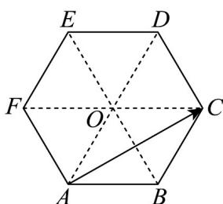

> [!faq]- 《专题6.2 平面向量的运算（高效培优讲义）》官方解析
>
> > [!success]- **【答案】** A
>
> > [!note]- **【解析】**
> > 连接 AD、BE、CF 交于点 O，如下图所示：
> >
> > 
> >
> > 由正六边形的几何性质可知 $^{\triangle}$ OAB、 $\triangle OBC$ 、 $\triangle OCD$ 、 $\triangle ODE$ 、 $\triangle OEF$ 、 $\triangle OFA$ 均为等边三角形，
> >
> > 因为 $OF = AF = AB = OB$ ，故四边形ABOF为菱形，
> >
> > 同理可知，四边形 $ABCO$ 也为菱形，所以 $\overline{FO} = \overline{AB} = \overline{OC}$ ，故 $FC = 2AB$
> >
> > 故 $AC = AF + FC = AF + 2AB$
> >
> > 故选 **A**.
