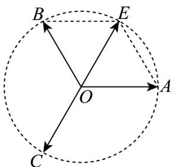

> [!faq]- 《专题6.2 平面向量的运算（高效培优讲义）》官方解析
>
> > [!success]- **【答案】** A
>
> > [!note]- **【解析】**
> > 因为 a, b, c 为单位向量，
> >
> > 所以 $\left|p\right|=\left|a+b+c\right|\leq3$ ，当且仅当a、b、c方向都相同时，等号成立，
> >
> > 作 $OA = a$ ， $OB = b$ ， $OC = c$
> >
> > 当 $\angle AOB = \angle BOC = \angle COA = \frac{2\pi}{3}$ 时，如下图所示：
> >
> > 
> >
> > 以 $OA$ 、 $OB$ 为邻边作平行四边形 $OAEB$ ，则该四边形为菱形，且 $\angle AOE = \frac{\pi}{3}$
> >
> > 所以， $\triangle AOE$ 为等边三角形，且 $\left|\overline{O}E\right| = 1$
> >
> > 又因为 $\angle AOC = \frac{2\pi}{3}$ ， $\left|\overline{OC}\right| = 1$ ，由图可知， $\overline{OC} +\overline{OE} = 0$
> >
> > 即 $|\dot{p}| = |\overline{OA} +\overline{OB} +\overline{OC}| = 0$
> >
> > 综上所述， $0 \leq |p| \leq 3$
> >
> > 故选 **A**.
