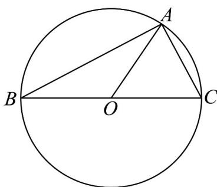
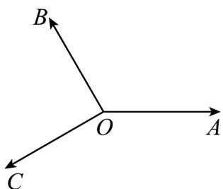
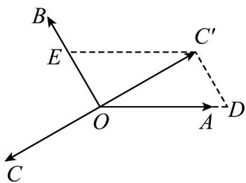

> [!faq]- 《专题6.2 平面向量的运算（高效培优讲义）》官方解析
>
> > [!success]- **【答案】** A
>
> > [!note]- **【解析】**
> > 因为 O 是 $\vee ABC$ 的外接圆圆心， $2AO = AB + AC$
> >
> > 所以由平行四边形法则可得 O 为 BC 的中点，BC 为圆的直径，
> >
> > 
> >
> > 因为 $\left|OA\right|=\left|AC\right|$ ，所以 $\triangle AOC$ 为等边三角形， $\angle ACB=\frac{\pi}{3}$ ，
> > 所以向量 $\stackrel{①②③}{CA}$ 在向量 $\stackrel{①②③}{CB}$ 上的投影向量为 $\left|\stackrel{①②③}{CA}\right|\cos\frac{\pi}{3}\cdot\frac{\stackrel{①②③}{CB}}{\left|CB\right|}=\frac{1}{4}\stackrel{①②③}{CB}$ 【变式3】如图，已知平面向量 $OA,OB,OC$ 满足 $|OA|=|OB|=|OC|,\left\langle OA,OB\right\rangle=120^{\circ},OB\perp OC$ ，则（）
> >
> > 
> >
> > A. $2\overline{OA} +\overline{OB} +\sqrt{3}\overline{OC} = 0$ B. $\overline{OA} +2\overline{OB} +\sqrt{3}\overline{OC} = 0$ C. $2\overline{OA} +\sqrt{3}\overline{OB} +\overline{OC} = 0$ D. $\sqrt{3}\overline{OA} +2\overline{OB} +\overline{OC} = 0$
> >
> > 【答案】A
> >
> > 【详解】设 $OC' = -OC$ ，过 $C'$ 分别作 $OA, OB$ 的平行线，
> >
> > 分别交OA,OB于D,E
> >
> > 如图，不妨设 $|\overline{OA}| = |\overline{OB}| = |\overline{OC}| = \sqrt{3}$
> >
> > $$
> > \because \left\langle O A, O B \right\rangle = 1 2 0 ^ {\circ}, O B \perp O C
> > $$
> >
> > 所以 $\angle EOC' = \angle OC'D = 90^{\circ}, \angle DOC' = 30^{\circ}$
> >
> > 则 $OD = 2, OE = C'D = 1$
> >
> > 从而 $-OC=OC' = OD + OE = \frac{2}{\sqrt{3}}OA + \frac{1}{\sqrt{3}}OB$
> >
> > 故 $2OA+OB+\sqrt{3}OC=0$ .
> >
> > 故选：A.
> >
> > 
