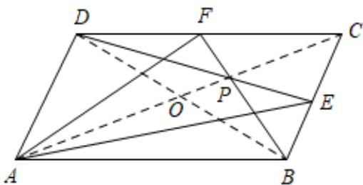

> [!faq]- 《专题6.2 平面向量的运算（高效培优讲义）》官方解析
>
> > [!success]- **【答案】** AC
>
> > [!note]- **【解析】**
> > 解：如图所示：
> >
> > 
> >
> > 对 A， $AE = AB + BE = AB + \frac{1}{2} BC$
> >
> > 又∵ $BC = AD$
> >
> > 即 $AE = AB + \frac{1}{2} AD$ ，故 A 正确；
> >
> > 对 B， $AF = AD + \frac{1}{2} DC = \frac{1}{2} AB + AD$ ，故 B 错误；
> >
> > 对 C，设 O 为 AC 与 BD 的交点，
> >
> > 由题意可得：P 是 $\triangle CBD$ 的重心，
> >
> > 故 $CP=2PO$ ，
> >
> > $\square\square\square\square\square\square\square\square\square\square\square\square\square\square\square\square\square\square\square\square\square\square\square\square\square\square\square\square\square\square\square\square\square\square\square\square\square\square\square\square\square\square\square\square\square\square\square\square\square\square\square\rho=\square\square\square\square\square\square\square\square\square\square\square\square\square+\square\square\square\square\square\square\square\square\square\square\square=\frac{2}{3}\square\square\square\square\square\square\square\square\square\square\square\square\square\square\square\square\square\square\square\square\square\square\square\square\square\square\square\square\square\square\square\square\square\square\square\square\square\square\square\square\square\square\square\square\square\square\square\square\square\square\square\sum\rho=\square O+O\Psi=\frac{2}{3}A C=\frac{2}{3}A B+\frac{2}{3}A D,\text{故C正确；}$
> >
> > 对 D， $\overline{CP}=\frac{2}{3}\overline{CO}=\frac{2}{3}\times\left(\frac{1}{2}\overline{CB}+\frac{1}{2}\overline{CD}\right)=\frac{1}{3}\overline{CB}+\frac{1}{3}\overline{CD}$ ，故 D 错误.
> >
> > 故选 **AC**.
