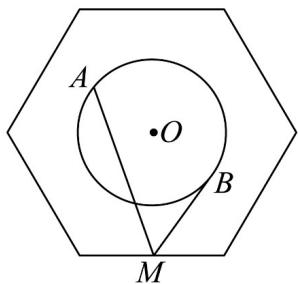
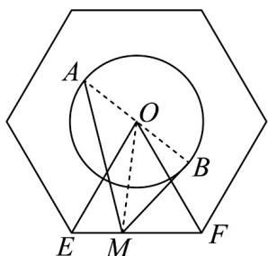

> [!faq]- 《专题6.2 平面向量的运算（高效培优讲义）》官方解析
>
> > [!success]- **【答案】**  A.9 B.10 C.11 D.12
>
> > [!note]- **【解析】**
> > 如下图所示，连接 $OE$ 、 $OF$ 、 $AB$ 、 $OM$ ，则 $O$ 为 $AB$ 的中点，则 $\angle EOF = 60^{\circ}$ ，且 $\left|OE\right| = \left|OF\right|$ ，故 $\triangle EOF$ 是边长为 $2\sqrt{3}$ 的等边三角形，
> >
> > 
> >
> > 易知 $\left|OA\right|=1$ ，则 $MA\cdot MB=\left(MO+OA\right)\cdot\left(MO+OB\right)=\left(MO+OA\right)\cdot\left(MO-OA\right)$ $=\left|MO\right|^{2}-\left|OA\right|^{2}=\left|MO\right|^{2}-1\leq\left|OE\right|^{2}-1=12-1=11$
> >
> > 当且仅当 M 与正六边形的顶点重合时， $MA \cdot MB$ 取最大值11.
> >
> > 故选 **C**.
