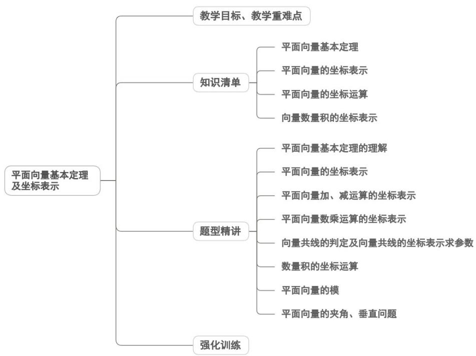

<!-- source-part:1 pages:1-50 -->

## 专题6.3 平面向量基本定理及坐标表示

## 内容概览

## 教学目标、教学重难点

<table><tr><td>教学目标</td><td>1.理解平面向量基本定理的核心内涵,明确“同一平面内两个不共线向量可作为基底”的前提条件,掌握向量线性表示的唯一性特征。2.掌握向量正交分解的方法,能将任意向量分解为两个互相垂直的向量,理解正交分解的合理性与简便性。3.熟练掌握平面向量的坐标表示规则,明确向量坐标与平面直角坐标系中点坐标的对应关系(起点在原点时向量坐标等于终点坐标)。4.能进行向量坐标的加、减、数乘运算,掌握向量共线、垂直的坐标表示条件,会用坐标求解向量夹角与模长。</td></tr><tr><td>教学重难点</td><td>1.重点平面向量的正交分解与坐标表示:掌握正交分解的操作方法,明确向量坐标的定义及几何意义,能准确写出向量的坐标。2.难点数形结合思想的灵活运用:在解决实际问题时,难以快速实现“几何图形→向量表示→坐标运算→几何结论”的转化链条。</td></tr></table>

## 知识清单

## 知识点 01 平面向量基本定理

## 1、平面向量基本定理

如果 $e_1, e_2$ 是同一平面内两个不共线的向量，那么对于这个平面内任一向量 $a$ ，有且只有一对实数 $\lambda_1, \lambda_2$ ，使 $a = \lambda_1 e_1 + \lambda_2 e_2$ ，称 $\lambda_1 e_1 + \lambda_2 e_2$ 为 $e_1, e_2$ 的线性组合。

(1) 其中 $e_{1}, e_{2}$ 叫做表示这一平面内所有向量的基底；

(2) 平面内任一向量都可以沿两个不共线向量 $e_1, e_2$ 的方向分解为两个向量的和，并且这种分解是唯一的。
这说明如果 $a = \lambda_{1}^{u} e_{1} + \lambda_{2}^{u} e_{2}$ 且 $a = \lambda_{1}^{u} e_{1} + \lambda_{2}^{u} e_{2}$ ，那么 $\lambda_{1} = \lambda_{1}^{\prime}, \lambda_{2} = \lambda_{2}^{\prime}$ .

（3）当基底 $e_1, e_2$ 是两个互相垂直的单位向量时，就建立了平面直角坐标系，因此平面向量基本定理实际上

是平面向量坐标表示的基础。

## 2、如何使用平面向量基本定理

平面向量基本定理反映了平面内任意一个向量可以写成任意两个不共线的向量的线性组合.

（1）由平面向量基本定理可知，任一平面直线形图形，都可以表示成某些向量的线性组合，这样在解答几何

问题时，就可以先把已知和结论表示为向量的形式，然后通过向量的运算，达到解题的目的。

$$
\begin{array}{c} \sqcup \\ e _ {1} \end{array}
$$

（2）在解具体问题时，要适当地选取基底，使其他向量能够用基底来表示．选择了不共线的两个向量 $e_{1}$ 、 $e_{2}$ ，平面上的任何一个向量a都可以用 $e_{1}$ 、 $e_{2}$ 唯一表示为 $a=\lambda_{1}e_{1}\pm\lambda_{2}e_{2}$ ，这样几何问题就转化为代数问题，转化为只含有 $e_{1}$ 、 $e_{2}$ 的代数运算．

## 【即学即练】

1．如图：在平行四边形ABCD中，M、N分别为边AB、AD上的点，且 $\overline{AM}=\frac{3}{4}\overline{AB}$ ， $\overline{AN}=\frac{2}{3}\overline{AD}$ ，连接AC，MN交于点P，若 $\overline{AP}=\lambda\overline{AC}$ ，则 $\lambda=$ \_\_\_\_。

【答案】

【答案】 $\frac{6}{17}$

【详解】由题意可得， $AP = \lambda AC = \lambda AB + \lambda AD$

因为 M, N, P 三点共线，所以设 $\overline{MP} = \mu \overline{MN}$

则 $\frac{\square\square\square}{MP} = \mu MN = \mu \left( \frac{\square\square\square}{AN} - \frac{\square\square\square\square}{AM} \right) = \mu \left( \frac{2}{3} AD - \frac{3}{4} AB \right)$

则 $\overrightarrow{AP} = \overrightarrow{AM} +\overrightarrow{MP} = \frac{3}{4}\overrightarrow{AB} +\mu \left(\frac{2}{3}\overrightarrow{AD} -\frac{3}{4}\overrightarrow{AB}\right) = \frac{2}{3}\mu \overrightarrow{AD} +\left(\frac{3}{4} -\frac{3}{4}\mu\right)\overrightarrow{AB}$

由平面向量基本定理可得， $\frac{2}{3}\mu=\frac{3}{4}-\frac{3}{4}\mu=\lambda$ ，得 $\lambda=\frac{6}{17}$

故答案为： $\frac{6}{17}$

2. 如图，在 $\mathrm{V}ABC$ 中， $\overline{AN} = 2NC$ ， $P$ 是 $BN$ 上一点，若 $\overline{AP} = tAB + \frac{1}{3} AC$ ，则实数 $t$ 的值为（）

【答案】

A. $\frac{1}{2}$ B. $\frac{1}{3}$ C. $\frac{1}{4}$ D. $\frac{1}{6}$

【答案】A

【详解】∵ $AN = 2NC$

$$
\therefore A N = 2 \left(A C - A N\right)
$$

$$
\therefore A C = \frac {3}{2} A N
$$

$$
\because A P = t A B + \frac {1}{3} A C
$$

$$
\therefore A P = t A B + \frac {1}{3} \times \frac {3}{2} A N = t A B + \frac {1}{2} A N
$$

$\because P_{是线段}BN$ 上一点，

∴ B, P, N
三点共线，

$$
\therefore t + \frac {1}{2} = 1
$$

解得 $t=\frac{1}{2}$ .

故选A.

## 知识点 02 平面向量的坐标表示

1、正交分解

把一个向量分解为两个互相垂直的向量，叫做把向量正交分解．如果基底的两个基向量 $e_{1}$ 、 $e_{2}$ 互相垂直，则

$$
\begin{array}{c c} \sqcup & \sqcup \\ e _ {1} & e _ {2} \end{array}
$$

称这个基底为正交基底，在正交基底下分解向量，叫做正交分解，事实上，正交分解是平面向量基本定理的

特殊形式.

## 2、平面向量的坐标表示

如图，在平面直角坐标系内，分别取与 $x$ 轴、 $y$ 轴方向相同的两个单位向量 $i$ 、 $j$ 作为基底，对于平面上的

一个向量 $a$ ，由平面向量基本定理可知，有且只有一对实数 $x,y$ ，使得 $a = xi + yj$ 。这样，平面内的任一向量

$a$ 都可由 $x,y$ 唯一确定，我们把有序数对 $(x,y)$ 叫做向量 $a$ 的（直角）坐标，记作 $a = (x,y)$ ， $x$ 叫做 $a$ 在 $x$ 轴

上的坐标， $y$ 叫做 $a$ 在 $y$ 轴上的坐标。把 $a = (x, y)$ 叫做向量的坐标表示。给出了平面向量的直角坐标表示，

在平面直角坐标系内，每一个平面向量都可以用一有序数对唯一表示，从而建立了向量与实数的联系，为向

量运算数量化、代数化奠定了基础，沟通了数与形的联系。

（1）由向量的坐标定义知，两向量相等的充要条件是它们的坐标相等，即 $a = b \Leftrightarrow x_{1} = x_{2}$ 且 $y_{1} = y_{2}$ ，其中 $a = (x_{1},y_{1})$ ， $b = (x_{2},y_{2})$

(2) 要把点的坐标与向量坐标区别开来。相等的向量的坐标是相同的，但始点、终点的坐标可以不同。比如，若 $A(2,3)$ ， $B(5,8)$ ，则 $AB = (3,5)$ ；若 $C(-4,3)$ ， $D(-1,8)$ ，则 $CD = (3,5)$ ， $AB = CD$ ，显然 $A$ 、 $B$ 、 $C$ 、 $D$ 四点坐标各不相同。

(3) $(x, y)$ 在直角坐标系中有双重意义，它既可以表示一个固定的点，又可以表示一个向量。

## 【即学即练】

1．已知点 $A(-1,3)$ ， $B(1,2)$ ，则 $AB=(\quad)$ A. $(-2,-1)$ B. $(-2,1)$ C. $(-1,2)$ D. $(2,-1)$

【答案】D

【详解】由点 $A(-1,3)$ ， $B(1,2)$ ，得 $AB=(2,-1)$

故选：D

2．已知 $A(2,-1), B(3,1)$ ，记 AB 的相反向量为 a，则（）

【答案】
A. $a = (-1, -2)$ B. $a = (1, 2)$ C. $a = (-1, 2)$ D. $a = (1, -2)$

【答案】A

【详解】因为 $A(2, - 1),B(3,1)$ ，所以 $AB = (3,1) - (2, - 1) = (1,2)$

所以它的相反向量 $a = -\overline{AB} = (-1, -2)$

故选：A.

## 知识点 03 平面向量的坐标运算

## 1、平面向量坐标的加法、减法和数乘运算

<table><tr><td>运算</td><td>坐标语言</td></tr><tr><td>加法与减法</td><td> $\text{记}^{OA = (x_1, y_1)}$ ,  $OB = (x_2, y_2)$  $OA + OB = (x_1 + x_2, y_1 + y_2)$ ,  $OB - OA = (x_2 - x_1, y_2 - y_1)$ </td></tr><tr><td>实数与向量的乘积</td><td> $\text{记} a = (x, y)$ , 则  $\lambda a = (\lambda x, \lambda y)$ </td></tr></table>

2、如何进行平面向量的坐标运算

在进行平面向量的坐标运算时，应先将平面向量用坐标的形式表示出来，再根据向量的直角坐标运算法则进

行计算．在求一个向量时，可以首先求出这个向量的起点坐标和终点坐标，再运用终点坐标减去起点坐标得

到该向量的坐标．求一个点的坐标，可以转化为求该点相对于坐标原点的位置向量的坐标．但同时注意以下

几个问题：

（1）点的坐标和向量的坐标是有区别的，平面向量的坐标与该向量的起点、终点坐标有关，只有起点在原点

时，平面向量的坐标与终点的坐标才相等。

(2) 进行平面向量坐标运算时，先要分清向量坐标与向量起点、终点的关系.

(3) 要注意用坐标求向量的模与用两点间距离公式求有向线段的长度是一样的.

（4）要清楚向量的坐标与表示该向量的有向线段的起点、终点的具体位置无关，只与其相对位置有关。

## 【即学即练】

1．如果用 i，j 分别表示 x 轴和 y 轴正方向上的单位向量，且 $A(2,3)$ ， $B(3,m)$ ，若 AB = i - 3j，则 m =

( )

A. -1 B. 1 C. 2 D. 0

【答案】D

【详解】用 i，j 分别表示 x 轴和 y 轴正方向上的单位向量，则 $i = (1,0)$ ， $j = (0,1)$ ，且 $A(2,3)$ ， $B(3,m)$ ，若 $AB = (1,m-3)$ ， $i - 3j = (1,-3)$ ，

则 $m - 3 = -3$ ，则 $m = 0$

故选：D.

2. 已知平面向量 $a = (2, -3)$ ， $b = (3, m)$ ， $m \in \mathbf{R}$ .

(1)若 $c = (7, - 5)$ ，且 $c = xa + b$ ，求 $x$ 和 $m$ 的值；

(2)若 $a / / b$ ，求 $\left|a + 2b\right|$ 的值.

【答案】(1) $x = 2, m = 1$

(2) $4\sqrt{13}$

【详解】（1）因为平面向量 $a = (2, - 3)$ ， $b = (3,m)$ ， $c = (7, - 5)$ ，且 $c = xa + b$

所以 $c = xa + b = x(2, -3) + (3, m) = (2x + 3, m - 3x) = (7, -5)$ .

则有 $\left\{ \begin{array}{l} 2x + 3 = 7 \\ m - 3x = -5 \end{array} \right.$ ，解得 $\left\{ \begin{array}{l} x = 2 \\ m = 1 \end{array} \right.$ .

(2) 因为平面向量 $a = (2, -3)$ ， $b = (3, m)$ ，a // b

所以 $\frac{3}{2} = \frac{m}{-3}$ ，解得 $m = -\frac{9}{2}$ ，所以向量 $a = (2, - 3)$

所以 $\vec{a} + 2\vec{b} = (2, -3) + 2\left(3, -\frac{9}{2}\right) = (8, -12)$

所以 $\left|a+2b\right|=\sqrt{64+144}=4\sqrt{13}$

## 知识点 04 向量数量积的坐标表示

1、已知两个非零向量 $a = (x_{1},y_{1})$ ， $b = (x_2,y_2)$ ， $a\cdot b = x_1x_2 + y_1y_2$

2、设 $a=(x,y)$ ，则 $\left|a\right|^{2}=x^{2}+y^{2}$ 或 $\left|a\right|=\sqrt{x^{2}+y^{2}}$

3、如果表示向量 $a$ 的有向线段的起点和终点的坐标分别为 $(x_{1},y_{1})$ 、 $(x_{2},y_{2})$ ，那么 $|a| = \sqrt{(x_1 - x_2)^2 + (y_1 - y_2)^2}$

(平面内两点间的距离公式).

【即学即练】

1. 在平面直角坐标系中， $M(-2,0), N(-3,1), P(-1,3)$ ，设 $a = MN, b = MP$

(1)若 $\left(a + mb\right)\perp a$ ，求 $m$ 的值；

(2)若向量 $c$ 满足 $\left|c\right| = 6$ ，且 $c / / (b - a)$ ，求向量 $c$ 的坐标.

【答案】(1) $m = -1$

$$
(2) \left(3 \sqrt {2}, 3 \sqrt {2}\right) _ {\text {或}} \left(- 3 \sqrt {2}, - 3 \sqrt {2}\right)
$$

【详解】（1）由题意得， $a = MN = (-1, 1)$ ， $b = MP = (1, 3)$

则 $a^2 = 1 + 1 = 2, b \cdot a = -1 + 3 = 2$

又 $\left(a + mb\right) \perp a$ ，所以 $\left(a + mb\right) \cdot a = a^2 + mb \cdot a = 2 + 2m = 0$ ，得 $m = -1$ ；

(2) 设 $c = (x, y)$ ，则 $\left|c\right| = \sqrt{x^{2} + y^{2}} = 6$ ，即 $x^{2} + y^{2} = 36$

因为 $b - a = (1,3) - (-1,1) = (2,2)$ ， $c // (b - a)$ ，所以 $2x = 2y$ ，即 $x = y$

故 $x = y = 3\sqrt{2}$ 或 $x = y = -3\sqrt{2}$

故向量 c 的坐标为 $\left(3\sqrt{2},3\sqrt{2}\right)$ 或 $\left(-3\sqrt{2},-3\sqrt{2}\right)$ .

2. 已知向量 $a = (1, 2)$ ， $b = (-1, 1)$ ，则（）A. $b \cdot (a + b) = 3$ B. $(2a + b) // (a + 2b)$ C. 向量 $2a - b$ 与 $a - 2b$ 的夹角为 $\frac{\pi}{4}$ D. 向量 $a$ 在 $b$ 方向上的投影向量为 $\frac{1}{3} b$

【答案】AC

【详解】对于 A， $a + b = (1 - 1, 2 + 1) = (0, 3)$

$b \cdot (a + b) = (-1) \times 0 + 1 \times 3 = 3$ ，故 A 正确；

对于 B， $2a + b = 2(1,2) + (-1,1) = (1,5)$

$$
a + 2 b = (1, 2) + 2 (- 1, 1) = (- 1, 4)
$$

因为 $1 \times 4 - (-1) \times 5 = 4 + 5 = 9 \neq 0$

所以 $2a + b$ 与 $a + 2b$ 不平行，故 B 错误；

对于 C，设向量 2a - b 与 a - 2b 的夹角为 $\theta$

$$
2 a - b = 2 (1, 2) - (- 1, 1) = (3, 3)
$$

$$
a - 2 b = (1, 2) - 2 (- 1, 1) = (3, 0)
$$

$$
\cos \theta = \frac {(2 a - b) \cdot (a - 2 b)}{| 2 a - b | \cdot | a - 2 b |} = \frac {3 \times 3}{3 \sqrt {2} \times 3} = \frac {\sqrt {2}}{2},
$$

又 $\theta \in [0,\pi ]$ ，所以 $\theta = \frac{\pi}{4}$ ，故C正确；

对于 D，设 a 和 b 的夹角为 $\beta$ ，

则向量 $_{a}$ 在 $_{b}$ 方向上的投影向量为 $\frac{b}{|b|}\cdot\overrightarrow{|a|}\cos\beta=\frac{b}{|b|}\cdot|a|\cdot\frac{a\cdot b}{|a|\cdot|b|}=\frac{a\cdot b}{|b|^{2}}\overrightarrow{b}$ ，

$a\cdot b = 1\times (-1) + 2\times 1 = 1$ ， $\left|b\right|^2 = (-1)^2 +1^2 = 2$

则 $\frac{a\cdot b}{|b|^2}\vec{b} = \frac{1}{2} b$ ，故D错误.

故选：AC.

## 题型精讲

![[高中/课堂同步/题库/人教A版高中数学同步讲义(2026)/02_必修第二册/第六章 平面向量及其应用/专题6.3 平面向量基本定理及坐标表示（高效培优讲义）/题型01_平面向量基本定理的理解/题型01_平面向量基本定理的理解.md]]
![[高中/课堂同步/题库/人教A版高中数学同步讲义(2026)/02_必修第二册/第六章 平面向量及其应用/专题6.3 平面向量基本定理及坐标表示（高效培优讲义）/题型02_平面向量的坐标表示/题型02_平面向量的坐标表示.md]]
![[高中/课堂同步/题库/人教A版高中数学同步讲义(2026)/02_必修第二册/第六章 平面向量及其应用/专题6.3 平面向量基本定理及坐标表示（高效培优讲义）/题型03_平面向量加_减运算的坐标表示/题型03_平面向量加_减运算的坐标表示.md]]
![[高中/课堂同步/题库/人教A版高中数学同步讲义(2026)/02_必修第二册/第六章 平面向量及其应用/专题6.3 平面向量基本定理及坐标表示（高效培优讲义）/题型04_平面向量数乘运算的坐标表示/题型04_平面向量数乘运算的坐标表示.md]]
![[高中/课堂同步/题库/人教A版高中数学同步讲义(2026)/02_必修第二册/第六章 平面向量及其应用/专题6.3 平面向量基本定理及坐标表示（高效培优讲义）/题型05_向量共线的判定及向量共线的坐标表示求参数/题型05_向量共线的判定及向量共线的坐标表示求参数.md]]
![[高中/课堂同步/题库/人教A版高中数学同步讲义(2026)/02_必修第二册/第六章 平面向量及其应用/专题6.3 平面向量基本定理及坐标表示（高效培优讲义）/题型06_数量积的坐标运算/题型06_数量积的坐标运算.md]]
![[高中/课堂同步/题库/人教A版高中数学同步讲义(2026)/02_必修第二册/第六章 平面向量及其应用/专题6.3 平面向量基本定理及坐标表示（高效培优讲义）/题型07_平面向量的模/题型07_平面向量的模.md]]
![[高中/课堂同步/题库/人教A版高中数学同步讲义(2026)/02_必修第二册/第六章 平面向量及其应用/专题6.3 平面向量基本定理及坐标表示（高效培优讲义）/题型08_平面向量的夹角_垂直问题/题型08_平面向量的夹角_垂直问题.md]]
![[高中/课堂同步/题库/人教A版高中数学同步讲义(2026)/02_必修第二册/第六章 平面向量及其应用/专题6.3 平面向量基本定理及坐标表示（高效培优讲义）/强化训练/强化训练.md]]
