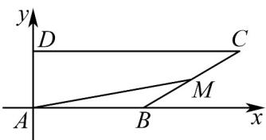

> [!faq]- 《专题6.3 平面向量基本定理及坐标表示（高效培优讲义）》官方解析
>
> > [!success]- **【答案】** [1,3]
>
> > [!note]- **【解析】**
> > 以 $A$ 为原点，以 $AB, AD$ 所在直线为 $x, y$ 轴建立平面直角坐标系，
> >
> > 设 AB = a, AD = b，则 $A(0,0)$ , $B(a,0)$ , $C(2a,b)$ , $D(0,b)$ .
> >
> > 则 $\overline{AB}=(a,0),\overline{BC}=(a,b),\overline{AD}=(0,b)$ ，因为 $\overline{AM}=x\overline{AB}+y\overline{AD}$
> >
> > 所以 $\overline{AM}=x\overline{AB}+y\overline{AD}=x(a,0)+y(0,b)=(ax,by)$ ，设 $\overline{BM}=\lambda\overline{BC},(0\leq\lambda\leq1)$
> >
> > 则 $AM = AB + BM = (a,0) + \lambda (a,b) = ((1 + \lambda)a,\lambda b)$ .
> >
> > 所以 $\left\{\begin{aligned}x&=1+\lambda\\ y&=\lambda\end{aligned}\right.$ ，所以 $x+y=1+2\lambda$ .
> >
> > 因为 $0 \leq \lambda \leq 1$ ，所以 $1 \leq 1 + 2\lambda \leq 3$ ，即 $x + y$ 的取值范围是 $[1,3]$ 。故答案为： $[1,3]$ 。
> >
> > 
