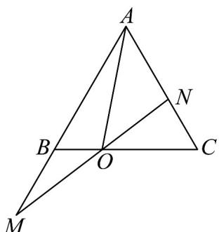

> [!faq]- 《专题6.3 平面向量基本定理及坐标表示（高效培优讲义）》官方解析
>
> > [!success]- **【答案】** C
>
> > [!note]- **【解析】**
> > 
> >
> > 由 $2\overline{BO} = \overline{OC}$ ，得 $2(AO - AB) = AC - AO$ ，则 $\overline{AO} = \frac{2}{3} AB + \frac{1}{3} AC$ 又 $AB = mAM, AC = nAN$ ，则 $\overline{AO} = \frac{2m}{3} AM + \frac{n}{3} AN$ 又 $M,O,N$ 共线，因此 $\frac{2m}{3} +\frac{n}{3} = 1$ ，即 $2m + n = 3$
> >
> > 故选 **C**
