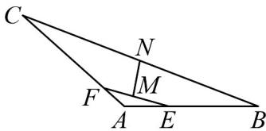

<!-- question-source:start -->
【变式1】如图，在VABC中，已知 $AB = 2\sqrt{2}, AC = 3, \angle A = 135^{\circ}$ ， $AE = xAB, AF = yAC$ ，且

$x + 3y = 1(x > 0,y > 0)$ ，若线段 $EF,BC$ 的中点分别为 $M,N$ ，则 $\left|\frac{MN}{MN}\right|$ 的最小值为

<!-- question-source:end -->

![[高中/课堂同步/题库/人教A版高中数学同步讲义(2026)/02_必修第二册/第六章 平面向量及其应用/专题6.3 平面向量基本定理及坐标表示（高效培优讲义）/题型01_平面向量基本定理的理解/questions/answers/Q00078442A1.md]]
