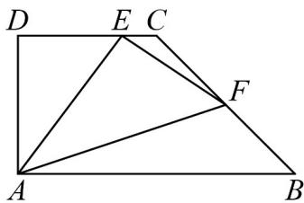

<!-- question-source:start -->
【变式3】在直角梯形ABCD中，已知 $\overline{AB}=2\overline{DC}$ ， $AD\perp AB$ ， $\left|\overline{AD}\right|=\left|\overline{CD}\right|=1$ ，动点E、F分别在线段DC和BC上，且 $\overline{BF}=\lambda\overline{BC}$ ， $\overline{DE}=(1-\lambda)\overline{DC}$ 。

(1)当 $\lambda = \frac{2}{3}$ 时，求 $\overline{AC}.\overline{EF}$ 的值；

(2)求 $\left|\frac{AE}{2}\frac{AF}{EF}\right|$ 的取值范围.
<!-- question-source:end -->

![[高中/课堂同步/题库/人教A版高中数学同步讲义(2026)/02_必修第二册/第六章 平面向量及其应用/专题6.3 平面向量基本定理及坐标表示（高效培优讲义）/题型01_平面向量基本定理的理解/questions/answers/Q00078444A1.md]]
