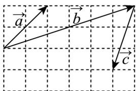

<!-- question-source:start -->
【典例1】向量 $a$ ， $b$ ， $c$ 在正方形网格中的位置如图所示，若 $c = \lambda a + \mu b(\lambda ,\mu \in \mathrm{R})$ ，则 $\frac{\lambda}{\mu} =$

<!-- question-source:end -->

![[高中/课堂同步/题库/人教A版高中数学同步讲义(2026)/02_必修第二册/第六章 平面向量及其应用/专题6.3 平面向量基本定理及坐标表示（高效培优讲义）/题型03_平面向量加_减运算的坐标表示/questions/answers/Q00078449A1.md]]
