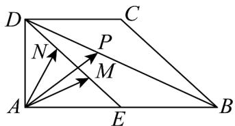

<!-- question-source:start -->
【变式3】如图，在直角梯形ABCD中， $AB \perp AD$ ， $AB = 2DC$ ，E为AB的中点，M，N分别为线段DE的两

个三等分点，点 $P$ 为线段 $BD$ 上的任意一点，若 $\overline{AP} = \overline{\lambda AM} +\overline{\mu AN}$ ，则 $\lambda -\mu$ 的值不可能是（）

A. -5 B. 3 C. 7 D. 9
<!-- question-source:end -->

![[高中/课堂同步/题库/人教A版高中数学同步讲义(2026)/02_必修第二册/第六章 平面向量及其应用/专题6.3 平面向量基本定理及坐标表示（高效培优讲义）/题型03_平面向量加_减运算的坐标表示/questions/answers/Q00078452A1.md]]
