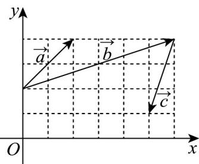

> [!faq]- 《专题6.3 平面向量基本定理及坐标表示（高效培优讲义）》官方解析
>
> > [!success]- **【答案】** -4
>
> > [!note]- **【解析】**
> > 如图建立平面直角坐标系，
> >
> > 
> >
> > 则 $a = (2,2), b = (6,2), c = (-1, -3)$ ，又 $c = \lambda a + \mu b (\lambda, \mu \in \mathbb{R})$
> >
> > 所以 $\left\{ \begin{array}{l} 2\lambda + 6\mu = -1 \\ 2\lambda + 2\mu = -3 \end{array} \right. \Rightarrow \left\{ \begin{array}{l} \lambda = -2 \\ \mu = \frac{1}{2} \end{array} \right.$
> >
> > 则 $\frac{\lambda}{\mu} = -4$
> >
> > 故答案为：-4.
> >
> > ## 方法技巧
> >
> > 平面向量坐标运算的技巧
> >
> > (1) 若已知向量的坐标，则直接应用两个向量和、差的运算法则进行。
> >
> > (2) 若已知有向线段两端点的坐标，则可先求出向量的坐标，然后再进行向量的坐标运算.
