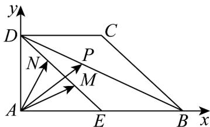

> [!faq]- 《专题6.3 平面向量基本定理及坐标表示（高效培优讲义）》官方解析
>
> > [!success]- **【答案】** ACD
>
> > [!note]- **【解析】**
> > 由题可建立如图以 $A$ 为坐标原点的平面直角坐标系，
> >
> > 
> >
> > 则 $AB = 6$ ，不妨设 $AD = 3m, m > 0$ ，则 $A(0,0), B(6,0), D(0,3m), E(3,0), M(2,m), N(1,2m)$
> >
> > 则 $AM = (2,m),AN = (1,2m),BD = (-6,3m),AB = (6,0)$
> >
> > 设 $\overline{BP}=x\overline{BD},0\leq x\leq1$ ，则 $\overline{AP}=AB+x\overline{BD}=(6-6x,3mx)$
> >
> > 因为 $AP = \lambda AM + \mu AN$ ，所以 $(6 - 6x,3mx) = \lambda (2,m) + \mu (1,2m) = (2\lambda +u,m\lambda +2m\mu)$
> >
> > 所以 $\left\{ \begin{array}{l}6 - 6x = 2\lambda +u\\ 3mx = m\lambda +2mu \end{array} \right.$ ，整理得 $\lambda -\mu = 6 - 9x$
> >
> > 因为 $0 \leq x \leq 1$ ，所以 $\lambda - \mu = 6 - 9x \in [-3, 6]$ .
> >
> > 故选 **ACD**
