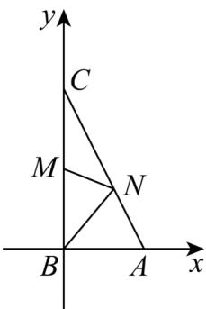

> [!faq]- 《专题6.3 平面向量基本定理及坐标表示（高效培优讲义）》官方解析
>
> > [!success]- **【答案】** $\frac{15}{4}/3.75$
>
> > [!note]- **【解析】**
> > 由 $AB = 4$ ， $AC = 8$ ， $\angle BAC = 60^{\circ}$
> >
> > 所以 $\left|\overline{BC}\right|=\left|\overline{AC}-\overline{AB}\right|=\sqrt{\left(\overline{AC}-\overline{AB}\right)^{2}}=\sqrt{\overline{AC}^{2}+\overline{AB}^{2}-2\overline{AC}\cdot\overline{AB}}$ $=\sqrt{64+16-2\times4\times8\times\frac{1}{2}}=4\sqrt{3}$
> >
> > 所以 $AB^{2} + BC^{2} = AC^{2}$ ，所以 $AB \perp BC$ ，
> >
> > 如图，以点 B 为原点，建立平面直角坐标系，
> >
> > 则 $A(4,0),B(0,0),C(0,4\sqrt{3}),M(0,2\sqrt{3})$ ，设 $\overline{AN} = \lambda \overline{AC}\big(0\leq \lambda \leq 1\big)$
> >
> > 则 $AN = \lambda AC = \lambda (-4, 4\sqrt{3}) = (-4\lambda, 4\sqrt{3}\lambda), BM = (0, 2\sqrt{3}), BA = (4, 0)$
> >
> > 故 $\overline{BN} = \overline{BA} +\overline{AN} = (-4\lambda +4,4\sqrt{3}\lambda)$ $M N = B N - B M = (-4\lambda +4,4\sqrt{3}\lambda -2\sqrt{3})$
> >
> > 所以 $MN \cdot BN = (-4\lambda + 4)^{2} + 4\sqrt{3}\lambda (4\sqrt{3}\lambda - 2\sqrt{3}) = 64\lambda^{2} - 56\lambda + 16$
> >
> > 当 $\lambda = \frac{7}{16}$ 时， $MN \cdot BN$ 取得最小值 $\frac{15}{4}$
> >
> > 所以 $MN \cdot BN$ 的最小值为 $\frac{15}{4}$ .
> >
> > 故答案为： $\frac{15}{4}$
> >
> > 
> >
> > ## 方法技巧
> >
> > 进行数量积运算时，要正确使用公式 $a \cdot b = x_{1}x_{2} + y_{1}y_{2}$ ，并能灵活运用以下几个关系。
