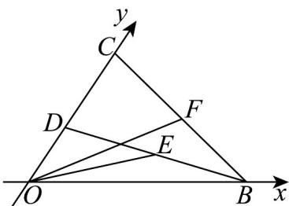

<!-- question-source:start -->
【变式2】如图，设 $Ox$ ， $Oy$ 是平面内相交成 $\alpha (0 < \alpha < \pi)$ 角的两条射线， $e_1$ ， $e_2$ 分别为与 $Ox$ ， $Oy$ 同向的单

位向量，定义平面坐标系 $xOy$ 为 $\alpha-$ 仿射坐标系，在 $\alpha-$ 仿射坐标系中，若 $OP = xe_1 + ye_2$ ，则记 $OP = (x,y)$

(1)若 $\cos \alpha = -\frac{1}{3}$ ，在 $\alpha-$ 仿射坐标系中， $a = (2, -1)$ ， $b = (-1, 1)$ ，求 $a - b$ ；

(2)在 $\alpha -$ 仿射坐标系中，若 $a = (-1,\sqrt{3})$ ，且 $_a$ 与 $e_1$ 的夹角为 $\frac{\pi}{3}$ ，求 $\alpha$

(3)如图，在 $\frac{\pi}{3}^{-}$ 仿射坐标系中，点 $B$ ， $C$ 分别在射线 $Ox$ 、射线 $Oy$ 上（均与点 $O$ 不重合）， $B\Phi = 1$

$\overline{OD}=\frac{7}{19}\overline{OC}$ ，E，F分别为 $BD,BC$ 的中点，求 $OE\cdot OF$ 的最大值.
<!-- question-source:end -->

![[高中/课堂同步/题库/人教A版高中数学同步讲义(2026)/02_必修第二册/第六章 平面向量及其应用/专题6.3 平面向量基本定理及坐标表示（高效培优讲义）/题型07_平面向量的模/questions/answers/Q00078467A1.md]]
