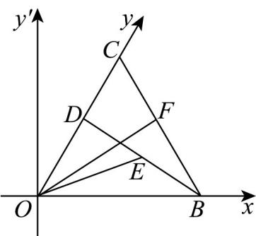

> [!faq]- 《专题6.3 平面向量基本定理及坐标表示（高效培优讲义）》官方解析
>
> > [!success]- **【答案】** (1) $\sqrt{17}$ (2) $\alpha = \frac{\pi}{6}$ ; (3) $\frac{121}{228}$
>
> > [!note]- **【解析】**
> > （1） $\cos \alpha = -\frac{1}{3}$ ，则 $\sin a = \frac{2\sqrt{2}}{3}$
> >
> > 如图，以 $O$ 为原点构造直角坐标系 $xOy'$
> >
> > 
> >
> > 在直角坐标系 $xOy'$ 中，当 $\cos \alpha = -\frac{1}{3}$ 时，记 $e_1 = (1,0)$ ，则 $\vec{e}_2 = (-\frac{1}{3}, \frac{2\sqrt{2}}{3})$
> >
> > 在 $\alpha -$ 仿射坐标系中， $a = (2, - 1)$ ， $b = (-1,1)$
> >
> > $$
> > \vec {a} = 2 \vec {e} _ {1} - \vec {e} _ {2} = 2 (1, 0) - \left(- \frac {1}{3}, \frac {2 \sqrt {2}}{3}\right) = \left(\frac {7}{3}, - \frac {2 \sqrt {2}}{3}\right)
> > $$
> >
> > $$
> > \vec {b} = - \vec {e _ {1}} + \vec {e _ {2}} = - (1, 0) + \left(- \frac {1}{3}, \frac {2 \sqrt {2}}{3}\right) = \left(- \frac {4}{3}, \frac {2 \sqrt {2}}{3}\right)
> > $$
> >
> > 所以 $\left|\vec{a}-\vec{b}\right|=\left(\frac{11}{3},\frac{-4\sqrt{2}}{3}\right)=\sqrt{\left(\frac{11}{3}\right)^{2}+\left(-\frac{4\sqrt{2}}{3}\right)^{2}}=\sqrt{17}$
> >
> > (2) 在直角坐标系 $xOy'$ 中，记 $e_1^{\square} = (1,0)$ ，则 $e_2^{\square} = (\cos \alpha, \sin \alpha)$
> >
> > 在 $\alpha$ -仿射坐标系中， $a = (-1,\sqrt{3}) = -e_1 + \sqrt{3} e_2 = (-1 + \sqrt{3}\cos \alpha ,\sqrt{3}\sin \alpha)$
> >
> > $$
> > \cos a, e _ {1} = \frac {a \cdot e _ {1}}{| a | | e _ {1} |} = \frac {- 1 + \sqrt {3} \cos \alpha}{\sqrt {(- 1 + \sqrt {3} \cos \alpha) ^ {2} + 3 \sin^ {2} \alpha}} = \cos \frac {\pi}{3} = \frac {1}{2}
> > $$
> >
> > 解得 $\cos\alpha=0$ （舍去）或 $\cos\alpha=\frac{\sqrt{3}}{2}$ ，所以 $\alpha=\frac{\pi}{6}$ ；
> >
> > (3) 在直角坐标系 $xOy'$ 中， $\vec{e}_{1}=(1,0),\vec{e}_{2}=(\cos\frac{\pi}{3},\sin\frac{\pi}{3})=(\frac{1}{2},\frac{\sqrt{3}}{2})$
> >
> > 设 $\overrightarrow{OB}=me_{1}=(m,0)$ ， $\overrightarrow{OC}=ne_{2}=(\frac{1}{2}n,\frac{\sqrt{3}}{2}n)$ ，m>0,n>0，即 $\left|OB\right|=m,\left|OC\right|=n$
> >
> > 则 $\left|\overrightarrow{BC}\right|=\sqrt{m^{2}+n^{2}-2mn\cos\frac{\pi}{3}}=1$ ，所以 $m^{2}+n^{2}-mn=1$ ，
> >
> > $E, F$ 分别为 $BD, BC$ 的中点，
> >
> > $$
> > \text {则} \quad \overrightarrow {O E} = \frac {1}{2} (\overrightarrow {O B} + \overrightarrow {O D}) = \frac {1}{2} (m + \frac {7}{3 8} n, \frac {7 \sqrt {3}}{3 8} n), \quad \overrightarrow {O F} = \frac {1}{2} (\overrightarrow {O B} + \overrightarrow {O C}) = \frac {1}{2} (m + \frac {1}{2} n, \frac {\sqrt {3}}{2} n)
> > $$
> >
> > $$
> > \overrightarrow {O E} \cdot \overrightarrow {O F} = \frac {1}{4} \left[ (m + \frac {7}{3 8} n) (m + \frac {1}{2} n) + \frac {7 \sqrt {3}}{3 8} n \cdot \frac {\sqrt {3}}{2} n \right] = \frac {1}{4} \left(m ^ {2} + \frac {1 3}{1 9} m n + \frac {7}{1 9} n ^ {2}\right) = \frac {1}{1 9} \left(8 m ^ {2} + 5 n ^ {2}\right) - \frac {1 3}{7 6}
> > $$
> >
> > $\triangle OBC$ 中，由正弦定理 $\frac{BC}{\sin\frac{\pi}{3}}=\frac{OB}{\sin\angle BCO}=\frac{OC}{\sin\angle CBO}$ ，
> >
> > 设 $\angle BCO = \theta$ ，则 $\sin \angle CBO = \sin (\theta +\frac{\pi}{3}),\theta \in (0,\frac{2\pi}{3})$
> >
> > 所以 $m=\frac{2}{\sqrt{3}}\sin\theta,\quad n=\frac{2}{\sqrt{3}}\sin(\theta+\frac{\pi}{3})$
> >
> > $$
> > 8 m ^ {2} + 5 n ^ {2} = \frac {3 2}{3} \sin^ {2} \theta + \frac {2 0}{3} \sin^ {2} (\theta + \frac {\pi}{3}) = \frac {3 2}{3} \times \frac {1 - \cos 2 \theta}{2} + \frac {2 0}{3} \times \frac {1 - \cos (2 \theta + \frac {2 \pi}{3})}{2}
> > $$
> >
> > $$
> > = \frac {2}{3} [ 8 (1 - \cos 2 \theta) + 5 (1 + \frac {1}{2} \cos 2 \theta + \frac {\sqrt {3}}{2} \sin 2 \theta) ]
> > $$
> >
> > $= \frac{2}{3} (13 + \frac{5\sqrt{3}}{2}\sin 2\theta -\frac{11}{2}\cos 2\theta) = \frac{2}{3} (13 + 7\sin (2\theta -\varphi)]$ ，其中 $\varphi$ 为锐角，且 $\tan \varphi = \frac{11}{5\sqrt{3}}$
> >
> > 因为 $\theta \in (0, \frac{2\pi}{3})$ ，则 $-\varphi < 2\theta - \varphi < \frac{4\pi}{3} - \varphi$
> >
> > 故当 $2\theta - \varphi = \frac{\pi}{2}$ 时， $8m^2 + 5n^2$ 取得最大值 $\frac{2}{3}(13 + 7) = \frac{40}{3}$ ，
> >
> > $$
> > O E \cdot O F = \frac {1}{1 9} \left(8 m ^ {2} + 5 n ^ {2}\right) - \frac {1 3}{7 6} \leq \frac {1}{1 9} \times \frac {4 0}{3} - \frac {1 3}{7 6} = \frac {1 2 1}{2 2 8}
> > $$
