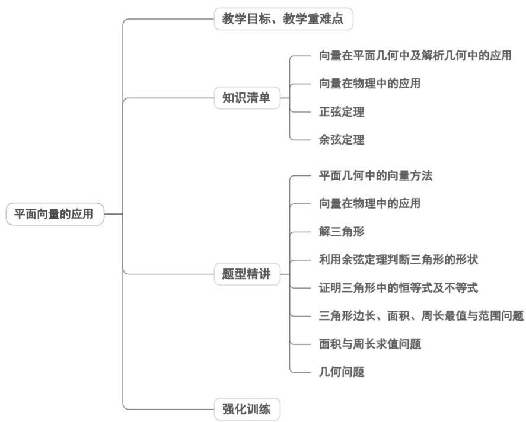
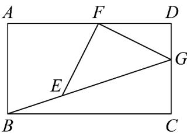
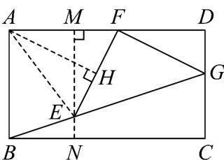
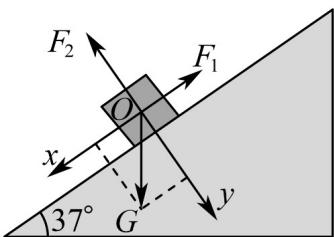
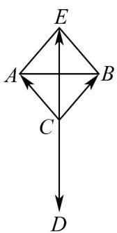
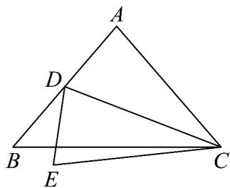

<!-- source-part:1 pages:1-50 -->

## 专题6.4 平面向量的应用

## 内容概览

## 教学目标、教学重难点

<table><tr><td>教学目标</td><td>1.理解平面向量基本定理的核心内涵,明确“同一平面内两个不共线向量可作为基底”的前提条件,掌握向量线性表示的唯一性特征。2.掌握向量正交分解的方法,能将任意向量分解为两个互相垂直的向量,理解正交分解的合理性与简便性。3.熟练掌握平面向量的坐标表示规则,明确向量坐标与平面直角坐标系中点坐标的对应关系(起点在原点时向量坐标等于终点坐标)。4.能进行向量坐标的加、减、数乘运算,掌握向量共线、垂直的坐标表示条件,会用坐标求解向量夹角与模长。</td></tr><tr><td>教学重难点</td><td>1.重点平面向量的正交分解与坐标表示:掌握正交分解的操作方法,明确向量坐标的定义及几</td></tr></table>

何意义，能准确写出向量的坐标。

2.难点

数形结合思想的灵活运用：在解决实际问题时，难以快速实现“几何图形 $\rightarrow$ 向量表示 $\rightarrow$ 坐标运算 $\rightarrow$ 几何结论”的转化链条。

## 知识清单

## 知识点 01 向量在平面几何中及解析几何中的应用

1、向量在平面几何中的应用主要有以下几个方面：

（1）证明线段相等、平行，常运用向量加法的三角形法则、平行四边形法则，有时用到向量减法的意义.

（2）证明线段平行、三角形相似，判断两直线（或线段）是否平行，常运用向量平行（共线）的条件： $a / / b \Leftrightarrow a = \lambda b$ （或 $x_{1}y_{2} - x_{2}y_{1} = 0$ ）.

（3）证明线段的垂直问题，如证明四边形是矩形、正方形，判断两直线（线段）是否垂直等，常运用向量垂

直的条件： $a \perp b \Leftrightarrow a \cdot b = 0$ （或 $x_{1}x_{2} + y_{1}y_{2} = 0$ ）.

(4) 求与夹角相关的问题，往往利用向量的夹角公式 $\cos\theta=\frac{a\cdot b}{|a|\cdot|b|}$

（5）向量的坐标法，对于有些平面几何问题，如长方形、正方形、直角三角形等，建立直角坐标系，把向量

用坐标表示，通过代数运算解决几何问题。

2、向量在解析几何中的应用

在平面直角坐标系中，有序实数对 $(x, y)$ 既可以表示一个固定的点，又可以表示一个向量，使向量与解

析几何有了密切的联系，特别是有关直线的平行、垂直问题，可以用向量方法解决。

常见解析几何问题及应对方法：

(1) 斜率相等问题：常用向量平行的性质。

(2) 垂直条件运用：转化为向量垂直，然后构造向量数量积为零的等式，最终转换出关于点的坐标的方程。

(3) 定比分点问题：转化为三点共线及向量共线的等式条件。

(4) 夹角问题：利用公式 $\cos\theta=\frac{a\cdot b_{\rightarrow}}{|a|\cdot|b|}$

## 【即学即练】

1. $a, b, c$ 起点重合， $\left|a\right| = 2\sqrt{3}, \left|b\right| = 4, < a, b >= \frac{\pi}{6}, (a - c) \cdot (b - c) = 0$ ，则 $\left|c\right|$ 的最大值为（）A. $2\sqrt{3} + 1$ B. 3 C. $\sqrt{13} - 1$ D. $\sqrt{13} + 1$

【答案】D

$a\cdot b = |a|\cdot |b|\cos < a,b > = 2\sqrt{3}\times 4\times \frac{\sqrt{3}}{2} = 12$ 【详解】由题意

$\left|a + b\right|^2 = \left|a\right|^2 +\left|b\right|^2 +2a\cdot b = 12 + 16 + 24 = 52$ ，则 $\left|a + b\right| = 2\sqrt{13}$

因为 $\left(a - c\right) \cdot \left(b - c\right) = 0$

所以 $a \cdot b - a \cdot c - b \cdot c + (c)^2 = 0$

所以 $\left(c\right)^2 = \left|c\right|^2 = -12 + c\cdot (a + b) = -12 + \left|c\right|\cdot \left|a + b\right|\cos <  c,a + b>$

所以 $\cos < c, a + b > = \frac{\left|c\right|^{2} + 12}{2\sqrt{13}\left|c\right|}$ 因为 $-1 \leq \cos < c, a + b > \leq 1$ ，所以 $-1 \leq \frac{\left|c\right|^{2} + 12}{2\sqrt{13}\left|c\right|} \leq 1$ ，

整理得 $\left|c\right|^{2}-2\sqrt{13}\left|c\right|+12\leq0$ 且 $\left|c\right|^{2}+2\sqrt{13}\left|c\right|+12\quad0$ （恒成立），

解得 $\sqrt{13} - 1 \leq |c| \leq \sqrt{13} + 1$ ，即 $|c|$ 的最大值为 $\sqrt{13} + 1$ 。

故选：D

2．如图，以矩形ABCD的顶点A为圆心，以AB长为半径作弧，交AD于点F，交BG于点E，且 $EF\perp FG$ ，

若 $DF = 2, DG = 1$ ，则 $AB$ 的长为（）

A. $\sqrt{10}$ B. $2\sqrt{5}$ C. $\frac{5}{2}$ D. $\frac{9}{4}$

【答案】C

【详解】方法一：以 A 点为坐标原点，分别以 AB、AD 方向为 x 轴正方向、y 轴正方向，建立平面直角坐标

系，

设 $|AB|=a,|AD|=b$ ，则 $A(0,0),B(a,0),D(0,b),C(a,b),F(0,b-2),G(1,b)$

圆 $A$ 的方程 $x^{2} + y^{2} = a^{2}$ ，则 $F(0,a)$ ，故 $a = b - 2$

设 $\overset{\square\square\square}{BE}=t\overset{\square\square\square}{BG}=t(1-a,b)=t(3-b,b)$ ，则 $E(3t-tb+b-2,tb)$

则 $\overline{FE} = (3t - tb + b - 2, tb - b + 2)$

因 $\left|AE\right|=a$ ，则 $(3t-tb+b-2)^{2}+(tb)^{2}=(b-2)^{2}$ ①，

因 $\stackrel{\mathrm{uuu}}{FG} = (1,2)$ ，则 $\stackrel{\mathrm{uuu}}{FG} \cdot \stackrel{\mathrm{uuu}}{FE} = 3t - tb + b - 2 + 2tb - 2b + 4 = 3t + tb - b + 2 = 0$

则 $t = \frac{b - 2}{b + 3}$ ，将其代入①式得 $\left(3\cdot \frac{b - 2}{b + 3} -b\cdot \frac{b - 2}{b + 3} +b - 2\right)^2 +\left(b\cdot \frac{b - 2}{b + 3}\right)^2 = (b - 2)^2$

即 $(b - 2)^{2}(6b - 27) = 0$ ，得 $b = 2$ （舍，此时 $a = 0$ ）或 $b = \frac{9}{2}$ ，则 $\left|AB\right| = a = b - 2 = \frac{5}{2}$

方法二：因 $DF = 2, DG = 1$ ，则在 $\mathrm{Rt}^{\triangle}$ FDG中 $FG = \sqrt{FD^2 + DG^2} = \sqrt{2^2 + 1^2} = \sqrt{5}$ ，

$$
\sin \angle F G D = \frac {F D}{F G} = \frac {2 \sqrt {5}}{5}, \cos \angle F G D = \frac {D G}{F G} = \frac {\sqrt {5}}{5}
$$

因 $EF \perp FG$ ， $AD \perp DC$ ，则 $\angle FGD + \angle GFD = \angle AFE + \angle GFD = 90^{\circ}$

则 $\angle FGD = \angle AFE$ ，有 $\sin \angle AFE = \frac{2\sqrt{5}}{5},\cos \angle AFE = \frac{\sqrt{5}}{5}$

过点 $E$ 作 $ME \perp AD$ ，垂足为 $M$ 交 $BC$ 于点 $N$ ；过点 $A$ 作 $AH \perp EF$ ，垂足为 $H$

易证四边形 $ABNM$ 是矩形，则有 $MN = AB = AE = AF$ ，则有 $FH = EH$ ，设 $FH = EH = x$ ，于是有 $AF = \frac{FH}{\cos\angle AFE} = \frac{x}{\frac{\sqrt{5}}{5}} = \sqrt{5} x$ ， $MF = EF\cos \angle AFE = \frac{2\sqrt{5}}{5} x$

$$
M E = E F \sin \angle A F E = \frac {4 \sqrt {5}}{5} x, E N = A F - M E = \frac {\sqrt {5}}{5} x, A M = A F - M F = \frac {3 \sqrt {5}}{5} x
$$

在矩形ABCD中，有 $CG = AF - 1 = \sqrt{5} x - 1, BC = AF + 2 = \sqrt{5} x + 2$

则 $\tan \angle GBC = \frac{EN}{BN} = \frac{GC}{BC}$ ，即 $\frac{\frac{\sqrt{5}x}{5}}{\frac{3\sqrt{5}x}{5}} = \frac{\sqrt{5}x - 1}{\sqrt{5}x + 2}$ ，解得 $x = \frac{\sqrt{5}}{2}$ ，即 $AB = \sqrt{5} x = \frac{5}{2}$

故选：C

## 知识点 02 向量在物理中的应用

1、利用向量知识来确定物理问题，应注意两方面：一方面是如何把物理问题转化成数学问题，即将物理问题

抽象成数学模型；另一方面是如何利用建立起来的数学模型解释相关物理现象。

2、明确用向量研究物理问题的相关知识：①力、速度、位移都是向量；②力、速度、位移的合成与分解就是

向量的加减法；③动量 $mv$ 是数乘向量；④功即是力 $F$ 与所产生位移 $s$ 的数量积。

3、用向量方法解决物理问题的步骤：一是把物理问题中的相关量用向量表示；二是转化为向量问题的模型，

通过向量运算解决问题；三是把结果还原为物理结论。

## 【即学即练】

1. 如图所示，把一个物体放在倾斜角为 $37^{\circ}$ 的斜面上，物体处于平衡状态，且受到三个力的作用，即重力

$G$ ，沿着斜面向上的摩擦力 $F_{1}$ ，垂直斜面向上的弹力 $F_{2}$ ，已知 $\left|F_1\right| = 60\mathrm{N}$ 那么 $\left|G\right| =$ \_\_\_\_ N.（ $\sin 37^{\circ} \approx \frac{3}{5}$

)

【答案】100

【详解】以平行于斜坡方向为 $x$ 轴，垂直于斜坡方向为 $y$ 轴，建立如图所示的平面直角坐标系，

则 $F_{1}(-60,0)$ ，设 $F_{2}(0,b)$ ， $G(x\sin 37^{\circ},x\cos 37^{\circ})$

所以 $OF_{1}=\left(-60,0\right)$ ， $OF_{2}=\left(0,b\right)$ ， $OG=\left(x\sin37^{\circ},x\cos37^{\circ}\right)$

由题意可得 $OF_{1} + OF_{2} + OG = 0$

所以 $(-60,0) + (0,b) + (x\sin 37^{\circ},x\cos 37^{\circ}) = (0,0)$ ，即 $x\sin 37^{\circ} - 60 = 0$

解得 $x = 100$ ， $\left|G\right| = \left|\overline{OG}\right| = \sqrt{\left(100\sin37^\circ\right)^2 + \left(100\cos37^\circ\right)^2} = 100$

故答案为：100

2. 在日常生活中，我们会看到两个人共提一桶水或者共提一个行李包这样的情景。假设行李包或者水桶所受

重力为 $\stackrel{\cup}{G}$ ，作用在行李包或者水桶上的两个拉力分别为 $\stackrel{\cup}{F}_{1}$ ， $\stackrel{\cup}{F}_{2}$ ，且 $\left|\stackrel{\cup}{F}_{1}\right|=\left|\stackrel{\cup}{F}_{2}\right|$ ， $\stackrel{\cup}{F}_{1}$ 与 $\stackrel{\cup}{F}_{2}$ 的夹角为 $\alpha$ ，下列结

论中正确的是（）

A. 当 $\alpha = \frac{2\pi}{3}$ 时， $\left|F_1\right| = \left|G\right|$

B. 当 $\alpha = \frac{\pi}{3}$ 时， $\left|\vec{F}_1\right| = \frac{|G|}{2}$

C. 当 $\alpha = \frac{\pi}{2}$ 时， $\left|F_1\right|$ 有最小值 D. $\alpha$ 越小越费力， $\alpha$ 越大越省力

【答案】A

【详解】设 $\overset{\text{UUU}}{CA}=\overset{\text{UU}}{F_{1}}$ ， $\overset{\text{UUU}}{CB}=\overset{\text{UU}}{F_{2}}$ ， $\overset{\text{UUU}}{CD}=G$

由题意可得：四边形 $ACBE$ 为菱形且 $\overline{CD} = -\overline{CE}$ ， $AB^{\wedge} CE$

因为 $\stackrel{\cup}{F}_{1}$ 与 $\stackrel{\cup}{F}_{2}$ 的夹角为 $\angle ACB = \alpha$ ， $(0 < \frac{\alpha}{2} < \frac{\pi}{2})$

则 $\left|CE\right|=2\left|CA\right|\cos\frac{\alpha}{2}$

即 $\left|\vec{G}\right|=2\left|\stackrel{\mathrm{II}}{F_{1}}\right|\cos\frac{\alpha}{2}$ .

对于 $\mathrm{A}$ ，当 $\alpha = \frac{2\pi}{3}$ 时， $\left|\vec{G}\right| = 2\left|\overline{F_1}\right|\cos \frac{\pi}{3} = \left|\overline{F_1}\right|$

则 $\left|\stackrel{\sqcup}{F}_{1}\right|=\left|G\right|$ ，即A正确；

对于 $\mathbf{B}$ ，当 $\alpha = \frac{\pi}{3}$ 时， $\left|\vec{G}\right| = 2\left|\overrightarrow{F_1}\right|\cos \frac{\pi}{6}$

则 $\left|\vec{F}_{1}\right|=\frac{\sqrt{3}}{3}\left|\vec{G}\right|$ ，即 B 错误；

对于 C， $\left|\vec{G}\right|=2\left|\stackrel{\text{II}}{F_{1}}\right|\cos\frac{\alpha}{2}$ ，当 $\cos\frac{\alpha}{2}$ 取最大值时， $\left|\stackrel{\text{III}}{F_{1}}\right|$ 有最小值，

又 $0 < \frac{\alpha}{2} < \frac{\pi}{2}$ ，即当 $\alpha = \frac{\pi}{2}$ 时， $\left|F_1\right|$ 取不到最小值，即C错误；

对于 $\mathrm{D}$ ， $\alpha$ 越小， $\cos \frac{\alpha}{2}$ 越大， $\left|\overline{F_1}\right|$ 越小， $\alpha$ 越大， $\cos \frac{\alpha}{2}$ 越小， $\left|\overline{F_1}\right|$ 越大，即 $\mathrm{D}$ 错误.

故选：A

## 知识点 03 余弦定理

1、三角形任意一边的平方等于其他两边平方的和减去这两边与它们夹角的余弦的积的两倍．即：

$$
a ^ {2} = b ^ {2} + c ^ {2} - 2 b c \cos A
$$

$$
b ^ {2} = a ^ {2} + c ^ {2} - 2 a c \cos B
$$

$$
c ^ {2} = a ^ {2} + b ^ {2} - 2 a b \cos C
$$

2、余弦定理的变形公式：

$$
\cos A = \frac {b ^ {2} + c ^ {2} - a ^ {2}}{2 b c}, \cos B = \frac {a ^ {2} + c ^ {2} - b ^ {2}}{2 a c}, \cos C = \frac {a ^ {2} + b ^ {2} - c ^ {2}}{2 a b}
$$

3、利用余弦定理可以解决下列两类三角形的问题：

(1) 已知三角形的两条边及夹角，求第三条边及其他两个角；

(2) 已知三角形的三条边，求其三个角。

## 【即学即练】

1. 在VABC中，已知 $B=120^{\circ}, AC=\sqrt{19}, AB=2$ ，则BC=( )

【答案】

A. 3    B. $\sqrt{3}$ C. $\sqrt{5}$ D. 1

【答案】A

【详解】在VABC中，由余弦定理可得 $\cos B = \frac{AB^2 + BC^2 - AC^2}{2AB\cdot BC} = \cos 120^\circ = -\frac{1}{2}$

所以 $\frac{2^2 + BC^2 - (\sqrt{19})^2}{4BC} = -\frac{1}{2}$ ，即 $BC^{2} + 2BC - 15 = 0$

解得 BC = 3 或 -5 （舍去），

故选：A

2. 如图所示，在 $\mathrm{V}ABC$ 中， $AB = AC, BC = 2, D$ 为边 $AB$ 的中点，平面上一点 $E$ 满足 $DE = \frac{1}{2} AB$ .

(1)若 $CE = \sqrt{3},\angle EDC = \frac{\pi}{2}$ ，求线段 $_{AB}$ 的长度；

(2)若 $CE = \sqrt{6},\angle EDC$ 为钝角，求线段 $DC$ 长度的取值范围.

【答案】(1) $\sqrt{2}$

(2) $\left(\frac{2\sqrt{6}}{3},2\right)$

【详解】（1）

取 BC 中点 F ，连接 AF ，∵ BC = 2 ，∴ BF = CF = 1

设 AB = 2x ，则 AD = BD = DE = x ，

因为 $CE = \sqrt{3},\angle EDC = \frac{\pi}{2}$ ，故 $CD = \sqrt{CE^2 - DE^2} = \sqrt{3 - x^2}$

因为 $AB = AC$ ，故 $AF \perp BC$ ，则 $\cos B = \cos \angle ABF = \frac{BF}{AB} = \frac{1}{2x}$

在 $\triangle DBC$ 中，由余弦定理可知， $\cos B = \cos \angle DBC = \frac{BD^2 + BC^2 - CD^2}{2 \cdot BD \cdot BC} = \frac{x^2 + 4 - (3 - x^2)}{2 \cdot x \cdot 2} = \frac{2x^2 + 1}{4x}$

因此有 $\frac{1}{2x} = \frac{2x^{2} + 1}{4x}$ ，解得 $x = \frac{\sqrt{2}}{2}$ ，

故 $AB = 2x = \sqrt{2}$

(2)

设 $AB = 2x$ ，则 $AD = BD = DE = x$ ，设 $DC = m$

设 $\overline{DE}=a,\overline{DC}=b$ ，则 $|a|=x,|b|=m$ ， $\overline{CE}=DE-DC=a-b$ 。

由 $|\overline{CE}| = \sqrt{6}$ ，得 $(a - b)^2 = |a|^2 + |b|^2 - 2a \cdot b = 6$ ，得 $|a|^2 + |b|^2 - 6 = 2a \cdot b$

因 $\angle EDC$ 为钝角，故 $a \cdot b = |a||b|\cos\theta < 0$

可得 $x^{2} + m^{2} - 6 <   0$

由余弦定理可知，在 $\triangle BAC$ 中， $\cos \angle BAC = \frac{4x^2 + 4x^2 - 4}{8x^2} = 1 - \frac{1}{2x^2}$

在 $\triangle DAC$ 中， $\cos \angle BAC = \cos \angle DAC = \frac{x^2 + 4x^2 - m^2}{4x^2}$

因此有 $1 - \frac{1}{2x^2} = \frac{x^2 + 4x^2 - m^2}{4x^2}$ ，整理得 $x^{2} = m^{2} - 2 > 0$ ，得 $m > \sqrt{2}$ ， $m > x$ ，

故 $x^{2} + m^{2} - 6 = 2m^{2} - 8 < 0$ ，解得 $0 < m < 2$ ，即 $m \in (\sqrt{2}, 2)$ .

同时，在 $\triangle EDC$ 中，有两边之和大于第三边：

故有： $ED + EC > DC$ ，即 $x + \sqrt{6} > m$ ，因为 x > 0, m < 2，故 $ED + EC > DC$ 恒成立；

$CD + CE > DE$ ，即 $m + \sqrt{6} > x$ ，因为 m > x，故 $CD + CE > DE$ 恒成立；

$DC + DE > CE$ ，即 $m + x > \sqrt{6}$ ，即 $m + \sqrt{m^2 - 2} > \sqrt{6}$ ， $\sqrt{m^2 - 2} > \sqrt{6} - m$ ，两边平方后，整理得 $m > \frac{2\sqrt{6}}{3}$

综上所述， $m = DC \in (\frac{2\sqrt{6}}{3}, 2)$

## 知识点 04 正弦定理

1、正弦定理：在一个三角形中各边和它所对角的正弦比相等，即： $\frac{a}{\sin A} = \frac{b}{\sin B} = \frac{c}{\sin C}$

(1) 正弦定理适合于任何三角形；

(2) 可以证明 $\frac{a}{\sin A} = \frac{b}{\sin B} = \frac{c}{\sin C} = 2R$ (R 为 $\Delta ABC$ 的外接圆半径)；

(3) 每个等式可视为一个方程：知三求一.

（4）利用正弦定理可以解决下列两类三角形的问题：

①已知两个角及任意一边，求其他两边和另一角；

②已知两边和其中一边的对角，求其他两个角及另一边。

2、利用正弦定理，可以解决以下两类有关三角形的问题：

（1）已知两角和任一边，求其他两边和一角；

(2) 已知两边和其中一边的对角，求另一边的对角；

【即学即练】

1. $\triangle ABC$ 的内角 $A, B, C$ 的对边分别为 $a, b, c$ . 已知 $a \sin \frac{A + B}{2} = c \sin A$ .

(1)求 $C$

(2)求 $\frac{4S_{\triangle ABC}}{a^2 + b^2 + c^2}$ 的最大值（其中 $S_{\triangle ABC}$ 为 $\triangle ABC$ 的面积）.

【答案】(1) $C=\frac{\pi}{3}$

(2) $\frac{\sqrt{3}}{3}$

【详解】（1）因为 $\frac{A + B}{2} = \frac{\pi - C}{2}$ ，结合正弦定理可化简得 $\sin A\sin \frac{\pi - C}{2} = \sin C\sin A$

又 $A$ 为三角形内角，所以 $\sin A \neq 0$

所以 $\cos \frac{C}{2} = \sin C = 2\sin \frac{C}{2}\cos \frac{C}{2}$

因为 $0 < C < \pi \Rightarrow 0 < \frac{C}{2} < \frac{\pi}{2}$ ，则 $\cos \frac{C}{2} > 0$ ，

所以 $\sin\frac{C}{2}=\frac{1}{2}\Rightarrow\frac{C}{2}=\frac{\pi}{6}$ ，故 $C=\frac{\pi}{3}$ .

(2) 由面积公式及余弦定理可得 $\frac{4S_{\triangle ABC}}{a^2 + b^2 + c^2} = \frac{4 \cdot \frac{1}{2}ab\sin C}{a^2 + b^2 + a^2 + b^2 - 2ab\cos C} = \frac{\sqrt{3}ab}{2(a^2 + b^2) - ab} = \frac{\sqrt{3}}{2\left(\frac{a}{b} + \frac{b}{a}\right) - 1}$ ，又 $\frac{a}{b} + \frac{b}{a} \cdot 2\sqrt{\frac{a}{b} \cdot \frac{b}{a}} = 2$ ，当且仅当 $a = b$ 时，取等号，故 $\frac{4S_{\triangle ABC}}{a^2 + b^2 + c^2}$ 最大值为 $\frac{\sqrt{3}}{3}$ .

2. 在VABC中， $AB = 2, AC = \sqrt{2}, B = 30^{\circ}$ ，则 $A = (\quad)$ A. $105^{\circ}$ 或 $15^{\circ}$ B. $135^{\circ}$ 或 $45^{\circ}$ C. $120^{\circ}$ 或 $30^{\circ}$ D. $105^{\circ}$

【答案】A

【详解】在VABC中，根据正弦定理得 $\frac{AB}{\sin C} = \frac{AC}{\sin B}$ ，即 $\frac{2}{\sin C} = \frac{\sqrt{2}}{\sin 30^\circ}$

所以 $\sin C = \frac{\sqrt{2}}{2}$ ，又 $0^{\circ} < C < 180^{\circ}$ ，所以 $C = 45^{\circ}$ 或 $135^{\circ}$ ，

当 $C = 45^{\circ}$ 时， $B + C = 75^{\circ} < 180^{\circ}$ ，符合题意，

当 $C = 135^{\circ}$ 时， $B + C = 165^{\circ} < 180^{\circ}$ ，符合题意；

所以 C 的两个解均成立.

根据三角形内角和定理 $A + B + C = 180^{\circ}$

所以 $A = 15^{\circ}$ 或 $105^{\circ}$ .

故选：A

## 题型精讲

![[高中/课堂同步/题库/人教A版高中数学同步讲义(2026)/02_必修第二册/第六章 平面向量及其应用/专题6.4 平面向量的应用（高效培优讲义）/题型01_平面几何中的向量方法/题型01_平面几何中的向量方法.md]]
![[高中/课堂同步/题库/人教A版高中数学同步讲义(2026)/02_必修第二册/第六章 平面向量及其应用/专题6.4 平面向量的应用（高效培优讲义）/题型02_向量在物理中的应用/题型02_向量在物理中的应用.md]]
![[高中/课堂同步/题库/人教A版高中数学同步讲义(2026)/02_必修第二册/第六章 平面向量及其应用/专题6.4 平面向量的应用（高效培优讲义）/题型03_解三角形/题型03_解三角形.md]]
![[高中/课堂同步/题库/人教A版高中数学同步讲义(2026)/02_必修第二册/第六章 平面向量及其应用/专题6.4 平面向量的应用（高效培优讲义）/题型04_利用余弦定理判断三角形的形状/题型04_利用余弦定理判断三角形的形状.md]]
![[高中/课堂同步/题库/人教A版高中数学同步讲义(2026)/02_必修第二册/第六章 平面向量及其应用/专题6.4 平面向量的应用（高效培优讲义）/题型05_证明三角形中的恒等式及不等式/题型05_证明三角形中的恒等式及不等式.md]]
![[高中/课堂同步/题库/人教A版高中数学同步讲义(2026)/02_必修第二册/第六章 平面向量及其应用/专题6.4 平面向量的应用（高效培优讲义）/题型06_三角形边长_面积_周长最值与范围问题/题型06_三角形边长_面积_周长最值与范围问题.md]]
![[高中/课堂同步/题库/人教A版高中数学同步讲义(2026)/02_必修第二册/第六章 平面向量及其应用/专题6.4 平面向量的应用（高效培优讲义）/题型07_面积与周长求值问题/题型07_面积与周长求值问题.md]]
![[高中/课堂同步/题库/人教A版高中数学同步讲义(2026)/02_必修第二册/第六章 平面向量及其应用/专题6.4 平面向量的应用（高效培优讲义）/题型08_几何问题/题型08_几何问题.md]]
![[高中/课堂同步/题库/人教A版高中数学同步讲义(2026)/02_必修第二册/第六章 平面向量及其应用/专题6.4 平面向量的应用（高效培优讲义）/强化训练/强化训练.md]]
