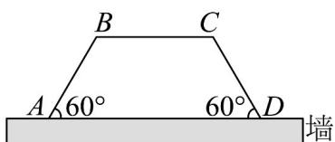

<!-- question-source:start -->
7. 用篱笆在一块靠墙的空地围一个面积为 $75\sqrt{3} \mathrm{~m}^2$ 的等腰梯形菜园，如图所示，用墙的一部分做下底 $AD$ ，

用篱笆做两腰及上底，且腰与墙成 $60^{\circ}$ ，设等腰梯形的腰长为 $x \mathrm{~m}$ 。

(1)用 $x$ 表示上底 $BC$ ；

(2)求出所用篱笆长度的最小值.
<!-- question-source:end -->

![[高中/课堂同步/题库/人教A版高中数学同步讲义(2026)/02_必修第二册/第六章 平面向量及其应用/专题6.4 平面向量的应用（高效培优讲义）/强化训练/questions/answers/Q00078521A1.md]]
