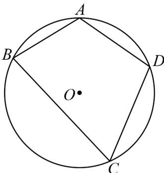
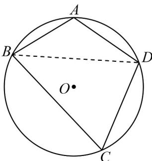

> [!faq]- 《专题6.4 平面向量的应用（高效培优讲义）》官方解析
>
> > [!success]- **【答案】**  A. $\angle C = \frac{\pi}{3}$ B. $CD\cdot BC = 12$ C. $BD = 2\sqrt{6}$ D. 四边形 $ABCD$ 的面积为 $8\sqrt{3}$
>
> > [!note]- **【解析】**
> > 在圆内接四边形ABCD中，连接BD， $AB = 2,BC = 6,AD = CD = 4$ ， $A = \pi -C$
> >
> > 
> >
> > 对于A，由余弦定理得， $AD^{2} + AB^{2} - 2AD\cdot AB\cos A = BD^{2} = CD^{2} + CB^{2} - 2CD\cdot CB\cos C$
> >
> > 即 $2^{2} + 4^{2} + 2 \times 2 \times 4 \cos C = 4^{2} + 6^{2} - 2 \times 4 \times 6 \cos C$ ，解得 $\cos C = \frac{1}{2}$ ，而 $0 < C < \pi$ ，则 $C = \frac{\pi}{3}$ ，A 正确；对于 B， $\overline{CD} \cdot \overline{BC} = 4 \times 6 \cos (\pi - C) = -12$ ，B 错误；
> >
> > 对于 C， $BD^{2}=4^{2}+6^{2}-2\times4\times6\cos C=28$ ，解得 $BD=2\sqrt{7}$ ，C 错误；
> >
> > 对于 D，四边形 ABCD 的面积 $S = S_{\triangle ABD} + S_{\triangle CBD} = \frac{1}{2} \times 2 \times 4 \times \frac{\sqrt{3}}{2} + \frac{1}{2} \times 6 \times 4 \times \frac{\sqrt{3}}{2} = 8\sqrt{3}$ ，D 正确.
> >
> > 故选 **AD**
