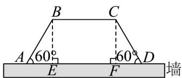

> [!faq]- 《专题6.4 平面向量的应用（高效培优讲义）》官方解析
>
> > [!success]- **【答案】** (1) $BC = \frac{150}{x} -\frac{1}{2} x$ (2) $30 \mathrm{~m}$
>
> > [!note]- **【解析】**
> > （1）
> >
> > 
> >
> > 分别过点 B, C 作下底的垂线，垂足分别为 E, F
> >
> > 则 $BE = CF = AB \cdot \sin 60^{\circ} = x \cdot \sin 60^{\circ}, AD = BC + 2AB\cos 60^{\circ} = BC + 2x\cos 60^{\circ}$
> >
> > 所以梯形面积 $S=\frac{1}{2}(BC+AD)\cdot BE$
> >
> > 所以 $75\sqrt{3}=\frac{1}{2}(BC+BC+2x\cos60^{\circ})\cdot x\cdot\sin60^{\circ}$
> >
> > 即 $BC=\frac{150}{x}-\frac{1}{2}x$
> >
> > (2) 设 $AB = a(m)(a > 0)$ ，上底 $BC = b(m)(b > 0)$ ，
> >
> > 则 $BE = \frac{\sqrt{3}}{2} a, AE = DF = \frac{a}{2}$
> >
> > 则下底 $AD = \frac{a}{2} + b + \frac{a}{2} = a + b$
> >
> > 该等腰梯形的面积 $S = \frac{(b + a + b)}{2} \cdot \frac{\sqrt{3}}{2} a = \frac{\sqrt{3}}{4} (a + 2b)a = 75\sqrt{3}$
> >
> > 所以 $(a + 2b)a = 300$ ，则 $b = \frac{300}{2a} -\frac{a}{2}$
> >
> > 所用篱笆长为 $l = 2a + b$
> >
> > $$
> > = 2 a + \frac {3 0 0}{2 a} - \frac {a}{2} = \frac {3 0 0}{2 a} + \frac {3 a}{2} \quad 2 \sqrt {\frac {3 0 0}{2 a} \cdot \frac {3 a}{2}} = 3 0
> > $$
> >
> > 当且仅当 $\frac{300}{2a} = \frac{3a}{2}$ ，即 $a = 10(\mathrm{m})$
> >
> > $b=10(m)$ 时取等号．
> >
> > 所以，当等腰梯形的腰长为 $10 \mathrm{~m}$ 时，
> >
> > 所用篱笆长度最小，其最小值为 $30 \mathrm{~m}$
