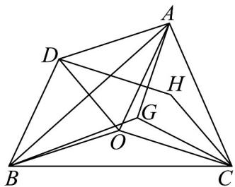

<!-- question-source:start -->
【典例1】如图， $\mathrm{VABC}$ 为锐角三角形，点 $O$ 为 $\mathrm{VABC}$ 的外心，点 $G$ 为 $\mathrm{VABC}$ 的重心， $\mathrm{VABC}$ 的外接圆半径

为 $R$ .以 $OA,OB$ 为邻边作平行四边形，它的第四个顶点为点 $D$ ，再以 $OC,OD$ 为邻边作平行四边形，它的第四

个顶点为点 $H$ ，若 $\overline{OA} = a,\overline{OB} = b,\overline{OC} = c$

(1)试用 $a, b, c$ 表示 $OH, OG$ ；并探究 $O, H, G$ 三点是否共线，如果共线，请给出证明，若不共线，说明理由.

(2)求证： $H$ 是VABC的垂心；

(3)求证： $GA^{2}+GB^{2}+GC^{2}\leq3R^{2}\leq HA^{2}+HB^{2}+HC^{2}$ ，并且指出等号成立的条件.
<!-- question-source:end -->

![[高中/课堂同步/题库/人教A版高中数学同步讲义(2026)/02_必修第二册/第六章 平面向量及其应用/专题6.4 平面向量的应用（高效培优讲义）/题型01_平面几何中的向量方法/questions/answers/Q00078483A1.md]]
