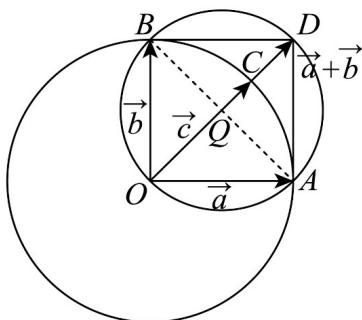

> [!faq]- 《专题6.4 平面向量的应用（高效培优讲义）》官方解析
>
> > [!success]- **【答案】** A. $\left[0,2\sqrt{2}+2\right]$ B. $[0,2]$ C. $\left[2\sqrt{2}-2,2\sqrt{2}+2\right]$ D. $\left[2\sqrt{2}-2,2\right]$
>
> > [!note]- **【解析】**
> > 如图，由 $\left|a\right|=\left|b\right|=\left|c\right|=2$ 知3个向量终点都在半径为2的圆上运动，
> >
> > 
> >
> > 设 $a = OA$ ， $b = OB$ ， $c = OC$ ，由 $a \cdot b = 0$ 得 $OA \perp OB$
> >
> > 由 $(c-a)\cdot(c-b)\leq0$ 即 $\overline{CA}\cdot\overline{CB}\leq0$ 结合极化恒等式知点 C 在以 AB 为直径的圆上和内部，
> >
> > 即点 C 只能在劣弧 AB 上运动，
> >
> > 而 $\left|a+b-c\right|$ 表示 $\left|DC\right|$ ，所以 $\left|a+b-c\right|\in\left[2\sqrt{2}-2,2\right]$
> >
> > 故选 **D**
