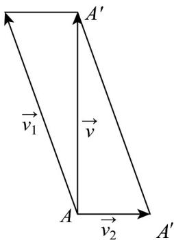

> [!faq]- 《专题6.4 平面向量的应用（高效培优讲义）》官方解析
>
> > [!success]- **【答案】** B
>
> > [!note]- **【解析】**
> > 解：如图，
> >
> > 
> >
> > $v=\stackrel{\sqcup}{v_{1}}+\stackrel{\sqcup}{v_{2}}$ ， $\left|\vec{v}\right|=\sqrt{\left|\stackrel{\sqcup}{v_{1}}\right|^{2}-\left|\stackrel{\sqcup}{v_{2}}\right|^{2}}=\sqrt{8^{2}-2^{2}}=2\sqrt{15}$ ，故C错误；
> >
> > 设船头方向与 $AA'$ 的夹角为 $\theta$ ，则 $\sin\theta=\frac{2}{8}=\frac{1}{4}$ ，则船头方向与水流方向不垂直，故A错误； $\cos\left\langle v_1, v_2 \right\rangle = \cos\left(\frac{\pi}{2}+\theta\right)=-\sin\theta=-\frac{1}{4}$ ，故B正确；
> >
> > 该船到达对岸的时间为 $t=\frac{400}{2\sqrt{15}\times1000}\times60=\frac{4\sqrt{15}}{5}$ 分钟，故 D 错误.
> >
> > 故选 **B**.
