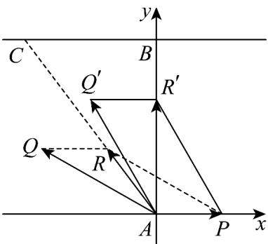

> [!faq]- 《专题6.4 平面向量的应用（高效培优讲义）》官方解析
>
> > [!success]- **【答案】** (1) $\sqrt{65}$ km/h (2) $\frac{4}{35}$ h
>
> > [!note]- **【解析】**
> > （1）以 A 为坐标原点，以东向方向为 x 轴，以垂直对岸的方向为 y 轴建立直角坐标系如图所示.
> >
> > 货船从码头 A 航行到货站 C 的最短路径要求合速度方向由 A 指向 C.
> >
> > 设货船在静水中的速度为 $\stackrel{\square\square}{AQ}=(x,y)$ ，水流速度为 4 km/h 向东，即 $\stackrel{\square\square\square}{AP}=(4,0)$
> >
> > $$
> > A R = A P + A Q = (x + 4, y)
> > $$
> >
> > 合速度为水流速度与船速的矢量和：
> >
> > 由题意，合速度方向与向量 $AC = (-0.6, 0.8)$ 同向，且大小为 5km/h.
> >
> > 设合速度为 $AR = k(-0.6, 0.8)$ ，则： $\sqrt{(-0.6k)^{2} + (0.8k)^{2}} = 5$ 。
> >
> > 因此，合速度为 $AR = (-3,4)$
> >
> > 联立方程： $\left\{\begin{aligned}x+4&=-3\\ y&=4\end{aligned}\right.$ $x=-7,y=4.$
> >
> > 货船速度大小为： $\left|AQ\right|=\sqrt{(-7)^{2}+4^{2}}=\sqrt{65}km/h.$
> >
> > 
> >
> > (2) 货船要垂直到达正对岸 B，需使合速度的东向分量为 0.
> >
> > 设船速为 $AQ'=(x,y)$ ，则： $x+4=0$ ， $x=-4$ 。
> >
> > 由（1）知船速大小为 $\left|AQ'\right|=\left|AQ\right|=\sqrt{65}$ ，故： $(-4)^{2}+v_{y}^{2}=65\hat{v}_{y}=7$ .
> >
> > 合速度的北向分量为 $7km / \mathrm{h}$ ，河宽 $0.8km$ ，所需时间为： $t = \frac{0.8}{7} = \frac{4}{35}$ 小时
