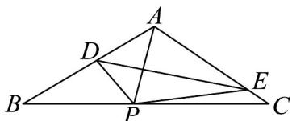

> [!faq]- 《专题6.4 平面向量的应用（高效培优讲义）》官方解析
>
> > [!success]- **【答案】** $\sqrt{3} - 1$
>
> > [!note]- **【解析】**
> > 设 A 落在边 BC 的 P 处，则 A, P 两点关于折线 DE 对称，连接 DP，
> >
> > 由于 $AB = AC = 2$ ， $BC = 2\sqrt{3}$ ，则 $\cos \angle ABC = \frac{\frac{1}{2}BC}{AB} = \frac{\sqrt{3}}{2}$
> >
> > $\because \angle ABC \in (0, \pi), \therefore \angle ABC = \frac{\pi}{6}$ , 进而可得 $\angle BAC = \frac{2\pi}{3}$ ,
> >
> > 设 $\angle BAP = \angle APD = \theta, \theta \in \left[\frac{\pi}{4}, \frac{5\pi}{12}\right], AD = x, x \in (0, 2)$
> >
> > 则 $\angle BDP = 2\theta$ ， $AD = DP = x$ ， $BD = 2 - x$
> >
> > 在 $\triangle ABP$ 中， $\angle APB = \pi - \angle ABP - \angle BAP = \frac{5\pi}{6} - \theta$
> >
> > 在 $\triangle BDP$ 中， $\angle BPD = \angle APB - \angle APD = \frac{5\pi}{6} - 2\theta$
> >
> > 由正弦定理知： $\frac{BD}{\sin\angle BPD}=\frac{DP}{\sin\angle DBP}$ ，即 $\frac{2-x}{\sin\left(\frac{5\pi}{6}-2\theta\right)}=\frac{x}{\sin\frac{\pi}{6}}$
> >
> > 所以 $\frac{2 - x}{x} = 2\sin \left(\frac{5\pi}{6} -2\theta\right)$ ，即 $\frac{2}{x} = 1 + 2\sin \left(\frac{5\pi}{6} -2\theta\right)$
> >
> > 由于 $\theta \in \left[\frac{\pi}{4},\frac{5\pi}{12}\right]$ ，则 $\frac{5\pi}{6} -2\theta \in \left[0,\frac{\pi}{3}\right]$
> >
> > 故当 $\frac{5\pi}{6} - 2\theta = \frac{\pi}{3}$ ，即 $\sin \left(\frac{5\pi}{6} - 2\theta\right) = \frac{\sqrt{3}}{2}$ 时，此时 $1 + 2\sin \left(\frac{5\pi}{6} - 2\theta\right)$ 取到最大值 $1 + \sqrt{3}$
> >
> > 故 $\frac{2}{x}$ 取到最大值 $1 + \sqrt{3}$ ，进而 $x$ 取最小值 $\sqrt{3} - 1$
> >
> > 
> >
> > 故答案为： $\sqrt{3}-1$ .
