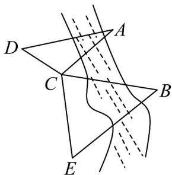

<!-- question-source:start -->
【典例1】如图，为了测量河对岸 $A$ ， $B$ 两点之间的距离，观察者找到一个点 $C$ ，从点 $C$ 可以观察到点 $A$ ， $B$ ；找到一个点 $D$ ，从点 $D$ 可以观察到点 $A$ ， $C$ ；找到一个点 $E$ ，从点 $E$ 可以观察到点 $B$ ， $C$ ，并测量得到一些数据： $CD = 2$ ， $CE = 2\sqrt{3}$ ， $\angle D = 45^{\circ}$ ， $\angle ACD = 105^{\circ}$ ， $\angle ACB = 48.19^{\circ}$ ， $\angle BCE = 75^{\circ}$ ， $\angle E = 60^{\circ}$ （其中 $\cos 48.19^{\circ} \approx \frac{2}{3}$ ）

(1)求 $A$ ， $C$ 两点之间的距离；

(2)求 A，B 两点之间的距离.
<!-- question-source:end -->

![[高中/课堂同步/题库/人教A版高中数学同步讲义(2026)/02_必修第二册/第六章 平面向量及其应用/专题6.4 平面向量的应用（高效培优讲义）/题型08_几何问题/questions/answers/Q00078511A1.md]]
