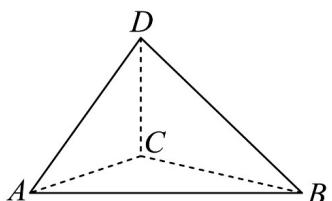

<!-- question-source:start -->
【变式2】美丽的千岛湖位于浙江省淳安县境内，是“世界三大千岛湖”之一，也是国家5A级旅游景区。千岛湖有三座岛屿 $A, B, C$ ，旅游公司准备在岛屿 $C$ 上开发一个旅游项目，需测量其高度，由于地理位置等原因无法直接测量。如图，在岛屿 $B$ 的底部测得岛屿 $C$ 的顶部 $D$ 处的仰角为 $60^\circ$ ，并测得岛屿 $C$ 在岛屿 $B$ 的北偏西 $75^\circ$ 方向上，另外测得岛屿 $C$ 在岛屿 $A$ 的北偏东 $60^\circ$ 方向上，岛屿 $B$ 在 $A$ 的正东方向 $600\mathrm{m}$ 处，且三座岛屿

$A, B, C$ 在同一水平面上，则岛屿 $C$ 的高度为（）

A. $300\sqrt{2}\mathrm{m}$ B. $300\sqrt{6}\mathrm{m}$ C. $600\sqrt{3}\mathrm{m}$ D. $100\sqrt{6}\mathrm{m}$
<!-- question-source:end -->

![[高中/课堂同步/题库/人教A版高中数学同步讲义(2026)/02_必修第二册/第六章 平面向量及其应用/专题6.4 平面向量的应用（高效培优讲义）/题型08_几何问题/questions/answers/Q00078513A1.md]]
