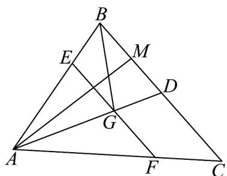

<!-- question-source:start -->
17．（15分）如图，在VABC中，AD是BC边上的中线·M为BD的中点，G是AD上一点，且 $AG=2GD$

直线 EF 过点 G，交 AB 于点 E，交 AC 于点 F.

(1)试用 $\stackrel{\square\square}{AB}$ 和 $\stackrel{\square\square\square}{AC}$ 表示 $\stackrel{\square\square\square\square}{AM}$ ， $BG$

(2)若 $AE = \lambda AB$ ， $AF = \mu AC\left(\lambda ,\mu \in \mathrm{R}^{+}\right)$ ，求 $\lambda +4\mu$ 的最小值.
<!-- question-source:end -->

![[高中/课堂同步/题库/人教A版高中数学同步讲义(2026)/02_必修第二册/第六章 平面向量及其应用/单元测试/第六章_平面向量及其应用_高效培优单元自测_强化卷_/三_填空题_sec_04/questions/answers/Q00065692A1.md]]
