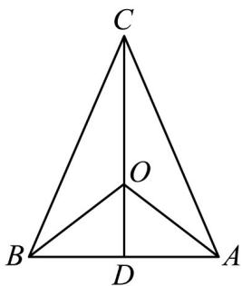

> [!faq]- 《第六章_平面向量及其应用_高效培优单元自测_强化卷_》官方解析
>
> > [!success]- **【答案】** ① 若 $\lambda = -1$ ， $\mu = 0$ ，则VABC为直角三角形； ②若 $\lambda = \mu = -1$ ，则VABC为正三角形； ③ 若 $\lambda = -1$ ， $\mu = -\sqrt{3}$ ，则VABC为顶角为 $30^{\circ}$ 的等腰三角形； 若 $\lambda=-\frac{3}{2}$ ， $\mu=-2$ ，则
>
> > [!note]- **【解析】**
> > 若 $\lambda = -1$ ， $\mu = 0$ ，则 $OA = -OB$ ，所以 O 是 AB 的中点，又 O 是 VABC 的外心，从而 VABC 为直
> >
> > 角三角形，故①正确；
> >
> > 若 $\lambda = \mu = -1$ ，则 $OA = -OB - OC$ ，即 $OA + OB + OC = 0$ ，所以 $O$ 是VABC的重心，又 $O$ 是VABC的外心，
> >
> > 从而VABC为等边三角形，故②正确；
> >
> > 若 $\lambda = -1$ ， $\mu = -\sqrt{3}$ ，则 $OA = -OB - \sqrt{3OC}$ ，即 $OA + OB = -\sqrt{3OC}$
> >
> > 取 $AB$ 的中点 $D$ ，则 $\overline{OA} +\overline{OB} = 2\overline{OD}$ ，从而 $2\overline{OD} = -\sqrt{3}\overline{OC}$
> >
> > 所以 $O$ 是中线 $CD$ 上一点，又因为 $O$ 是 $\mathrm{VABC}$ 的外心，即 $O$ 是 $\mathrm{VABC}$ 中垂线的交点，
> >
> > 所以 $CD \perp AB$ ，从而 VABC 是等腰三角形。
> >
> > 两边平方得 $OA^2 + OB^2 + 2OA \cdot OB = 3OC^2$ (\*)
> >
> > 因为 $\left|OA\right|=\left|OB\right|=\left|OC\right|=1$ 且 $OA\cdot OB=\left|OA\right|\left|OB\right|\cos\angle AOB=\cos\angle AOB$
> >
> > 所以（ $^{*}$ ）式化为 $\cos\angle AOB=\frac{1}{2}$ ，所以 $\angle AOB=60^{\circ}$
> >
> > 由圆周角是圆心角的一半可得 $\angle ACB = 30^{\circ}$ ，即VABC为顶角为 $30^{\circ}$ 的等腰三角形，故③正确；
> >
> > 
> >
> > 若 $\lambda = -\frac{3}{2}$ ， $\mu = -2$ ，则
> >
> > 两边平方得
> >
> > $$
> > O A ^ {2} = \frac {9}{4} O B ^ {2} + 4 O C ^ {2} + 6 O B \cdot O C
> > $$
> >
> > 因为 $\left|\overline{OA}\right|=\left|\overline{OB}\right|=\left|\overline{OC}\right|=1$ ，所以 $OB\cdot OC=-\frac{7}{8}$
> >
> > 从而 $OA\cdot OB + OA\cdot OC + OB\cdot OC = OA\cdot \left(OB + OC\right) + OB\cdot OC = \left(-\frac{3}{2}OB - 2OC\right)\cdot \left(OB + OC\right) + OB\cdot OC$
> >
> > $$
> > = - \frac {3}{2} O B ^ {2} - 2 O B \cdot O C - \frac {3}{2} O B \cdot O C - 2 O C ^ {2} + O B \cdot O C
> > $$
> >
> > $= -\frac{3}{2} - \frac{5}{2} \times \left(-\frac{7}{8}\right) - 2 = -\frac{21}{16}$ , 故④错误.
> >
> > 故答案为：①②③·
> >
> > 四、解答题：本题共5小题，共77分。解答应写出文字说明、证明过程或演算步骤。
