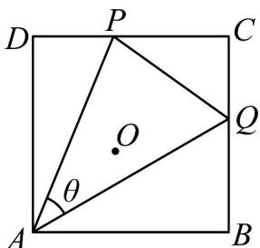
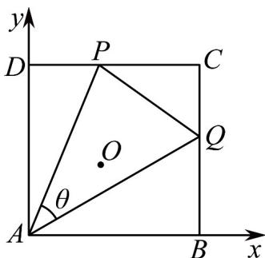

> [!faq]- 《第六章_平面向量及其应用_高效培优单元自测_强化卷_》官方解析
>
> > [!success]- **【答案】** △ APQ 的外心.  $$ D P = \lambda D C $$ $$ \stackrel {{\text { u u u }}} {{C Q}} = \lambda \stackrel {{\text { u u u }}} {{C B}} $$ $$ 0 \leq \lambda \leq 1 $$ $$ \stackrel {{\text { 一 }}} {{A P}} \cdot \stackrel {{\text { 二 }}} {{A Q}} $$ (2) 若 $\theta = 45^{\circ}$ , 求 $AP \cdot AQ$ 的取值范围; (3)若 $\theta = 60^{\circ}$ ，若 $AO = xAP + yAQ$ ，求 $3x + 6y$ 的最大值·
>
> > [!note]- **【解析】**
> > （1）以 A 点为坐标原点，AB 为 x 轴，建立直角坐标系 $P(\lambda,1)$ ， $Q(1,1-\lambda)$ ，
> > 所以 $PA \cdot QA = (-\lambda, -1) \cdot (-1, -1 + \lambda) = 1$ .
> >
> > 
> >
> > (2) 设 $\angle QAB = \alpha \in \left[0, \frac{\pi}{4}\right]$ ， $0 \leq \tan \alpha \leq 1, 1 \leq \tan \alpha + 1 \leq 2$ ，则 $Q(1, \tan \alpha)$ ， $P\left(\tan \left(\frac{\pi}{4} - \alpha\right), 1\right)$ .
> >
> > $$
> > P A \cdot Q A = \left(- \tan \left(\frac {\pi}{4} - \alpha\right), - 1\right) \cdot (- 1, - \tan \alpha) = \tan \left(\frac {\pi}{4} - \alpha\right) + \tan \alpha = \frac {1 - \tan \alpha}{1 + \tan \alpha} + \tan \alpha
> > $$
> >
> > $$
> > = \frac {2}{1 + \tan \alpha} + \tan \alpha - 1 = \left(\frac {2}{1 + \tan \alpha} + \tan \alpha + 1\right) - 2,
> > $$
> >
> > 由于 $\tan \alpha + 1 \in [1,2]$ ，根据对勾函数的性质可知 $PA \cdot QA \in [2\sqrt{2} - 2,1]$ .
> >
> > $$
> > A O \cdot A P = \frac {1}{2} A P ^ {2} = \left(x A P + y A Q\right) \cdot A P = x A P ^ {2} + y A Q \cdot A P \tag {3}
> > $$
> >
> > $$
> > A O \cdot A Q = \frac {1}{2} A Q ^ {2} = (x A P + y A Q) \cdot A Q = x A P \cdot A Q + y A Q ^ {2}
> > $$
> >
> > 设 $\left| \overline{A}P \right| = a$ ， $\left| \overline{A}Q \right| = b$ ，则这两个式子为 $\left\{\begin{aligned}\frac{1}{2}a^{2} &= xa^{2} + \frac{1}{2}yab,\\ \frac{1}{2}b^{2} &= \frac{1}{2}xab + yb^{2}.\end{aligned}\right.$
> >
> > 化简得 $\left\{ \begin{array}{l}a = 2xa + yb,\\ b = xa + 2yb. \end{array} \right.$ 解得 $\left\{ \begin{array}{l}x = \frac{2a - b}{3a},\\ y = \frac{2b - a}{3b}. \end{array} \right.$ 所以 $3x + 6y = 3\frac{2a - b}{3a} +6\frac{2b - a}{3b} = 6 - \left(\frac{b}{a} +\frac{2a}{b}\right)$
> >
> > 设 $\angle QAB = \alpha \in \left[0, \frac{\pi}{6}\right]$ ， $\tan \alpha \in \left[0, \frac{\sqrt{3}}{3}\right]$ ，
> >
> > $$
> > t = \frac {b}{a} = \frac {\left| \begin{array}{l} \square \square \square \\ A Q \\ \square \square \square \end{array} \right|}{\left| \begin{array}{l} A P \end{array} \right|} = \frac {\frac {1}{\cos \alpha}}{\frac {1}{\cos \left(\frac {\pi}{6} - \alpha\right)}} = \frac {\frac {\sqrt {3}}{2} \cos \alpha + \frac {1}{2} \sin \alpha}{\cos \alpha} = \frac {\sqrt {3}}{2} + \frac {1}{2} \tan \alpha \in \left[ \frac {\sqrt {3}}{2}, \frac {2 \sqrt {3}}{3} \right],
> > $$
> >
> > 所以由对勾函数的性质得 $3x + 6y = 6 - \left(\frac{b}{a} + \frac{2a}{b}\right) = 6 - \left(t + \frac{2}{t}\right) \in \left[6 - \frac{11\sqrt{3}}{6}, 6 - \frac{5\sqrt{3}}{3}\right]$ ，
> >
> > 所以当 $\alpha=\frac{\pi}{6}$ 时，即点 P 与 D 点重合时， $3x+6y$ 取到最大值 $6-\frac{5\sqrt{3}}{3}$
