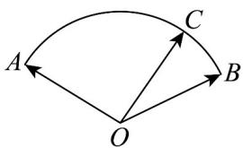

<!-- question-source:start -->
4. 如图，半径为 $\sqrt{3}$ 的扇形 $AOB$ 的圆心角为 $120^{\circ}$ ，点 $C$ 在 $AB$ 上，且 $\angle COB = 30^{\circ}$ ，若 $OC = \lambda OA + \mu OB$

则 $\lambda +\mu$ 等于（

A. $\sqrt{3}$ B. $\frac{\sqrt{3}}{3}$ C. $\frac{4\sqrt{3}}{3}$ D. $2\sqrt{3}$
<!-- question-source:end -->

![[高中/课堂同步/题库/人教A版高中数学同步讲义(2026)/02_必修第二册/第六章 平面向量及其应用/单元测试/第六章_平面向量及其应用_高效培优单元自测_提升卷_/一_选择题_sec_02/questions/answers/Q00065698A1.md]]
