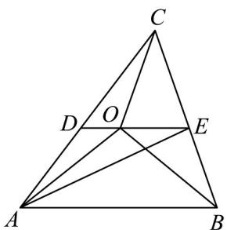
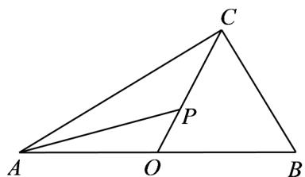

> [!faq]- 《第六章_平面向量及其应用_高效培优单元自测_提升卷_》官方解析
>
> > [!success]- **【答案】** A．若 $\overline{OA}=(3,-4),\overline{OB}=(6,-3),\overline{OC}=(5-m,-3-m)$ ， $\angle ABC$ 为锐角，则实数 m 的取值范围是 $m>-\frac{3}{4}$ B. 点 $O$ 在 $\triangle ABC$ 所在的平面内，若 $OA + OB + OC = 0$ ，则点 $O$ 为 $\triangle ABC$ 的重心 C. 点 $O$ 在 $\triangle ABC$ 所在的平面内，若 $2OA + OB + 3OC = 0$ ， $S_{\triangle AOC}$ ， $S_{\triangle ABC}$ 分别表示 $\triangle AOC$ ， $\triangle ABC$ 的面积， 则 $S_{\triangle AOC}: S_{\triangle ABC} = 1:6$ D．点 O 在 $\triangle ABC$ 所在的平面内，满足 $\frac{AQ\cdot AB}{|AB|} = \frac{AQ\cdot AC}{|AC|}$ 且 $\frac{CO\cdot CA}{|CA|} = \frac{CO\cdot CB}{|CB|}$ ，则点 O 是且 $\triangle ABC$ 的外 心
>
> > [!note]- **【解析】**
> > 对于 A，由 $OA = (3, -4)$ , OB = (6, -3), OC = (5 - m, -3 - m)
> >
> > 得 $\overline{BA} = OA - OB = (-3, -1), BC = OC - OB = (-m - 1, -m)$
> >
> > 因为 $\angle ABC$ 为锐角，故 $BA \cdot BC > 0$ 且 $BA, BC$ 不共线，
> >
> > 所以 $\left\{\begin{aligned}-3(-m-1)+m&>0\\ 3m+(-m-1)\neq0\end{aligned}\right.$ ，解得 $m>-\frac{3}{4}$ 且 $m\neq\frac{1}{2}$ ，故 A 错误；
> >
> > 对于 B，设 AB 边上的中点为 D，则 $OA + OB = 2OD$ ，
> >
> > 因为 $OA + OB + OC = 0$ ，所以 OC = -2OD
> >
> > 所以 $OC \parallel OD$ ，又点 O 为公共端点，所以 O, C, D 三点共线，
> >
> > 即点 O 在 AB 边的中线上，
> >
> > 同理可得点 O 也在 AC, BC 两边的中线上，
> >
> > 所以点 O 为 $\triangle ABC$ 的重心，故 B 正确；
> >
> > 对于 $C$ ，因为 $2\overline{OA} +\overline{OB} +3\overline{OC} = 0$ ，所以 $\overline{OB} +\overline{OC} = -2\left(\overline{OA} +\overline{OC}\right)$
> >
> > 如图，设 $AC$ 的中点为 $D$ ， $BC$ 的中点为 $E$ ，
> >
> > 则 $OE = -2OD$ ，所以 $OE // OD$
> >
> > 又点 $O$ 为公共端点，所以 $O, D, E$ 三点共线，且 $\left|\overline{OE}\right| = 2\left|\overline{OD}\right|$
> >
> > 所以 $S_{\triangle AOC} = \frac{1}{3} S_{\triangle ACE}$ ，
> >
> > 又 $S_{\triangle ACE} = \frac{1}{2} S_{\triangle ABC}$
> >
> > 所以 $S_{\triangle AOC} = \frac{1}{6} S_{\triangle ABC}$ ，即 $S_{\triangle AOC} : S_{\triangle ABC} = 1 : 6$ ，故 C 正确；
> >
> > 
> >
> > 对于D，由 $\frac{\overline{AQ}\cdot\overline{AB}}{|AB|} = \frac{\overline{AQ}\cdot\overline{AC}}{|AC|}$
> >
> > 可得 $\left|AO\right|\cos\angle OAB=\left|AO\right|\cos\angle OAC$ ，即 $\cos\angle OAB=\cos\angle OAC$
> >
> > 又因 $\angle OAB, \angle OAC \in (0, \pi)$ ，所以 $\angle OAB = \angle OAC$
> >
> > 所以 $OA$ 是 $\angle BAC$ 的角平分线，
> >
> > 由 $\frac{CO\cdot CA}{|CA|}=\frac{CO\cdot CB}{|CB|}$ ，
> >
> > 可得 $\left|\overline{CO}\right|\cos\angle OCA=\left|\overline{CO}\right|\cos\angle OCB$ ，即 $\cos\angle OCA=\cos\angle OCB$
> >
> > 又 $\angle OCA, \angle OCB \in (0, \pi)$ ，所以 $\angle OCA = \angle OCB$
> >
> > 所以 OC 是 $\angle ACB$ 的角平分线，
> >
> > 所以点 O 是且 $\triangle ABC$ 的内心，故 D 错误.
> >
> > 故选：BC.
> >
> > 11. 直角 VABC 中，斜边 AB = 2，P 为 VABC 所在平面内一点， $\overline{AP} = \frac{1}{2}\sin^{2}\theta \cdot \overline{AB} + \cos^{2}\theta \cdot \overline{AC}$ （其中 $\theta \in R$ ），则（）
> >
> > 【答案】
> >
> > A. $AB \cdot AC$ 的取值范围是 $(0,4)$ B. 点 P 经过 VABC 的外心
> >
> > C. 点 P 所在轨迹的长度为 2
> >
> > D. $PC \cdot (PA + PB)$ 的取值范围是 $\left[-\frac{1}{2}, 0\right]$
> >
> > 【答案】ABD
> >
> > 【详解】由 $AB \cdot AC = AC^{2}$ ，又斜边 AB = 2，则 $|AC| \in (0, 2)$ ，则 $AB \cdot AC \in (0, 4)$ ，A 正确；
> >
> > 若 $O$ 为 $AB$ 中点，则 $\overline{AO} = \frac{1}{2}\overline{AB}$ 故 $\overline{AP} = \sin^2\theta \cdot \overline{AO} +\cos^2\theta \cdot \overline{AC}$ 又 $\sin^2\theta +\cos^2\theta = 1$
> >
> > 所以 O, P, C 共线，故 P 在线段 OC 上，轨迹长为 1，又 O 是 VABC 的外心， $^{B}$ 正确， $^{C}$ 错误；
> >
> > 
> >
> > 由上 $PA + PB = 2PO$ ，则 $PC \cdot (PA + PB) = 2PC \cdot PO = -2|PC||PO|$ ，又 $|\overrightarrow{PC}| + |\overrightarrow{PO}| = |\overrightarrow{OC}| = 1$ ，则 $\left|\overrightarrow{PC}\right| \left| \overrightarrow{PO}\right| \leq \left(\frac{\left|\overrightarrow{PC}\right| + \left| \overrightarrow{PO}\right|}{2}\right)^2 = \frac{1}{4}$ ，当且仅当 $|\overrightarrow{PC}| = |\overrightarrow{PO}| = \frac{1}{2}$ 等号成立，所以 $\overrightarrow{PC} \cdot (PA + PB) = -2|\overrightarrow{PC}||\overrightarrow{PO} \in [-\frac{1}{2},0]$ ，D正确.
> >
> > 故选 **ABD**
