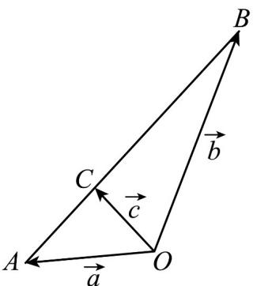

> [!faq]- 《第六章_平面向量及其应用_高效培优单元自测_提升卷_》官方解析
>
> > [!success]- **【答案】** $\frac{\sqrt{21}}{7}$
>
> > [!note]- **【解析】**
> > 设 $OA = aQB = bQC = c$ ，则 $\left|\begin{array}{c|c}U & U \\ OA & 1, \end{array}\right| = 1, \left|\begin{array}{c}U \\ OB \end{array}\right| = 2$ ， $a \cdot b = \left|\begin{array}{c}U \\ OA \end{array}\right| \cdot \left|\begin{array}{c}U \\ OB \end{array}\right|\cos \angle AOB = 2\cos \angle AOB = -1$
> >
> > $\therefore \cos \angle AOB = -\frac{1}{2}, \therefore \angle AOB = 120^{\circ}$
> >
> > 又 $\stackrel{\mathrm{r}}{c} = \lambda \stackrel{\mathrm{r}}{a} + (1 - \lambda)b\stackrel{\mathrm{r}}{\varphi}\cdot \left(\stackrel{\mathrm{r}}{a} - \stackrel{\mathrm{r}}{b}\right) = 0$ ，∴点 $C$ 在线段 $AB$ 上，且 $OC\perp AB$
> >
> > 易知 $\left|AB\right| = \sqrt{\left(a - b\right)^2} = \sqrt{a^2 - 2a \cdot b + b^2} = \sqrt{1 + 2 + 4} = \sqrt{7}$
> >
> > 由 $\frac{1}{2}\left|\frac{U_{III}}{AB}\right| \cdot \left|\frac{U_{III}}{OC}\right| = \frac{1}{2}\left|\frac{U_{I}r}{OA}\right| \cdot \left|\frac{U_{III}}{OB}\right| \sin 120^{\circ}$ ，可得 $\frac{\sqrt{7}}{2}\left|\frac{U_{III}}{OC}\right| = \frac{\sqrt{3}}{2}$ ，
> >
> > $\therefore \left|\overline{O C}\right| = \frac{\sqrt{21}}{7},$ 即 $\left|\overline{c}\right| = \frac{\sqrt{21}}{7}.$
> >
> > 故答案为： $\frac{\sqrt{21}}{7}$
> >
> > 
> >
> > 四、解答题：本题共5小题，共77分。解答应写出文字说明、证明过程或演算步骤。
