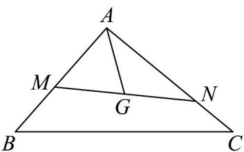

<!-- question-source:start -->
6. 如图所示，已知点 $G$ 是 $\mathrm{V}ABC$ 的重心，过点 $G$ 作直线分别与 $AB$ ， $AC$ 两边交于 $M$ ， $N$ 两点（点 $N$ 与点

$C$ 不重合），设 $AM = xAB, AN = yAC$ ，则 $\frac{1}{x} + \frac{1}{y}$ 的值为（）

A.3 B.4 C.5 D.6
<!-- question-source:end -->

![[高中/课堂同步/题库/人教A版高中数学同步讲义(2026)/02_必修第二册/第六章 平面向量及其应用/第六章 平面向量及其应用（高效培优单元自测·强化卷）/一_选择题/questions/answers/Q00078529A1.md]]
