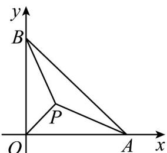

> [!faq]- 《第六章 平面向量及其应用（高效培优单元自测·强化卷）》官方解析
>
> > [!success]- **【答案】** D
>
> > [!note]- **【解析】**
> > 因为 $\angle ACB = 90^{\circ}$ ，以 C 为原点，以 CA, CB 分别为 x 轴、y 轴建立平面直角坐标系，
> >
> > 如图所示，因为 AB = 20 ，且 VABC 为等腰直角三角形，
> >
> > 可得 $A(10\sqrt{2},0),B(0,10\sqrt{2})$
> >
> > 又因为 $\tan\angle PAC=\tan\angle PCB=\frac{1}{2}$ ，可得 $\angle PAC=\angle PCB$ ，
> >
> > 所以 $\angle PAC + \angle PCA = \angle PCB + \angle PCA = \angle ACB = 90^{\circ}$
> >
> > 所以 $\angle APC = 90^{\circ}$ ， $\cos \angle PCA = \sin \angle PAC = \frac{\sqrt{5}}{5}$ ，所以 $\sin \angle PCA = \cos \angle PAC = \frac{2\sqrt{5}}{5}$ ，
> >
> > 所以 $PC = AC\cdot \cos \angle PCA = 2\sqrt{10}$ ， $PC\cdot \cos \angle PCA = 2\sqrt{2}$ ， $PC\cdot \sin \angle PCA = 4\sqrt{2}$
> >
> > 所以点 $P(2\sqrt{2}, 4\sqrt{2})$
> >
> > 所以 $\overline{PA}=(8\sqrt{2},-4\sqrt{2}),\overline{PB}=(-2\sqrt{2},6\sqrt{2})$
> >
> > 则 $\cos\angle APB=\frac{\square\square\square\cdot\square\square\square}{\left|PA\right|\left|PB\right|}=\frac{-8}{4\sqrt{10}\times4\sqrt{5}}=-\frac{\sqrt{2}}{2}$
> >
> > 所以直线 AP 与直线 BP 的夹角的余弦值为 $\frac{\sqrt{2}}{2}$ 故选：D.
> >
> > 
