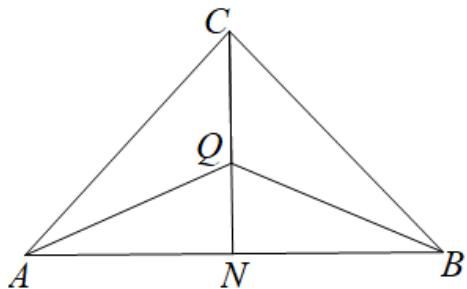

> [!faq]- 《第六章 平面向量及其应用（高效培优单元自测·强化卷）》官方解析
>
> > [!success]- **【答案】** A
>
> > [!note]- **【解析】**
> > 由 $\left|\overline{OA}\right|^{2}+\left|\overline{BC}\right|^{2}=\left|\overline{OB}\right|^{2}+\left|\overline{CA}\right|^{2}$ ，得 $\left|\overline{OA}\right|^{2}-\left|\overline{OB}\right|^{2}=\left|\overline{CA}\right|^{2}-\left|\overline{BC}\right|^{2}$
> >
> > 即 $\left( \begin{array}{c} \square \square \square \\ OA + OB \end{array} \right)\left( \begin{array}{c} \square \square \square \\ OA - OB \end{array} \right) = \left( \begin{array}{c} \square \square \square \\ CA + BC \end{array} \right)\left( \begin{array}{c} \square \square \square \\ CA - BC \end{array} \right)$
> >
> > 则 $\left( \overline{OA} + \overline{OB} \right) \overline{BA} = \overline{BA} \left( \overline{CA} + \overline{CB} \right) \Rightarrow \left( \overline{OA} + \overline{OB} - \overline{CA} - \overline{CB} \right) \overline{BA} = 0$
> >
> > 所以 $2OC\cdot BA = 0$ ，则 $OC\perp AB$ ，同理可得 $OA\perp BC$ ， $OB\perp AC$
> >
> > 即 O 是 VABC 三边上高的交点，则 O 为 VABC 的垂心；
> >
> > 由 $GA + GB + GC = 0$ ，得 $GA + GB = -GC$ ，
> >
> > 设 $AB$ 的中点为 $M$ ，则 $\overline{GA} +\overline{GB} = 2\overline{GM} = -\overline{GC}$ ，即 $G$ ， $M$ ， $C$ 三点共线，
> >
> > 所以 $G$ 在 $\mathrm{VABC}$ 的中线 $CM$ 上，同理可得 $G$ 在 $\mathrm{VABC}$ 的其余两边的中线上，
> >
> > 即 G 是 VABC 三边中线的交点，故 G 为 VABC 的重心；
> >
> > 由 $\left( \overline{P}A + \overline{P}B \right) \cdot \overline{AB} = 0$ ，得 $2PM \cdot AB = 0$ ，即 $PM \perp AB$
> >
> > 又 $M$ 是 $AB$ 的中点，所以 $P$ 在 $AB$ 的垂直平分线上，
> >
> > 同理可得，P 在 BC，AC 的垂直平分线上，
> >
> > 即 P 是 VABC 三边垂直平分线的交点，故 P 是 VABC 的外心；
> >
> > 延长 $CQ$ 交 $AB$ 于点 $N$ ，因为 $Q$ ， $C$ ， $N$ 三点共线，则设 $\overline{QN} = k\overline{QC}$ （ $k < 0$ ），
> >
> > 
> >
> > 且 $QA = QN + NA = kQC + NA$ ， $QB = QN + NB = kQC + NB$
> >
> > 代入 $a\overline{QA} + b\overline{QB} + c\overline{QC} = 0$ ，得 $a\left(k\overline{QC} + NA\right) + b\left(k\overline{QC} + NB\right) + c\overline{QC} = 0$
> >
> > 即 $\left(ak+bk+c\right)QC+aNA+bNB=0$ ①，
> >
> > 又因为 NA 与 NB 共线，QC 与 NA、NB 不共线，
> >
> > 则只能当 $ak + bk + c = 0$ 且 $a\overline{NA} + b\overline{NB} = 0$ 时，①成立，
> >
> > 即 $aNA = -bNB \Rightarrow \frac{|NA|}{|NB|} = \frac{b}{a} = \frac{|AC|}{|BC|}$ ，则 $\frac{|NA|}{|AC|} = \frac{|NB|}{|BC|}$
> >
> > 由正弦定理得： $\frac{\sin\angle ACN}{\sin\angle ANC}=\frac{\sin\angle BCN}{\sin\angle BNC}$ ，
> >
> > 又 $\angle ANC + \angle BNC = \pi$ ，则 $\sin \angle ANC = \sin \angle BNC$
> >
> > 即 $\sin \angle ACN = \sin \angle BCN$ ，又 $0 < \angle ACB < \pi$ ，所以 $\angle ACN = \angle BCN$
> >
> > 则 CN 是 $\angle ACB$ 的角平分线，即点 Q 在 $\angle ACB$ 的角平分线上，
> >
> > 同理可得， $Q$ 在 $\angle ABC$ ， $\angle BAC$ 的垂直平分线上，
> >
> > 即 $Q$ 是VABC内角平分线的交点，故 $Q$ 是VABC的内心；
> >
> > 故选：A.
> >
> > ## 二、选择题：本题共 3 小题，每小题 6 分，共 18 分．在每小题给出的选项中，有多项符合题目要求．全部选对的得 6 分，部分选对的得部分分，有选错的得 0 分.
