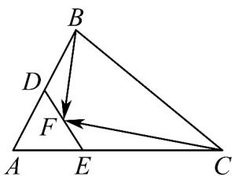

<!-- question-source:start -->
12. 如图，在VABC中，已知 $AB = 2, AC = 3, \angle BAC = 60^{\circ}$ ，点 $D$ ， $E$ 分别在边 $AB$ ， $AC$ 上，且 $AC = 3AE$

$AB = 2AD$ ，点 F 为线段 DE 上的动点，则 $BF \cdot CF$ 的取值范围是 \_\_\_\_。

<!-- question-source:end -->

![[高中/课堂同步/题库/人教A版高中数学同步讲义(2026)/02_必修第二册/第六章 平面向量及其应用/第六章 平面向量及其应用（高效培优单元自测·强化卷）/三_填空题/questions/answers/Q00078534A1.md]]
