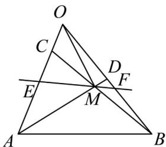

<!-- question-source:start -->
15．（13分）如图所示，在 $^{\triangle}OAB$ 中， $\frac{UUC}{OC}=\frac{1}{4}OA,\quad\frac{UUC}{OD}=\frac{1}{2}OB$ ，AD与BC交于点M．过M点的直线l

与 $OA$ 、 $OB$ 分别交于点 $E, F$ .

(1) 试用 $OA$ ， $OB$ 表示向量 $OM$ ；

(2) 设 $\overline{OE} = \lambda \overline{OA}$ ， $\overline{OF} = \mu \overline{OB}$ ，求证： $\frac{1}{\lambda} + \frac{3}{\mu}$ 是定值。
<!-- question-source:end -->

![[高中/课堂同步/题库/人教A版高中数学同步讲义(2026)/02_必修第二册/第六章 平面向量及其应用/第六章 平面向量及其应用（高效培优单元自测·强化卷）/三_填空题/questions/answers/Q00078537A1.md]]
