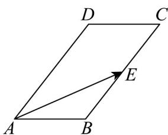

<!-- question-source:start -->
16．（15分）已知平行四边形ABCD中， $AB = 3$ ， $BC = 6$ ， $\angle DAB = 60^{\circ}$ ，点 $E$ 是线段 $BC$ 的中点.

(1)求 $AB \cdot AE$ 的值；

(2)若 $AF = AE + \lambda AD$ ，且 $BD \perp AF$ ，求 $\lambda$ 的值.
<!-- question-source:end -->

![[高中/课堂同步/题库/人教A版高中数学同步讲义(2026)/02_必修第二册/第六章 平面向量及其应用/第六章 平面向量及其应用（高效培优单元自测·强化卷）/三_填空题/questions/answers/Q00078538A1.md]]
