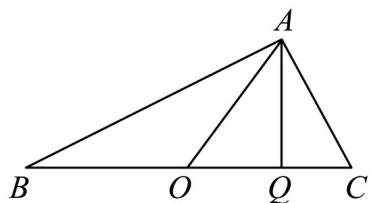

> [!faq]- 《第六章 平面向量及其应用（高效培优单元自测·强化卷）》官方解析
>
> > [!success]- **【答案】** $\left[\frac{1}{5},\frac{3}{5}\right]$
>
> > [!note]- **【解析】**
> > 因为 $AO = \lambda AB + (1 - \lambda)AC$ ，所以 $AO = \lambda AC + \lambda CB + AC - \lambda AC$
> >
> > 所以 $AO - AC = \lambda CB$ ，所以 $CO = \lambda CB$ 。
> >
> > 又因为 O 为 VABC 的外心，所以 VABC 为直角三角形且 $AB \perp AC$ ，O 为斜边 BC 的中点，
> >
> > 过 $A$ 作 $BC$ 的垂线 $AQ$ ，垂足为 $Q$ ·因为 $\stackrel{\mathrm{uuu}}{BA}$ 在 $\stackrel{\mathrm{uuu}}{BC}$ 上的投影向量为 $\mu BC$
> >
> > 所以 $OA$ 在 $BC$ 上的投影向量为
> >
> > 因为 $\left|\begin{matrix}\overrightarrow{OA}\\ \overrightarrow{BC}\end{matrix}\right|=\frac{1}{2}\left|\begin{matrix}\overrightarrow{BC}\end{matrix}\right|$ ，所以 $\cos\angle AOC=\frac{\left|\begin{matrix}\overrightarrow{OQ}\\ \overrightarrow{OA}\end{matrix}\right|}{\left|\begin{matrix}0A\\ BC\end{matrix}\right|}=\frac{\left|\mu-\frac{1}{2}\right|\left|\begin{matrix}0B C\\ \overrightarrow{BC}\end{matrix}\right|}{\frac{1}{2}\left|\begin{matrix}0B C\\ BC\end{matrix}\right|}=\left|2\mu-1\right|$ ，
> >
> > 因为 $\mu \in \left[\frac{3}{5},\frac{4}{5}\right]$ ，所以 $|2\mu -1| = 2\mu -1\in \left[\frac{1}{5},\frac{3}{5}\right]$ ，即 $\cos \angle AOC$ 的取值范围为 $\left[\frac{1}{5},\frac{3}{5}\right]$
> >
> > 
> >
> > 故答案为： $\left[\frac{1}{5},\frac{3}{5}\right]$
