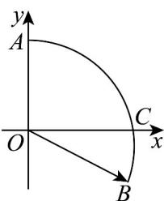
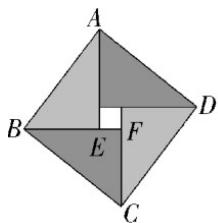

> [!faq]- 《第六章 平面向量及其应用（高效培优单元自测·提升卷）》官方解析
>
> > [!success]- **【答案】** A
>
> > [!note]- **【解析】**
> > 由题意，得 $\angle AOC = 90^{\circ}$ ，故以 $O$ 为坐标原点， $OC$ ， $OA$ 所在直线分别为 $x$ 轴， $y$ 轴建立平面直角
> >
> > 坐标系，
> >
> > 则 $O(0,0)$ ， $A(0,\sqrt{3})$ ， $C(\sqrt{3},0)$ ， $B\left(\sqrt{3}\cos 30^{\circ}, - \sqrt{3}\sin 30^{\circ}\right)$
> >
> > 因为 $OC = \lambda OA + \mu OB$
> >
> > 所以 $(\sqrt{3},0) = \lambda (0,\sqrt{3}) + \mu \left(\sqrt{3}\times \frac{\sqrt{3}}{2}, - \sqrt{3}\times \frac{1}{2}\right)$
> >
> > 即 $\left\{ \begin{array}{l} \sqrt{3} = \mu \times \sqrt{3} \times \frac{\sqrt{3}}{2}, \\ 0 = \sqrt{3}\lambda - \sqrt{3} \times \frac{1}{2}\mu, \end{array} \right.$ 则 $\left\{ \begin{array}{l} \mu = \frac{2\sqrt{3}}{3}, \\ \lambda = \frac{\sqrt{3}}{3}, \\ \lambda + \mu = \sqrt{3} \end{array} \right.$ .
> >
> > 
> >
> > 故选：A
> >
> > 5. 我国东汉末数学家赵爽在《周髀算经》中利用一幅“弦图”给出了勾股定理的证明，后人称其为“赵爽弦
> >
> > 图”，它是由四个全等的直角三角形与一个小正方形拼成的一个大正方形，如图所示．在“赵爽弦图”中，若
> >
> > $BE = 2EF$ ，则 $EF =$ （）
> >
> > 
> >
> > A. $\frac{3}{13} BC + \frac{1}{13} BA$ B. $\frac{3}{13} BC + \frac{2}{13} BA$ C. $\frac{2}{13} BC + \frac{3}{13} BA$ D. $\frac{1}{13} BC + \frac{2}{13} BA$
> >
> > 【答案】B
> >
> > 【详解】因为在“赵爽弦图”中，若 BE = 2EF ，
> >
> > 所以 $\frac{\square\square\square}{EF}=\frac{1}{3}\frac{\square\square\square}{BF}=\frac{1}{3}\left(\frac{\square\square\square}{BC}+\frac{\square\square\square}{CF}\right)=\frac{1}{3}\left(\frac{\square\square\square}{BC}+\frac{2}{3}\frac{\square\square\square}{EA}\right)=\frac{1}{3}\frac{\square\square\square}{BC}+\frac{2}{9}\frac{\square\square\square}{EA}=\frac{1}{3}\frac{\square\square\square}{BC}+\frac{2}{9}\left(\frac{\square\square\square}{BA}-\frac{\square\square\square}{BE}\right)$
> >
> > $$
> > = \frac {1}{3} B C + \frac {2}{9} \left(B A - 2 E F\right)
> > $$
> >
> > 所以 $\frac{1}{3}BC + \frac{2}{9}BA - \frac{4}{9}EF$ ，所以 $\frac{13}{9}EF = \frac{1}{3}BC + \frac{2}{9}BA$ ，所以 $\frac{13}{13}BC + \frac{2}{13}BA$
> >
> > 故选 **B**.
