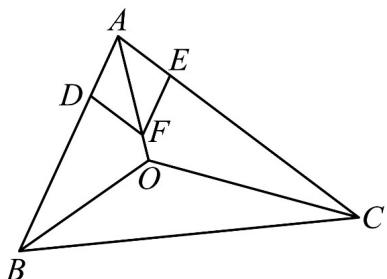

> [!faq]- 《第六章 平面向量及其应用（高效培优单元自测·提升卷）》官方解析
>
> > [!success]- **【答案】** B
>
> > [!note]- **【解析】**
> > 在 $AB$ ， $AC$ 上分别取点 $D$ ， $E$ ，使得 $\vec{AD} = \frac{\vec{AB}}{c}$ ， $\vec{AE} = \frac{\vec{AC}}{b}$ ，则 $\left|\overrightarrow{AD}\right| = \left|\overrightarrow{AE}\right| = 1$
> >
> > 以 $AD$ ， $AE$ 为邻边作平行四边形 $ADFE$ ，如图，
> >
> > 
> >
> > 则四边形 ADFE 是菱形，且 $\vec{AF} = \vec{AD} + \vec{AE} = \frac{\vec{AB}}{c} + \frac{\vec{AC}}{b}$
> >
> > $\therefore AF$ 为 $\angle BAC$ 的平分线． $\because a\overrightarrow{OA} +b\overrightarrow{OB} +c\overrightarrow{OC} = \overrightarrow{0}$
> >
> > $\therefore a \cdot \overrightarrow{OA} + b \cdot (\overrightarrow{OA} + \overrightarrow{AB}) + c \cdot (\overrightarrow{OA} + \overrightarrow{AC}) = \overrightarrow{0}$
> >
> > 即 $(a + b + c)\vec{OA} +b\vec{AB} +c\vec{AC} = \vec{0}$
> >
> > $$
> > \stackrel {\square \square \square} {A O} = \frac {b}{a + b + c} \stackrel {\square \square \square} {A B} + \frac {c}{a + b + c} \stackrel {\square \square \square} {A C} = \frac {b c}{a + b + c} \left(\frac {\stackrel {\square \square \square} {A B}}{c} + \frac {\stackrel {\square \square \square} {A C}}{b}\right) = \frac {b c}{a + b + c} \stackrel {\square \square \square} {A F}
> > $$
> >
> > ∴ A O F 三点共线，即 在 ∠BAC 的平分线上，
> >
> > 同理可得 O 在其它两角的平分线上，
> >
> > $\therefore O_{是}$ VABC 的内心.
> >
> > 故选 **B**.
