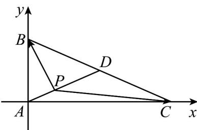

> [!faq]- 《第六章 平面向量及其应用（高效培优单元自测·提升卷）》官方解析
>
> > [!success]- **【答案】** A $[-5,0]$ B $[-3,0]$ C $[0,3]$ D $[0,5]$
>
> > [!note]- **【解析】**
> > 以 A 为坐标原点，AC, AB 为 x, y 轴的正方向建立平面直角坐标系，
> > 所以 $A(0,0)$ , $B(0,2)$ , $C(4,0)$ ，因为 D 为 BC 的中点，所以 $D(2,1)$ ， $AD=(2,1)$ ，设 $AP=\lambda AD(0\leq\lambda\leq1)$ ，所以 $AP=\lambda(2,1)=(2\lambda,\lambda)$ ，
> > 所以 $P(2\lambda,\lambda)$ ，可得 $PB=(0,2)-(2\lambda,\lambda)=(-2\lambda,2-\lambda)$ ， $PC=(4,0)-(2\lambda,\lambda)=(4-2\lambda,-\lambda)$ ，
> > 所以 $PB \cdot PC = -10\lambda + 5\lambda^{2} = 5(\lambda - 1)^{2} - 5$ 因为 $0 \leq \lambda \leq 1$ ，所以 $PB \cdot PC = 5(\lambda - 1)^{2} - 5 \in [-5, 0]$ .
> >
> > 故选：A.
> >
> > 
