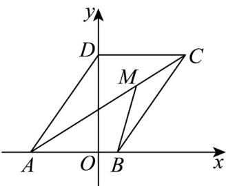

> [!faq]- 《第六章 平面向量及其应用（高效培优单元自测·提升卷）》官方解析
>
> > [!success]- **【答案】** $\overrightarrow{CP}=x\cdot\frac{\overrightarrow{CA}}{|CA|}+y\cdot\frac{\overrightarrow{CB}}{|CB|}$ ，则 $\frac{2}{x}+\frac{1}{y}$ 的最小值为（） A. $\frac{11}{6}+\frac{\sqrt{6}}{3}$ B. $\frac{11}{6}$ C. $\frac{11}{12}+\frac{\sqrt{6}}{3}$ D. $\frac{11}{12}$
>
> > [!note]- **【解析】**
> > 设，根据题意得 $\left\{\begin{aligned}&bc\cos A=9\\&b=c\cos A\\&\frac{1}{2}bc\sin A=6\end{aligned}\right.$
> >
> > 解得 $b = 3$ ， $c = 5$ ， $\sin A = \frac{4}{5}$ ， $\cos A = \frac{3}{5}$
> >
> > $$
> > \left| \overrightarrow {C B} \right| = \sqrt {\left(\overrightarrow {A B} - \overrightarrow {A C}\right) ^ {2}} = \sqrt {c ^ {2} + b ^ {2} - 2 b c \cos A} = \sqrt {5 ^ {2} + 3 ^ {2} - 2 \times 5 \times 3 \times \frac {3}{5}} = 4
> > $$
> >
> > $$
> > \begin{array}{l} \overrightarrow {C P} = x \cdot \frac {\overrightarrow {C A}}{| C A |} + y \cdot \frac {\overrightarrow {C B}}{| C B |} = \frac {x}{3} \overrightarrow {C A} + \frac {y}{4} \overrightarrow {C B} \\ . \end{array}
> > $$
> >
> > 又∵ A、P、B 三点共线，∴ $\frac{x}{3} + \frac{y}{4} = 1$ ，
> >
> > $$
> > \therefore \frac {2}{x} + \frac {1}{y} = (\frac {x}{3} + \frac {y}{4}) (\frac {2}{x} + \frac {1}{y}) = \frac {1 1}{1 2} + \frac {x}{3 y} + \frac {y}{2 x} \quad \frac {1 1}{1 2} + 2 \sqrt {\frac {x}{3 y} \cdot \frac {y}{2 x}} = \frac {1 1}{1 2} + \frac {\sqrt {6}}{3}
> > $$
> >
> > 当且仅当 $\left\{ \begin{array}{l} \frac{x}{3} + \frac{y}{4} = 1 \\ \frac{x}{3y} = \frac{y}{2x} \end{array} \right.$ ，即 $\left\{ \begin{array}{l} x = \frac{6 \times (4 - \sqrt{6})}{5} \\ y = \frac{4 \times (2\sqrt{6} - 3)}{5} \end{array} \right.$ 时，等号成立。
> >
> > 故选：C
> >
> > ## 二、选择题：本题共3小题，每小题6分，共18分．在每小题给出的选项中，有多项符合题目要求．全部选对的得6分，部分选对的得部分分，有选错的得0分.
> >
> > 9．平行四边形ABCD中，BC=3，BA=2， $\angle B=\frac{2\pi}{3}$ ．动点M满足 $\overline{BM}=\overline{\lambda BA}+\overline{\mu BC}$ ， $\lambda$ ， $\mu\in[0,1]$ ，下
> >
> > 列选项中正确的有（）
> >
> > A. $\frac{BM}{BA} = \frac{7}{2}$ 时，则 $\mu$ 的取值范围为 $\left[0, \frac{1}{3}\right]$ B. $\lambda=1$ 时， $\left|\begin{matrix}BM\\ DM\end{matrix}\right|$ 的取值范围是 $[0,3]$
> >
> > C. $\lambda = 1$ 时，存在 $M$ 使得 $BM\cdot AC = 0$
> >
> > D. $\mu=\frac{1}{3}$ 且 $\left|\stackrel{\cup\cup\cup\cup}{BM}\right|$ 最大时， $\stackrel{\cup\cup\cup\cup}{BM}$ 在 $\stackrel{\cup\cup\cup}{BA}$ 上的投影向量为 $\frac{3}{4}\stackrel{\square\square\square}{BA}$
> >
> > 【答案】BCD
> >
> > 【详解】作 $DO \perp AB$ 于点 O ，建立如图所示的坐标系，
> >
> > 
> >
> > 因为在平行四边形 ABCD 中，BC = 3，BA = 2， $\angle B = \frac{2\pi}{3}$ ，
> >
> > 所以 $AO = AD \cos \frac{\pi}{3} = 3 \times \frac{1}{2} = \frac{3}{2}$ ， $OB = \frac{1}{2}, DO = 3 \times \sin \frac{\pi}{3} = \frac{3}{2} \sqrt{3}$ ，
> >
> > 所以 $A\left(-\frac{3}{2},0\right),B\left(\frac{1}{2},0\right),C\left(2,\frac{3\sqrt{3}}{2}\right),D\left(0,\frac{3\sqrt{3}}{2}\right)$
> >
> > 所以 $\frac{\square\square\square\square}{BM} = \lambda \frac{\square\square\square}{BA} +\mu \frac{\square\square\square}{BC} = \lambda (-2,0) + \mu \left(\frac{3}{2},\frac{3\sqrt{3}}{2}\right) = \left(-2\lambda +\frac{3}{2}\mu ,\frac{3\sqrt{3}}{2}\mu\right)$
> >
> > 对于 A， $\overrightarrow{BM} \cdot \overrightarrow{BA} = \left(-2\lambda + \frac{3}{2}\mu, \frac{3\sqrt{3}}{2}\mu\right) \cdot (-2, 0) = 4\lambda - 3\mu = \frac{7}{2}$
> >
> > 因为 $\left\{\begin{aligned}0&\leq\mu\leq1\\ 0&\leq\lambda=\frac{7}{8}+\frac{3}{4}\mu\leq1\end{aligned}\right.$ ，解得 $0\leq\mu\leq\frac{1}{6}$ ，故 A 错误；
> >
> > 对于 $\mathsf{B}$ ，当 $\lambda = 1$ 时，因为 $AD = BC$ ，所以 $BM = \lambda BA + \mu BC = BA + \mu AD$
> >
> > 则 $AM = BM - BA = \mu AD$ ，故点 M 在 DA 上，所以 $\left|DM\right|$ 的取值范围是 $[0,3]$ ，故 B 正确；
> >
> > 对于 C，当 $\lambda=1$ 时， $BM=\lambda BA+\mu BC=\left(-2+\frac{3}{2}\mu,\frac{3\sqrt{3}}{2}\mu\right)$ ， $AC=\left(\frac{7}{2},\frac{3}{2}\sqrt{3}\right)$ ，
> >
> > 因为 $\stackrel{\square\square\square\square}{BM}\cdot\stackrel{\square\square\square}{AC}=0$ ，所以 $\left(-2+\frac{3}{2}\mu,\frac{3\sqrt{3}}{2}\mu\right)\cdot\left(\frac{7}{2},\frac{3}{2}\sqrt{3}\right)=0$ ，
> >
> > 即 $\left(-2 + \frac{3}{2}\mu\right)\times \frac{7}{2} +\frac{3\sqrt{3}}{2}\mu \times \frac{3}{2}\sqrt{3} = 0\Rightarrow \mu = \frac{7}{12}$ ，故C正确；
> >
> > 对于 D：当 $\mu=\frac{1}{3}$ 时，因为 $\overrightarrow{BM}=\lambda\overrightarrow{BA}+\mu\overrightarrow{BC}=\left(-2\lambda+\frac{1}{2},\frac{\sqrt{3}}{2}\right)$
> >
> > $\left|\overrightarrow{BM}\right| = \sqrt{\left(-2\lambda + \frac{1}{2}\right)^2 + \left(\frac{\sqrt{3}}{2}\right)^2} = \sqrt{4\left(\lambda - \frac{1}{4}\right)^2 + \frac{3}{4}}$ ，因为 $0 \leq \lambda \leq 1$
> >
> > 所以当 $\lambda=1$ 时， $\left|\overrightarrow{BM}\right|$ 最大，最大值为 $\sqrt{3}$ ，此时 $\overrightarrow{BM}=\lambda\overrightarrow{BA}+\mu\overrightarrow{BC}=\left(-\frac{3}{2},\frac{\sqrt{3}}{2}\right)$
> >
> > 又 $BA = (-2,0)$ ，则 $\left|BA\right| = 2$
> >
> > 所以 $\frac{\square\square\square\square}{BM}$ 在 $\frac{\square\square\square}{BA}$ 上的投影向量为 $\frac{\left(-\frac{3}{2},\frac{\sqrt{3}}{2}\right)\cdot(-2,0)}{2}\cdot\frac{\square\square\square}{BA}=\frac{3}{4}\square\square\square\square$ , 故 $^D$ 正确；
> >
> > 故选 **BCD**.
