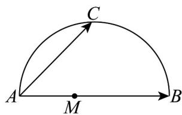

<!-- question-source:start -->
12．如图，AB为半圆的直径，点C为AB的中点，点M为线段AB上的一动点（含端点A，B）．若AB=2，则 $\left|\overline{AC}+\overline{MB}\right|$ 的取值范围是\_\_\_\_．

<!-- question-source:end -->

![[高中/课堂同步/题库/人教A版高中数学同步讲义(2026)/02_必修第二册/第六章 平面向量及其应用/第六章 平面向量及其应用（高效培优单元自测·提升卷）/三_填空题/questions/answers/Q00078550A1.md]]
