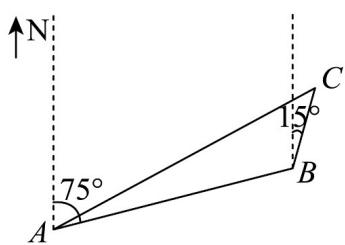

<!-- question-source:start -->
17．（15分）如图所示，有一艘缉毒船正在 $A$ 处巡逻，发现在北偏东 $75^{\circ}$ 方向、距离为 $60$ 海里 $B$ 处有毒贩

正驾驶小船以每小时 $15\left(\sqrt{3} - 1\right)$ 海里的速度往北偏东 $15^{\circ}$ 的方向逃跑，缉毒船立即驾船以每小时 $15\sqrt{6}$ 海里的

速度前往缉捕．

(1)求缉毒船经过多长时间恰好能将毒贩抓捕；

(2)试确定缉毒船的行驶方向.
<!-- question-source:end -->

![[高中/课堂同步/题库/人教A版高中数学同步讲义(2026)/02_必修第二册/第六章 平面向量及其应用/第六章 平面向量及其应用（高效培优单元自测·提升卷）/三_填空题/questions/answers/Q00078555A1.md]]
