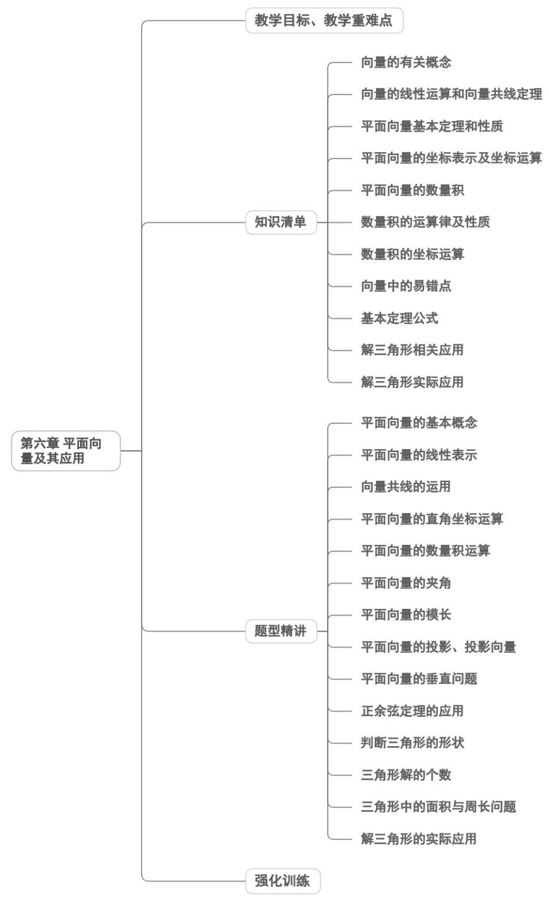
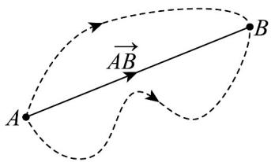
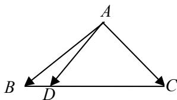
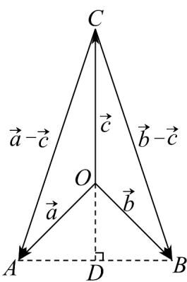
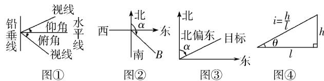
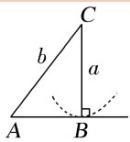
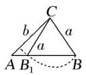
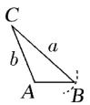

<!-- source-part:1 pages:1-50 -->

## 第六章 平面向量及其应用

内容概览

## 教学目标、教学重难点

<table><tr><td>教学目标</td><td>1. 理解平面向量的核心概念:明确向量是“既有大小又有方向”的量,能区分向量与数量(如温度、长度等仅含大小的量);熟练掌握向量的几何表示(有向线段)、字母表示及相关概念(模、零向量、单位向量、相等向量、相反向量、共线向量),明确零向量“模为0、方向任意”的特殊性与单位向量“模为1”的标准化特征。2. 掌握向量的运算体系:熟练运用三角形法则(首尾相接)、平行四边形法则(共起点)进行向量加减运算,理解其几何意义;掌握向量数乘运算的规则,方向由符号决定:理解向量数量积的概念、几何意义(投影乘积),能进行数量积的代数运算与坐标运算。3. 把握核心定理与坐标体系:理解平面向量基本定理(不共线向量可作为基底表示任意向量),掌握向量的正交分解与坐标表示;熟练运用向量共线)、垂直的充要条件,能通过坐标判断向量关系;掌握余弦定理、正弦定理的向量推导过程及应用场景。4. 具备实际应用能力:能将几何问题(平行、垂直、长度、角度计算)、物理问题(力的合成与分解、位移与速度合成)转化为向量问题,运用向量工具求解;能结合生活实例(如无人机飞行、帆船航行)解释向量的应用价值。</td></tr><tr><td>教学重难点</td><td>重点1. 向量的核心概念与表示方法:重点掌握向量“大小与方向”的双重本质,明确相等向量、共线向量的定义,熟练运用有向线段与坐标表示向量。2. 向量的运算规则与几何意义:重中之重是向量加法的三角形法则、平行四边形法则的适用条件与直观表征;向量数乘的伸缩与方向规律;数量积的几何意义(投影)与运算性质。3. 核心定理与应用工具:平面向量基本定理的内涵(基底的任意性与唯一性);向量共线、垂直的充要条件;余弦定理、正弦定理的向量推导与实际应用(解三角形)。4. 数形结合的思维方法:掌握“几何图形→向量表示→代数运算→几何结论”的转化路</td></tr></table>

## 知识清单

## 知识点 01 向量的有关概念

(1) 定义：既有大小又有方向的量叫做向量，向量的大小叫做向量的长度（或模）.

(2) 向量的模：向量 $\overline{AB}$ 的大小，也就是向量 $\overline{AB}$ 的长度，记作 $\left|\overline{AB}\right|$ .

(3) 特殊向量：

①零向量：长度为0的向量，其方向是任意的。

②单位向量：长度等于1个单位的向量。

③平行向量：方向相同或相反的非零向量．平行向量又叫共线向量．规定： $^{0}$ 与任一向量平行．

④相等向量：长度相等且方向相同的向量。

⑤相反向量：长度相等且方向相反的向量。

## 【即学即练】

1. 下列物理量：①质量；②速度；③力；④加速度；⑤位移；⑥密度；⑦功．其中是向量的有（）

【答案】
A. 4个
B. 3个
C. 2个
D. 1个

【答案】A

【分析】根据向量的知识进行分析，从而确定正确答案·

【详解】质量、密度、功是标量，不是向量；

速度、力、加速度、位移是向量；

所以向量共有4个·

故选：A

2. 定义：质点从位置 $A$ 运动到位置 $B$ ，位置的改变称为位移·位移只刻画起点 $A$ 与终点 $B$ 的位置的差别·如图，

从 $A$ 到 $B$ 虽然有不同的路线，但只要是从 $A$ 到 $B$ ，其位移就都是相同的，都用带箭头的线段 $AB$ 表示，其中箭

头表示这条线段的方向是从 $A$ 到 $B$ ，与质点实际运动的路线无关·像 $\overline{AB}$ 这样具有方向的线段，称为\_

【答案】有向线段

## 知识点 02 向量的线性运算和向量共线定理

## (1) 向量的线性运算

<table><tr><td>运算</td><td>定义</td><td>法则(或几何意义)</td><td>运算律</td></tr><tr><td>加法</td><td>求两个向量和的运算</td><td> 三角形法则平行四边形法则</td><td>1交换律 $a + b = b + a$ 2结合律 $(a + b) + c = a + (b + c)$ </td></tr><tr><td>减法</td><td>求 $a$ 与 $b$ 的相反向量- $b$ 的和的运算叫做 $a$ 与 $b$ 的差</td><td>三角形法则</td><td> $a - b = a + (-b)$ </td></tr><tr><td>数乘</td><td>求实数 $\lambda$ 与向量 $a$ 的积的运算</td><td>(1)  $|\lambda a| = |\lambda||a|$ (2)当 $\lambda >0$ 时, $\lambda a$ 与 $a$ 的方向相同;当λ&lt;0时,λa与a的方向相同;当λ=0时,λa=0</td><td> $\lambda(\mu a) = (\lambda\mu)a$  $(\lambda + \mu)a = \lambda a + \mu a$  $\lambda(a + b) = \lambda a + \lambda b$ </td></tr></table>

【注意】

(1) 向量表达式中的零向量写成 $0$ ，而不能写成 $0$ 。

（2）两个向量共线要区别与两条直线共线，两个向量共线满足的条件是：两个向量所在直线平行或重合，而

在直线中，两条直线重合与平行是两种不同的关系。

（3）要注意三角形法则和平行四边形法则适用的条件，运用平行四边形法则时两个向量的起点必须重合，和

向量与差向量分别是平行四边形的两条对角线所对应的向量；运用三角形法则时两个向量必须首尾相接，否

则就要把向量进行平移，使之符合条件。

(4) 向量加法和减法几何运算应该更广泛、灵活如： $OA - OB = BA$ ， $AM - AN = NM$ ， $OA = OB + CA \Leftrightarrow OA - OB = CA \Leftrightarrow BA - CA = BA + AC = BC$

## 【即学即练】

1. 在 $\forall ABC$ 中， $AB = 1$ ， $AC = \sqrt{3}$ ， $\angle BAC = 90^{\circ}$ ，点 $D$ 在边 $BC$ 上（不含端点），延长 $AD$ 到 $E$ ，若 $AE = (2 - \lambda)AB + \lambda AC$ 。且 $\left|AE\right| = 2$ ，则线段 $BD$ 的长度是（）A. $\frac{1}{2}$ B. 1 C. $\frac{3}{2}$ D. $\sqrt{3}$

【答案】B

【分析】利用平面向量数量积的运算性质可求出 $\lambda$ 的值，分析可知 D 为 BC 的中点，即可求出 BD 的长·

【详解】在 $\forall ABC$ 中， $AB = 1$ ， $AC = \sqrt{3}$ ， $\angle BAC = 90^{\circ}$ ，则 $AB\cdot AC = 0$

因为 $\overline{AE} = (2 - \lambda)\overline{AB} + \lambda\overline{AC}$

则 $\left|\overline{AE}\right|^2 = \left[(2 - \lambda)\overline{AB} +\lambda \overline{AC}\right]^2 = (2 - \lambda)^2\overline{AB}^2 +\lambda^2\overline{AC}^2 +2\lambda (2 - \lambda)\overline{AB}\cdot \overline{AC}$

$$
= (2 - \lambda) ^ {2} + 3 \lambda^ {2} = 4 \lambda^ {2} - 4 \lambda + 4 = 4
$$

整理可得 $\lambda(\lambda-1)=0$ ，解得 $\lambda=0$ 或 $\lambda=1$ ，

当 $\lambda = 0$ 时，则 $AE = 2AB$ ，此时点 $B$ 为 $AE$ 的中点，

由题意可知点 D 为线段 AE 与 BC 的交点，即点 D 与点 B 重合，不符合题意，

当 $\lambda=1$ 时， $AE=\overline{AB}+\overline{AC}$ ，由题意可知，四边形 ABEC 为矩形，

因为 $D$ 为线段 $AE$ 与 $BC$ 的交点，则 $D$ 为 $BC$ 的中点，

故 $BD = \frac{1}{2} BC = \frac{1}{2}\sqrt{AB^2 + AC^2} = \frac{1}{2}\times \sqrt{1 + 3} = 1$

故选：B.

2. 化简：

(1) $\left(AB - BM\right) + BO + OM =$

(2) $NQ + QP + MN + PM = \_\_\_\_$ .

【答案】 $AB$ 0

【分析】由向量的线性运算即可求解·

【详解】（1） $\left(AB-BM\right)+BO+OM=\left(AB-BM\right)+\left(BO+OM\right)=\left(AB-BM\right)+BM=AB$ ；

$$
(2) N Q + Q P + M N + P M = N P + P M + M N = N M + M N = 0.
$$

故答案为：① $AB$ ；②0.

## 知识点 03 平面向量基本定理和性质

## 1. 共线向量基本定理

如果 $a = \lambda b(\lambda \in R)$ ，则 $a / / b$ ；反之，如果 $a / / b$ 且 $b\neq 0$ ，则一定存在唯一的实数 $\lambda$ ，使 $a = \lambda b$ （口诀：

数乘即得平行，平行必有数乘）.

## 2. 平面向量基本定理

如果 $e_1$ 和 $e_2$ 是同一个平面内的两个不共线向量，那么对于该平面内的任一向量 $a$ ，都存在唯一的一对实数

$\lambda_1, \lambda_2$ ，使得 $a = \lambda_1 e_1 + \lambda_2 e_2$ ，我们把不共线向量 $e_1, e_2$ 叫做表示这一平面内所有向量的一组基底，记为

$\left\{e_1, e_2\right\}$ ， $\lambda_1 e_1 + \lambda_2 e_2$ 叫做向量 $a$ 关于基底 $\left\{e_1, e_2\right\}$ 的分解式。

注意：由平面向量基本定理可知：只要向量 $e_1$ 与 $e_2$ 不共线，平面内的任一向量 $a$ 都可以分解成形如

$a = \lambda_{1}e_{1} + \lambda_{2}e_{2}$ 的形式，并且这样的分解是唯一的。 $\lambda_1e_1 + \lambda_2e_2$ 叫做 $e_1, e_2$ 的一个线性组合。平面向量基本定

理又叫平面向量分解定理，是平面向量正交分解的理论依据，也是向量的坐标表示的基础。

推论1：若 $a = \lambda_1\bar{e}_1 + \lambda_2\bar{e}_2 = \lambda_3\bar{e}_1 + \lambda_4\bar{e}_2$ ，则 $\lambda_{1} = \lambda_{3},\lambda_{2} = \lambda_{4}$ .推论2：若 $a = \lambda_1\bar{e}_1 + \lambda_2\bar{e}_2 = 0$ ，则 $\lambda_1 = \lambda_2 = 0$

## 3. 线段定比分点的向量表达式

如图所示，在 $\triangle ABC$ 中，若点 $D$ 是边 $BC$ 上的点，且 $\overrightarrow{BD} = \lambda \overrightarrow{DC}$ （ $\lambda \neq -1$ ），则向量 $\overrightarrow{AD} = \frac{\overrightarrow{AB} + \overrightarrow{\lambda AC}}{1 + \lambda}$ 。在向

量线性表示（运算）有关的问题中，若能熟练利用此结论，往往能有“化腐朽为神奇”之功效，建议熟练掌握。

## 4.三点共线定理

平面内三点 $A, B, C$ 共线的充要条件是：存在实数 $\lambda, \mu$ ，使 $OC = \lambda OA + \mu OB$ ，其中 $\lambda + \mu = 1$ ， $O$ 为平面内

一点．此定理在向量问题中经常用到，应熟练掌握．

## A、B、C三点共线

$\Leftrightarrow$ 存在唯一的实数 $\lambda$ ，使得 $AC = \lambda AB$ ； $\Leftrightarrow$ 存在唯一的实数 $\lambda$ ，使得 $OC = OA + \lambda AB$ ；

$\Leftrightarrow$ 存在唯一的实数 $\lambda$ ，使得 $OC = (1 - \lambda)OA + \lambda OB$ ； $\Leftrightarrow$ 存在 $\lambda +\mu = 1$ ，使得 $OC = \lambda OA + \mu OB$

## 5. 中线向量定理

如图所示，在 $\triangle ABC$ 中，若点 $D$ 是边 $BC$ 的中点，则中线向量 $AD = \frac{1}{2} (AB + AC)$ ，反之亦正确。

## 【即学即练】

1. 如图，在平行四边形 $ABCD$ 中， $AE = 2EB$ ， $DF = 3FB$ ，设 $AB = a$ ， $AD = b$ 。注：本小题几何方法求解不

得分.

(1)用 a, b 表示 $BD$ , $AF$ ;

(2)用平面向量证明： $E$ ， $F$ ， $C$ 三点共线.

【答案】(1) $b - a$ ， $\frac{3}{4} a + \frac{1}{4} b$

(2)证明见解析

【分析】（1）根据题意，结合 $BD = AD - AB$ 和 $AF = AB + BF = AB + \frac{1}{4} BD$ ，即可求解；

$EF=\frac{1}{12}\vec{a}+\frac{1}{4}\vec{b},\quad EC=\frac{1}{3}\vec{a}+\vec{b}$ (2) 根据题意，求得 $\vec{EC}=4EF$ ，即可得证.

【详解】（1）由题意知，向量 $AB = a, AD = b$ 可得 $BD = AD - AB = b - a$

又由 $\stackrel{\square\square}{DF}=3FB$ ，可得 $\stackrel{\square\square\square}{BF}=\frac{1}{4}\stackrel{\square\square\square}{BD}$ ，

所以 $\overrightarrow{AF} = \overrightarrow{AB} + \overrightarrow{BF} = \overrightarrow{AB} + \frac{1}{4}\overrightarrow{BD} = a + \frac{1}{4}(b - a) = \frac{3}{4}a + \frac{1}{4}b$

(2) 因为 $AE = 2EB$ ，可得 $AE = \frac{2}{3}AB$

所以 $EF = AF - AE = \frac{3}{4}a + \frac{1}{4}b - \frac{2}{3}a = \frac{1}{12}a + \frac{1}{4}b$

$EC = EB + BC = \frac{1}{3} a + b$ 且 $EC = 4EF$ ，所以 $E,F,C$ 三点共线·

2．在 $\forall ABC$ 中，BC=6，AC=3， $\angle BAC=\frac{\pi}{2}$ ，D为 BC 中点，则 $AB\cdot AD=$ \_\_\_\_.

【答案】 $\frac{27}{2}$

【分析】利用基底向量表示向量 $AB, AD$ ，然后由向量的数量积公式求得结果

【详解】∵D为BC中点，∴ $\overline{AD}=\frac{1}{2}\overline{AB}+\frac{1}{2}\overline{AC}$

$\because \angle BAC = \frac{\pi}{2}, \therefore |BC|^2 = |AB|^2 + |AC|^2$ ，即 $|AB|^2 = 36 - 9 = 27, \therefore |AB| = 3\sqrt{3}$ ，

$\therefore AB\cdot AD=AB\cdot\left(\frac{1}{2}AB+\frac{1}{2}AC\right)=\frac{1}{2}\left|AB\right|^{2}+\frac{1}{2}AB\cdot AC=\frac{27}{2}.$

故答案为： $\frac{27}{2}$

## 知识点 04 平面向量的坐标表示及坐标运算

(1) 平面向量的坐标表示.

在平面直角坐标中，分别取与 $x$ 轴， $y$ 轴正半轴方向相同的两个单位向量 $i, j$ 作为基底，那么由平面向量基

本定理可知，对于平面内的一个向量 $a$ ，有且只有一对实数 $x, y$ 使 $a = xi + yj$ ，我们把有序实数对 $(x, y)$ 叫做

向量 $a$ 的坐标，记作 $a = (x, y)$

(2) 向量的坐标表示和以坐标原点为起点的向量是一一对应的，即有

向量 $(x,y)$ $\downarrow$ 对应 向量 $OA\downarrow$ 对应 点 $A(x,y)$

（3）设 $a = (x_{1},y_{1})$ ， $b = (x_{2},y_{2})$ ，则 $a + b = (x_1 + x_2,y_1 + y_2)$ ， $a - b = (x_{1} - x_{2},y_{1} - y_{2})$ ，即两个向量的和与差的

坐标分别等于这两个向量相应坐标的和与差.

若 $a = (x,y)$ ， $\lambda$ 为实数，则 $\lambda a = (\lambda x,\lambda y)$ ，即实数与向量的积的坐标，等于用该实数乘原来向量的相应坐标。

（4）设 $A(x_{1},y_{1})$ ， $B(x_{2},y_{2})$ ，则 $AB = OB - OA = (x_1 - x_2,y_1 - y_2)$ ，即一个向量的坐标等于该向量的有向线段

的终点的坐标减去始点坐标．

(2). 平面向量的直角坐标运算

①已知点 $A(x_{1},y_{1})$ ， $B(x_{2},y_{2})$ ，则 $\overline{AB} = (x_2 - x_1,y_2 - y_1)$ ， $|\overline{AB}| = \sqrt{(x_2 - x_1)^2 + (y_2 - y_1)^2}$

②已知 $a = (x_{1},y_{1})$ ， $b = (x_{2},y_{2})$ ，则 $a\pm b = (x_1\pm x_2,y_1\pm y_2)$ ， $\lambda a = (\lambda x_1,\lambda y_1)$

$$
a \cdot b = x _ {1} x _ {2} + y _ {1} y _ {2}, | \vec {a} | = \sqrt {x _ {1} ^ {2} + y _ {1} ^ {2}}. a \| b \Leftrightarrow x _ {1} y _ {2} - x _ {2} y _ {1} = 0, a \perp b \Leftrightarrow x _ {1} x _ {2} + y _ {1} y _ {2} = 0
$$

（1）向量的三角形法则适用于任意两个向量的加法，并且可以推广到两个以上的非零向量相加，称为多边形

法则．一般地，首尾顺次相接的多个向量的和等于从第一个向量起点指向最后一个向量终点的向量．

即 $A_{1}A_{2} + A_{2}A_{3} + \dots +A_{n - 1}A_{n} = A_{1}A_{n}$

(2) $||a| - |b|| \leq |a \pm b| \leq |a| + |b|$ ，当且仅当 $a, b$ 至少有一个为 0 时，向量不等式的等号成立。

(3) 特别地： $\left|\left|a\right|-\left|b\right|\right|\leq\left|a\pm b\right|$ 或 $\left|a\pm b\right|\leq\left|a\right|+\left|b\right|$ 当且仅当 a,b 至少有一个为 0 时或者两向量共线时，向量

不等式的等号成立．

(4) 减法公式： $AB - AC = CB$ ，常用于向量式的化简。

(5) A、P、B三点共线 $\Leftrightarrow OP=(1-t)OA+tOB(t\in R)$ ，这是直线的向量式方程.

## 【即学即练】

1. 已知向量 $a = (0,1)$ ， $b = (1,1)$ ， $c = (-1,2)$ ， $c = xa + yb$ ，则 $\frac{x}{y} = (\quad)$ A. -3 B. $-\frac{1}{3}$ C. $-\frac{1}{2}$ D. $\frac{1}{2}$

【答案】A

【分析】根据向量的坐标表示代入即可·

【详解】因为 $a=(0,1)$ ， $b=(1,1)$ ， $c=(-1,2)$ ，所以 $x(0,1)+y(1,1)=(-1,2)$ ， $\left\{\begin{aligned}y&=-1\\ x+y&=2\end{aligned}\right.$ ，解得 $\left\{\begin{aligned}y&=-1\\ x&=3\end{aligned}\right.$ ，所以 $\frac{x}{y}&=-3$

故选：A

2. 已知点 $O(0,0)$ ，向量 $\overline{OA} = (2,3)$ ， $\overline{OB} = (8,-3)$ ， $\overline{AP} = 2PB$ ，则 $P$ 点坐标为（）A. $(6,-1)$ B. $(6,1)$ C. $(4,-1)$ D. $(4,1)$

【答案】A

【分析】利用向量线性运算的坐标表示求出 $OP$ 即可·

【详解】向量 $OA=(2,3)$ ， $OB=(8,-3)$ ， $AP=2PB$ ，可得： $OP-OA=2(OB-OP)$

则 $\overline{OP} = \frac{2}{3}\overline{OB} +\frac{1}{3}\overline{OA} = \frac{2}{3}(8, - 3) + \frac{1}{3}(2,3) = (6, - 1)$

因为点 $O(0,0)$ ，则 P 点坐标为 $(6,-1)$

故选：A

## 知识点 05 平面向量的数量积 a

(1) 平面向量数量积的定义

已知两个非零向量与 b，我们把数量 $\left|a\right|\left|b\right|\cos\theta$ 叫做 a 与 b 的数量积（或内积），

记作 $a \cdot b$ ，即 $a \cdot b = |a||b|\cos \theta$ ，规定：零向量与任一向量的数量积为0.

(2) 平面向量数量积的几何意义

①向量的投影： $|a|\cos\theta$ 叫做向量 a 在 b 方向上的投影数量，当 $\theta$ 为锐角时，它是正数；当 $\theta$ 为钝角时，它是

负数；当 $\theta$ 为直角时，它是0.

② $a \cdot b$ 的几何意义：数量积 $a \cdot b$ 等于 $a$ 的长度 $|a|$ 与 $b$ 在 $a$ 方向上射影 $|b| \cos \theta$ 的乘积.

【即学即练】

1. 已知 $A(3, -4)$ ， $B(-1, 2)$ ， $\overline{AP} = 3\overline{BP}$ ，则点 $P$ 的坐标为

【答案】 $(-3,5)$

【分析】根据平面向量线性运算的坐标表示即可求解·

【详解】设点 $P(x,y)$

则 $AP = (x - 3, y + 4)$ ， $BP = (x + 1, y - 2)$

因为 $\overline{AP} = 3\overline{BP}$ ，所以 $\left\{ \begin{array}{l}x - 3 = 3(x + 1)\\ y + 4 = 3(y - 2) \end{array} \right.$ ，解得 $\left\{ \begin{array}{l}x = -3\\ y = 5 \end{array} \right.$

所以点 P 的坐标为 $(-3,5)$ .

故答案为： $(-3,5)$ .

2. 设向量 $\overline{OM}$ 绕点 O 顺时针旋转 $\frac{\pi}{2}$ 得到向量 $\overline{ON}$ ，且 $3\overline{OM}-2\overline{ON}=(2,-1)$ ，则向量 $\overline{OM}=(\quad)$ A. $\left(\frac{1}{13},-\frac{5}{13}\right)$ B. $\left(\frac{4}{13},-\frac{7}{13}\right)$ C. $\left(\frac{3}{13},-\frac{5}{13}\right)$ D. $\left(\frac{3}{13},-\frac{7}{13}\right)$

【答案】B

【分析】设 $\overline{OM} = (m, n)$ ，以 $\overline{OM}$ 所在直线为终边的一个角为 $\alpha$ ，根据题意可得到 ON 的坐标，根据坐标运算列方程组可求出 m, n.

【详解】设 $OM = (m, n)$ ，以 OM 所在直线为终边的一个角为 $\alpha$ ，

则 $m = \left|\overline{OM}\right|\cos \alpha ,n = \left|\overline{OM}\right|\sin \alpha$ ，且以 $\overline{ON}$ 所在直线为终边的一个角为 $\alpha -\frac{\pi}{2}$

∴ ON 的横坐标为 $\left|\overrightarrow{OM}\right|\cos\left(\alpha-\frac{\pi}{2}\right)=\left|\overrightarrow{OM}\right|\sin\alpha=n$ ，纵坐标为 $\left|\overrightarrow{OM}\right|\sin\left(\alpha-\frac{\pi}{2}\right)=-\left|\overrightarrow{OM}\right|\cos\alpha=-m$ ，即

$$
\stackrel {\sqcup \sqcup \sqcup} {O N} = (n, - m)
$$

$$
\therefore 3 \overline {{O M}} - 2 \overline {{O N}} = (3 m - 2 n, 3 n + 2 m) = (2, - 1)
$$

即 $\left\{\begin{aligned}3m-2n=2\\ 3n+2m=-1\end{aligned}\right.$ ，解得 $\left\{\begin{aligned}m&=\frac{4}{13}\\ n&=-\frac{7}{13}\end{aligned}\right.$ $\therefore OM=\left(\frac{4}{13},-\frac{7}{13}\right).$

故选：B.

## 知识点 06 数量积的运算律及性质

已知向量 $a$ 、 $b$ 、 $c$ 和实数 $\lambda$ ，则：

① $a \cdot b = b \cdot a$ ;

$$
② (\lambda \boldsymbol {a}) \cdot \boldsymbol {b} = \lambda (\boldsymbol {a} \cdot \boldsymbol {b}) = \boldsymbol {a} \cdot (\lambda \boldsymbol {b});
$$

$$
③ (a + b) \cdot c = a \cdot c + b \cdot c
$$

## 数量积的性质

设 $a$ 、 $b$ 都是非零向量， $e$ 是与 $b$ 方向相同的单位向量， $\theta$ 是 $a$ 与 $e$ 的夹角，则

① $e \cdot a = a \cdot e = |a| \cos \theta$ . ② $a \perp b \Leftrightarrow a \cdot b = 0$

③当 $a$ 与 $b$ 同向时， $a \cdot b = |a||b|$ ；当 $a$ 与 $b$ 反向时， $a \cdot b = -|a||b|$

特别地， $a \cdot a = |a|^{2}$ 或 $|a| = \sqrt{a \cdot a}$

$\cos\theta=\frac{a\cdot b}{|a||b|}\left(|a||b|\neq0\right)$ . ⑤ $|a\cdot b|\leq|a||b|$ .

## 【即学即练】

1. 已知 $\theta \in \mathbf{R}$ ，向量 $a = (\sin^2\theta, \cos 2\theta), b = (2,1)$ ，则 $(a + b) \cdot b = (\quad)$ A. 6 B. 5 C. 4 D. 3

【答案】A

【分析】根据向量坐标运算法则求出 $\left(a + b\right) \cdot b$ ，再结合倍角公式求解。

【详解】由题意知向量 $a = (\sin^2\theta, \cos 2\theta), b = (2,1)$

则 $\left(\vec{a} + b\right) \cdot b = a \cdot b + \left|b\right|^2 = 2\sin^2\theta + \cos 2\theta + 5 = 2\sin^2\theta + 1 - 2\sin^2\theta + 5 = 6$

故选：A.

2. 已知向量 $a = (-1, 1)$ ， $b = (x, -2)$ ，若 $a \perp (2a - b)$ ，则 $\left|a + b\right| = (\quad)$ A. $2\sqrt{2}$ B. 5 C. $5\sqrt{2}$ D. 8

【答案】C

【分析】先根据向量垂直和向量数量积的坐标表示求出 $x$ ，进而根据向量的模的公式求出结果

【详解】因为向量 $a=(-1,1)$ ， $b=(x,-2)$ ，所以 $2a-b=(-2,2)-(x,-2)=(-2-x,4)$ .

由于 $a \perp (2a - b)$ ，所以 $a \cdot (2a - b) = 0$

所以 $-1 \times (-2 - x) + 1 \times 4 = 0$ ，解得 $x = -6 \cdot$

所以 $a + b = (-1, 1) + (-6, -2) = (-7, -1)$ ，所以 $\left|a + b\right| = \sqrt{49 + 1} = 5\sqrt{2}$ .

故选：C.

## 知识点 07 数量积的坐标运算

已知非零向量 $a = (x_{1}, y_{1})$ ， $b = (x_{2}, y_{2})$ ， $\theta$ 为向量 $a$ 、 $b$ 的夹角。

<table><tr><td>结论</td><td>几何表示</td><td>坐标表示</td></tr><tr><td>模</td><td> $|a| = \sqrt{a \cdot a}$ </td><td> $|a| = \sqrt{x^2 + y^2}$ </td></tr><tr><td>数量积</td><td> $a \cdot b = |a||b| \cos \theta$ </td><td> $a \cdot b = x_1 x_2 + y_1 y_2$ </td></tr><tr><td>夹角 $a \perp b$ 的充要条件</td><td> $\cos \theta = \frac{a \cdot b}{|a||b|}$  $a \cdot b = 0$ </td><td> $\cos \theta = \frac{x_1 x_2 + y_1 y_2}{\sqrt{x_1^2 + y_1^2} \cdot \sqrt{x_2^2 + y_2^2}}$  $x_1x_2 + y_1y_2 = 0$ </td></tr><tr><td> $a\parallel b$ 的充要条件</td><td> $a = \lambda b (b \neq 0)$ </td><td> $x_1y_2 - x_2y_1 = 0$ </td></tr><tr><td> $|a \cdot b|$ 与 $|a||b|$ 的关系</td><td> $|a \cdot b| \leq |a||b|$ (当且仅当 $a\parallel b$ 时等号成立)</td><td> $|x_1x_2 + y_1y_2| \leq \sqrt{x_1^2 + y_1^2} \cdot \sqrt{x_2^2 + y_2^2}$ </td></tr></table>

## 【即学即练】

1. 向量 $\left|c\right|=\sqrt{2}\left|a\right|=\sqrt{2}\left|b\right|$ ，且 $a+b+c=0$ ，则 $\sin\langle a-c,b-c\rangle=(\quad)$ A. $\frac{1}{5}$ B. $\frac{2}{5}$ C. $\frac{3}{5}$ D. $\frac{4}{5}$

【答案】C

【分析】设 $\left|a\right|=\left|b\right|=1$ ，则 $\left|c\right|=\sqrt{2}$ ，由 $a+b+c=0$ 可得 $a\cdot b=0$ ，作出相应图象，结合图象利用二倍角公式

计算即可求解·

【详解】设 $\left|a\right|=\left|b\right|=1$ ，则 $\left|c\right|=\sqrt{2}$ ，

因为 $a + b + c = 0$ ，所以 $\stackrel{\mathrm{r}}{a} +\stackrel{\mathrm{i}}{b} = -\stackrel{\mathrm{r}}{c}$

即 $a^2 + b^2 + 2a \cdot b = c^2$ ，即 $1 + 1 + 2a \cdot b = 2$ ，所以 $a \cdot b = 0$ 。

如图，设 $OA = a$ ， $OB = b$ ， $OC = c$

则 $\left|OA\right|=\left|OB\right|=1,\quad\left|OC\right|=\sqrt{2}$

因为 $\triangle OAB$ 是等腰直角三角形，

设 AB 边中点为 D，则 $OD \perp AB$ ，

所以 AB 边上的高 $OD = \frac{\sqrt{2}}{2}$ ， $AD = \frac{\sqrt{2}}{2}$

因为 $\stackrel{r}{a} + \stackrel{i}{b} = 2OD = -\stackrel{u u}{c}$ ，所以 C, O, D 三点共线，

所以 $CD = CO + OD = \sqrt{2} + \frac{\sqrt{2}}{2} = \frac{3\sqrt{2}}{2}$ ，

则 $\tan\angle ACD=\frac{AD}{CD}=\frac{1}{3}$

所以 $\cos \angle ACD = \frac{3}{\sqrt{10}}$ ， $\sin \angle ACD = \frac{1}{\sqrt{10}}$

$\sin a-c,b-c=\sin\angle ACB=\sin2\angle ACD=2\sin\angle ACD\cdot\cos\angle ACD=2\times\frac{1}{\sqrt{10}}\times\frac{3}{\sqrt{10}}=\frac{3}{5}$ 所以

故选：C.

2. 平面向量 $a, b$ 满足 $\left|a\right| = 2, \left|b\right| = 4$ ， $a \perp (a - 2b)$ ，则 $|2a - b|$ 的值为

【答案】 $2 \sqrt{6}$

【分析】根据平面向量的数量积与向量垂直的关系计算 $a \cdot b$ ，再根据向量模长与数量积的关系求解 $\left|2a - b\right|$ 的

值即可·

【详解】由 $a \perp (a - 2b)$ 可得 $a \cdot (a - 2b) = 0$

又 $\left|a\right|=2,\left|b\right|=4$ ，所以 $a^{2}-2a\cdot b=\left|a\right|^{2}-2a\cdot b=4-2a\cdot b=0$ ，所以 $a\cdot b=2$

所以 $\left|2a-b\right|=\sqrt{\left(2a-b\right)^{2}}=\sqrt{4a^{2}-4a\cdot b+b^{2}}=\sqrt{24}=2\sqrt{6}$

故答案为： $2\sqrt{6}$

## 知识点 08 向量中的易错点

(1) 平面向量的数量积是一个实数，可正、可负、可为零，且 $\left|a\cdot b\right|\leq\left|a\right|\left|b\right|$

(2) 当 $a \neq 0$ 时，由 $a \cdot b = 0$ 不能推出 $b$ 一定是零向量，这是因为任一与 $a$ 垂直的非零向量 $b$ 都有 $a \cdot b = 0$

当 $a \neq 0$ 时，且 $a \cdot b = a \cdot c$ 时，也不能推出一定有 $b = c$ ，当 $b$ 是与 $a$ 垂直的非零向量， $c$ 是另一与 $a$ 垂直的非

零向量时，有 $a \cdot b = a \cdot c = 0$ ，但 $b \neq c$

（3）数量积不满足结合律，即 $(a\cdot b)c\neq (b\cdot c)a$ ，这是因为 $(a\cdot b)c$ 是一个与 $c$ 共线的向量，而 $(b\cdot c)a$ 是一个

与 $a$ 共线的向量，而 $a$ 与 $c$ 不一定共线，所以 $(a\cdot b)c$ 不一定等于 $(b\cdot c)a$ ，即凡有数量积的结合律形式的选项，

一般都是错误选项.

(4) 非零向量夹角为锐角（或钝角）. 当且仅当 $a \cdot b > 0$ 且 $a \neq \lambda b (\lambda > 0)$ （或 $a \cdot b < 0$ ，且 $a \neq \lambda b (\lambda < 0)$ ）

方法技巧与总结

(1) $^{b}$ 在 a 上的投影是一个数量，它可以为正，可以为负，也可以等于 0.

(2)数量积的运算要注意 $a = 0$ 时， $a \cdot b = 0$ ，但 $a \cdot b = 0$ 时不能得到 $a = 0$ 或 $b = 0$ ，因为 $a \perp b$ 时，也有 $a \cdot b = 0$ 。

(3)根据平面向量数量积的性质： $|a|=\sqrt{a\cdot a}$ ， $\cos\theta=\frac{a\cdot b}{|a||b|}$ ， $a\perp b\Leftrightarrow a\cdot b=0$ 等，所以平面向量数量积可以用来解决有关长度、角度、垂直的问题。

(4)若 $a$ 、 $b$ 、 $c$ 是实数，则 $ab = ac \Rightarrow b = c (a \neq 0)$ ；但对于向量，就没有这样的性质，即若向量 $a$ 、 $b$ 、 $c$ 满

$$
a \cdot b = a \cdot c (a \neq 0)
$$

$$
b = c
$$

(5)数量积运算不适合结合律，即 $(a\cdot b)\cdot c\neq a\cdot (b\cdot c)$ ，这是由于 $(a\cdot b)\cdot c$ 表示一个与 $c$ 共线的向量， $a\cdot (b\cdot c)$ 表示一个与 $a$ 共线的向量，而 $a$ 与 $c$ 不一定共线，因此 $(a\cdot b)\cdot c$ 与 $a\cdot (b\cdot c)$ 不一定相等．

## 【即学即练】

1. $P$ 是边长为 2 的正六边形 $ABCDEF$ 的六条边上的一个动点，则 $AB \cdot AP$ 的最大值是（）

【答案】
A. 4 B. $4\sqrt{3}$ C. 6 D. $6\sqrt{3}$

【答案】C

【分析】利用数量积的几何意义，结合图形分析即可得解·

【详解】因为 $AB \cdot AP = |AB| |AP|\cos AB, AP$

如图，过点 $C$ 作 $CH \perp AB$

由图可知，当 P 与点 C 重合时，向量 $\stackrel{\cup\cup}{AP}$ 在 $\stackrel{\cup\cup}{AB}$ 上的投影 $\left|\stackrel{\cup\cup}{AP}\right| \cos AB, \stackrel{\cup\cup}{AP}$ 取得最大值，

此时 $AB \cdot AP$ 取得最大值，则 $AB \cdot AP = |AB| |AP|\cos AB, AP = |AB| \cdot |AH|$ ，

因为 $AB = BC = 2, \angle CBH = \frac{\pi}{3}$ ，则 $BH = 1$ ， $AH = 3$ ，

所以 $\overline{AP} \cdot \overline{AB} = \left| AH \right| \cdot \left| AB \right| = 3 \times 2 = 6$ .

故选：C.

2．已知 $\forall ABC$ 中， $AB = 1$ ， $AC = 4$ ， $A = \frac{3\pi}{4}$ ，则 $\overline{AC}$ 在 $\overline{AB}$ 方向上的投影为\_\_\_\_。

【答案】 $-2\sqrt{2}$

【分析】借助向量投影定义与数量积公式计算即可得

【详解】 $\frac{\boxed{ABC}\cdot\boxed{AB}}{\left|AB\right|} = \frac{\left|\boxed{AC}\right|\cdot\left|\boxed{AB}\right|\cos A}{\left|AB\right|} = \left|\boxed{AC}\right|\cos A = 4\times \left(-\frac{\sqrt{2}}{2}\right) = -2\sqrt{2}.$

故答案为： $-2\sqrt{2}$

## 知识点 09 基本定理公式

(1) 正余弦定理：在 $\triangle ABC$ 中，角 $A, B, C$ 所对的边分别是 $a, b, c, R$ 为 $\triangle ABC$ 外接圆半径，则

<table><tr><td>定理</td><td>正弦定理</td><td>余弦定理</td></tr><tr><td>公式</td><td> $\frac{a}{\sin A} = \frac{b}{\sin B} = \frac{c}{\sin C} = 2R$ </td><td> $a^2 = b^2 + c^2 - 2bc\cos A$ ; $b^{2} = c^{2} + a^{2} - 2ac\cos B$  ; $c^{2} = a^{2} + b^{2} - 2ab\cos C$ .</td></tr><tr><td>常见变形</td><td>(1) $a = 2R\sin A$ ,  $b = 2R\sin B$ ,  $c = 2R\sin C$ ;(2) $\sin A = \frac{a}{2R}$ ,  $\sin B = \frac{b}{2R}$ ,  $\sin C = \frac{c}{2R}$ ;</td><td> $\cos A = \frac{b^{2} + c^{2} - a^{2}}{2bc}$ ; $\cos B = \frac{c^{2} + a^{2} - b^{2}}{2ac}$ ; $\cos C = \frac{a^{2} + b^{2} - c^{2}}{2ab}$ .</td></tr></table>

(2) 面积公式：

$$
S _ {\Delta} A B C = \frac {1}{2} a b \sin C = \frac {1}{2} b c \sin A = \frac {1}{2} a c \sin B
$$

$S_{\Delta}ABC=\frac{abc}{4R}=\frac{1}{2}(a+b+c)\cdot r$ (r 是三角形内切圆的半径，并可由此计算 R，r.)

## 【即学即练】

1. 记 $\forall ABC$ 的内角 $A, B, C$ 的对边分别为 $a, b, c$ , 已知 $A = \frac{\pi}{3}, a = 4, b + c = 8$ , 则 $\forall ABC$ 的面积为 ( )

【答案】
A. $8\sqrt{3}$ B. $4\sqrt{3}$ C. $24\sqrt{3} - 36$ D. $12\sqrt{3} - 18$

【答案】B

【分析】应用余弦定理得出 bc，再应用面积公式计算求解

【详解】由余弦定理得 $16=b^{2}+c^{2}-2bc\times\frac{1}{2}=(b+c)^{2}-3bc=64-3bc$

所以 bc = 16 ，

则VABC的面积为 $\frac{1}{2}bc\times\frac{\sqrt{3}}{2}=4\sqrt{3}$

故选：B.

2. 在 $\forall ABC$ 中，角 $A, B, C$ 所对的边分别为 $a, b, c$ 。已知 $a\sin A = 4b\sin B$ ， $C = \frac{2\pi}{3}$ ， $c = \sqrt{7}$

(1)求 $b$ 的值；

(2)求 $\sin A$ 的值；

(3)求 $\cos (2\mathrm{A} + \mathrm{C})$ 的值.

【答案】(1) $b=1(2)\sin A=\frac{\sqrt{21}}{7}(3)-\frac{13}{14}$

【分析】 $^{(1)}$ 利用正弦定理将已知条件转化为边的关系，再代入余弦定理，建立方程求解；

(2)用正弦定理求解；

(3)用三角函数的二倍角及和角公式求解·

【详解】（1）由正弦定理 $\frac{a}{\sin A} = \frac{b}{\sin B} = 2R$ 及 $a\sin A = 4b\sin B$

得 $a^2 = 4b^2$ ，得 $a = 2b$

由余弦定理 $c^2 = b^2 + a^2 - 2ab\cos C$ ，即 $7 = b^2 + a^2 - 2ab \cdot \left(-\frac{1}{2}\right)$

$$
7 = b ^ {2} + 4 b ^ {2} + 2 b ^ {2} \quad b ^ {2} = 1
$$

(2) 由上一小问可知 a = 2b = 2，

由正弦定理 $\frac{a}{\sin A} = \frac{c}{\sin C}$ 得 $\frac{2}{\sin A} = \frac{\sqrt{7}}{\frac{\sqrt{3}}{2}}$

从而 $\sin A = \frac{\sqrt{21}}{7}$

(3) 因为 $A \in \left(0, \frac{\pi}{2}\right)$ ，所以 $\cos A = \sqrt{1 - \sin^{2} A} = \sqrt{1 - \left(\frac{\sqrt{21}}{7}\right)^{2}} = \frac{2\sqrt{7}}{7}$ ，

$$
\sin 2 \mathrm{A} = 2 \sin \mathrm{A} \cdot \cos \mathrm{A} = \frac {4 \sqrt {3}}{7}, \cos 2 \mathrm{A} = 1 - 2 \sin^ {2} \mathrm{A} = \frac {1}{7}
$$

$$
\cos (2 \mathrm{A} + \mathrm{C}) = \cos 2 \mathrm{A} \cdot \cos \frac {2 \pi}{3} - \sin 2 \mathrm{A} \cdot \sin \frac {2 \pi}{3}
$$

$$
= \frac {1}{7} \times \left(- \frac {1}{2}\right) - \frac {4 \sqrt {3}}{7} \times \frac {\sqrt {3}}{2} = - \frac {1 3}{1 4}.
$$

## 知识点 10 解三角形相关应用

(1) 正弦定理的应用

①边化角，角化边 $\Leftrightarrow a:b:c = \sin A:\sin B:\sin C$

②大边对大角 大角对大边

$$
a > b \Leftrightarrow A > B \Leftrightarrow \sin A > \sin B \Leftrightarrow \cos A <   \cos B
$$

③合分比： $\frac{a + b + c}{\sin A + \sin B + \sin C} = \frac{a + b}{\sin A + \sin B} = \frac{b + c}{\sin B + \sin C} = \frac{a + c}{\sin A + \sin C} = \frac{a}{\sin A} = \frac{b}{\sin B} = \frac{c}{\sin C} = 2R$

(2) $\triangle ABC$ 内角和定理： $A + B + C = \pi$

① $\sin C = \sin (A + B) = \sin A\cos B + \cos A\sin B\Leftrightarrow c = a\cos B + b\cos A$

同理有： $a = b\cos C + c\cos B$ ， $b = c\cos A + a\cos C$

$$
② - \cos C = \cos (A + B) = \cos A \cos B - \sin A \sin B,
$$

③斜三角形中， $-\tan C=\tan(A+B)=\frac{\tan A+\tan B}{1-\tan A\cdot\tan B}\Leftrightarrow\tan A+\tan B+\tan C=\tan A\cdot\tan B\cdot\tan C$

$$
\sin \left(\frac {A + B}{2}\right) = \cos \frac {C}{2}; \cos \left(\frac {A + B}{2}\right) = \sin \frac {C}{2} \tag {④}
$$

⑤在 $\Delta ABC$ 中，内角 $A, B, C$ 成等差数列 $\Leftrightarrow B = \frac{\pi}{3}, A + C = \frac{2\pi}{3}$

## 【即学即练】

1. 在 $\forall ABC$ 中，角 $A, B, C$ 的对边分别为 $a, b, c$ ，且 $a - b = 4$ ， $c = 2\sqrt{5}$

(1)若 $a = 6$ ，求 $\vee ABC$ 的面积；

(2)若 $\tan\frac{A}{2}=\frac{1-\sin B}{\cos B}$ ，求 a .

【答案】(1) $\sqrt{11}$

(2) $a = 2 + \sqrt{6}$

【分析】（1）利用余弦定理求得 $\cos C$ ，进而得 $\sin C$ ，最后由 $S_{\triangle ABC} = \frac{1}{2} ab \sin C$ 即可求解；

(2) 由 $\tan \frac{A}{2} = \frac{1 - \sin B}{\cos B}$ 得 $\tan \frac{A}{2} = \tan \left(\frac{\pi}{4} - \frac{B}{2}\right)$ ，进而得 $A + B = \frac{\pi}{2}$ ，即 $\forall ABC$ 为直角三角形，利用勾股定理即

可求解·

【详解】（1）由题意得： $a = 6, a - b = 4, c = 2\sqrt{5}$ ，所以 $b = 2$ ，

由余弦定理得 $\cos C = \frac{a^2 + b^2 - c^2}{2ab} = \frac{36 + 4 - 4\times 5}{2\times 6\times 2} = \frac{5}{6}$

所以 $\sin C = \sqrt{1 - \cos^{2} C} = \frac{\sqrt{11}}{6}$

所以 $S_{\triangle ABC}=\frac{1}{2}ab\sin C=\frac{1}{2}\times6\times2\times\frac{\sqrt{11}}{6}=\sqrt{11}$

(2) 因为 $\tan\frac{A}{2}=\frac{1-\sin B}{\cos B}=\frac{\left(\cos\frac{B}{2}-\sin\frac{B}{2}\right)^{2}}{\cos^{2}\frac{B}{2}-\sin^{2}\frac{B}{2}}=\frac{\cos\frac{B}{2}-\sin\frac{B}{2}}{\cos\frac{B}{2}+\sin\frac{B}{2}}=\frac{1-\tan\frac{B}{2}}{1+\tan\frac{B}{2}}=\tan\left(\frac{\pi}{4}-\frac{B}{2}\right)$

所以 $\frac{A}{2} = \frac{\pi}{4} -\frac{B}{2}$ ，所以 $A + B = \frac{\pi}{2}$ ，即 $C = \pi -\big(A + B\big) = \frac{\pi}{2}$

所以 $\vee ABC$ 为直角三角形，

所以 $c^2 = a^2 + b^2 = 20$ ，又 $a - b = 4$

所以 $a^2 + (a - 4)^2 = 20$ ，即 $a^2 - 4a - 2 = 0$ ，解得 $a = 2 + \sqrt{6}$ 或 $2 - \sqrt{6}$

所以 $a = 2 + \sqrt{6}$ .

2. 已知 $\forall ABC$ 中，内角 $A$ 、 $B$ 、 $C$ 所对的边分别为 $a$ 、 $b$ 、 $c$ ，且 $a = 2$

$$
\cos 2 B + \cos 2 C + 2 \sin B \sin C = 2 - 2 \sin^ {2} A
$$

(1)求 $A$

(2)若 $\forall ABC$ 内心为 $I$ ，求 $\triangle IBC$ 的周长范围.

【答案】(1) $A = \frac{\pi}{3}$

(2) $\left(4,2+\frac{4\sqrt{3}}{3}\right]$

【分析】（1）利用二倍角的余弦公式以及正弦定理化简得出 $b^{2} + c^{2} - a^{2} = bc$ ，结合余弦定理可求出 $\cos A$ 的

值，再由角 A 的取值范围可得出角 A 的值；

(2) 解法一：求出 $\angle BIC = \frac{2\pi}{3}$ ，利用余弦定理结合基本不等式可求出 $IB + IC$ 的最大值，再利用三角形三边

关系可得出 $IB + IC$ 的取值范围，即可得出 $\triangle IBC$ 周长的取值范围；

解法二：求出 $\angle BIC = \frac{2\pi}{3}$ ，设 $\angle ABC = \theta$ ，求出 $\theta$ 的取值范围，利用正弦定理结合三角恒等变换化简得出

$IB + IC = \frac{4\sqrt{3}}{3}\sin \left(\frac{\theta}{2} +\frac{\pi}{3}\right)$ ，利用正弦函数的基本性质可求出 $IB + IC$ 的取值范围，进而可得出△IBC周长的取

值范围·

【详解】（1）因为 $\cos 2B + \cos 2C + 2\sin B\sin C = 1 - 2\sin^2 B + 1 - 2\sin^2 C + 2\sin B\sin C = 2 - 2\sin^2 A$

整理可得 $\sin^2 B + \sin^2 C - \sin^2 A = \sin B\sin C$

由正弦定理可得 $b^{2} + c^{2} - a^{2} = bc$

由余弦定理可得 $\cos A = \frac{b^{2} + c^{2} - a^{2}}{2bc} = \frac{1}{2}$ ，

因为 $A \in (0, \pi)$ ，故 $A = \frac{\pi}{3}$ .

(2) 方法一：因为 $\forall ABC$ 的内心为 $I$ ，所以 $IB$ 和 $IC$ 分别平分 $\angle ABC$ 和 $\angle ACB$

可得 $\angle IBC + \angle ICB = \frac{1}{2}\left(\angle ABC + \angle ACB\right) = \frac{1}{2}\left(\pi -\frac{\pi}{3}\right) = \frac{\pi}{3}$ ，则 $\angle BIC = \frac{2\pi}{3}$

设 $IC = m$ ， $IB = n$ ，在 $\triangle IBC$ 中，由余弦定理得 $BC^2 = IC^2 + IB^2 - 2IC \cdot IB\cos \frac{2\pi}{3}$

即 $m^2 + n^2 - 2mn\cos \frac{2\pi}{3} = 2^2 = 4$ ，即 $m^2 + n^2 + mn = 4$ ，整理得 $(m + n)^2 = 4 + mn$ ，

因为 $m > 0$ 且 $n > 0$ ，由基本不等式可得 $\left(m + n\right)^2 = 4 + mn \leq 4 + \frac{\left(m + n\right)^2}{4}$

可得 $\left(m+n\right)^{2}\leq\frac{16}{3}$ ，即 $m+n\leq\frac{4\sqrt{3}}{3}$

当且仅当 $m = n = \frac{2\sqrt{3}}{3}$ 时，即 $IB = IC = \frac{2\sqrt{3}}{3}$ 时等号成立，

又因为 $m + n > a = 2$ ，所以 $2 < m + n \leq \frac{4\sqrt{3}}{3}$ ，故 $4 < m + n + a \leq 2 + \frac{4\sqrt{3}}{3}$

综上所述， $\triangle IBC$ 的周长的取值范围为 $\left(4,2 + \frac{4\sqrt{3}}{3}\right)$ ；

方法二：因为 $\forall ABC$ 的内心为 $I$ ，所以 $IB$ 和 $IC$ 分别平分 $\angle ABC$ 和 $\angle ACB$

可得 $\angle IBC + \angle ICB = \frac{1}{2}\left(\angle ABC + \angle ACB\right) = \frac{1}{2}\left(\pi -\frac{\pi}{3}\right) = \frac{\pi}{3}$ ，则 $\angle BIC = \frac{2\pi}{3}$

设 $\angle ABC = \theta$ ，则有 $\angle ACB = \frac{2\pi}{3} -\theta$ ，则 $\angle IBC = \frac{\theta}{2}$ ， $\angle ICB = \frac{\pi}{3} -\frac{\theta}{2}$

由 $\left\{\begin{aligned}0&<\theta<\pi\\ 0&<\frac{2\pi}{3}-\theta<\pi\end{aligned}\right.$ ，可得 $0<\theta<\frac{2\pi}{3}$ ，

在 $\triangle IBC$ 中， $BC = 2$ ，由正弦定理得 $\frac{BC}{\sin\frac{2\pi}{3}} = \frac{IC}{\sin\frac{\theta}{2}} = \frac{IB}{\sin\left(\frac{\pi}{3} - \frac{\theta}{2}\right)}$

$$
I C = \frac {4 \sqrt {3}}{3} \sin \frac {\theta}{2}, I B = \frac {4 \sqrt {3}}{3} \sin \left(\frac {\pi}{3} - \frac {\theta}{2}\right)
$$

可得 $IB + IC = \frac{4\sqrt{3}}{3}\left[\sin \left(\frac{\pi}{3} -\frac{\theta}{2}\right) + \sin \frac{\theta}{2}\right] = \frac{4\sqrt{3}}{3}\left(\frac{\sqrt{3}}{2}\cos \frac{\theta}{2} -\frac{1}{2}\sin \frac{\theta}{2} +\sin \frac{\theta}{2}\right)$

$$
= \frac {4 \sqrt {3}}{3} \left(\frac {1}{2} \sin \frac {\theta}{2} + \frac {\sqrt {3}}{2} \cos \frac {\theta}{2}\right) = \frac {4 \sqrt {3}}{3} \sin \left(\frac {\theta}{2} + \frac {\pi}{3}\right)
$$

根据 $0 < \theta < \frac{2\pi}{3}$ ， $\frac{\pi}{3} < \frac{\theta}{2} + \frac{\pi}{3} < \frac{2\pi}{3}$ ，所以 $\sin \left(\frac{\theta}{2} + \frac{\pi}{3}\right) \in \left(\frac{\sqrt{3}}{2}, 1\right]$

可得 $\frac{4\sqrt{3}}{3}\sin\left(\frac{\theta}{2}+\frac{\pi}{3}\right)\in\left(2,\frac{4\sqrt{3}}{3}\right]$ ，所以 $4<IB+IC+BC\leq2+\frac{4\sqrt{3}}{3}$ ，

所以 $\triangle ABC$ 的周长范围为 $\left(4,2 + \frac{4\sqrt{3}}{3}\right]$

## 知识点 11 解三角形实际应用

## (1) 仰角和俯角

在视线和水平线所成的角中，视线在水平线上方的角叫仰角，在水平线下方的角叫俯角(如图①).

## (2) 方位角

从指北方向顺时针转到目标方向线的水平角，如 $B$ 点的方位角为 $\alpha$ (如图②).

(3) 方向角：相对于某一正方向的水平角。

(1)北偏东 $\alpha$ ，即由指北方向顺时针旋转 $\alpha$ 到达目标方向(如图③).

(2)北偏西 $\alpha$ ，即由指北方向逆时针旋转 $\alpha$ 到达目标方向.

(3)南偏西等其他方向角类似.

(4) 坡角与坡度

(1)坡角：坡面与水平面所成的二面角的度数(如图④，角θ为坡角).

(2)坡度：坡面的铅直高度与水平长度之比(如图④，i为坡度). 坡度又称为坡比.

## 方法技巧与总结

1. 方法技巧：解三角形多解情况

在 $\triangle ABC$ 中，已知 $a, b$ 和 $A$ 时，解的情况如下：

<table><tr><td></td><td colspan="3">A为锐角</td><td colspan="2">A为钝角或直角</td></tr><tr><td>图形</td><td></td><td></td><td></td><td colspan="2"></td></tr><tr><td>关系式</td><td>a=bsin A</td><td>bsin Aa ba&gt;ba≤b</td><td>a b</td><td>a&gt;b</td><td>a≤b</td></tr><tr><td>解的个数</td><td>一解</td><td>两解</td><td>一解</td><td>一解</td><td>无解</td></tr></table>

2. 在解三角形题目中，若已知条件同时含有边和角，但不能直接使用正弦定理或余弦定理得到答案，要选择

“边化角”或“角化边”，变换原则常用：

(1) 若式子含有 $\sin x$ 的齐次式，优先考虑正弦定理，“角化边”；

(2) 若式子含有 $a, b, c$ 的齐次式，优先考虑正弦定理，“边化角”；

(3) 若式子含有 $\cos x$ 的齐次式，优先考虑余弦定理，“角化边”；

(4) 代数变形或者三角恒等变换前置；

(5) 含有面积公式的问题，要考虑结合余弦定理使用；

(6) 同时出现两个自由角（或三个自由角）时，要用到 $A + B + C = \pi$ .

## 【即学即练】

1. 如图，一艘船向正东航行，顺次经过观测点 $B$ ， $M$ ， $N$ ， $C$ ，船航行到 $B$ 处，在 $B$ 处观测灯塔 $A$ 在船的北偏

东 $30^{\circ}$ 的方向上，船航行到 $C$ 处，在 $C$ 处观测灯塔在船的北偏西 $60^{\circ}$ 的方向上，已知 $B$ ， $C$ 相距6海里，

$$
\angle M A N = 3 0 ^ {\circ}
$$

(1)若 $\sin\angle BAM=\frac{\sqrt{21}}{7}$ ，求MN的距离；

(2)求 $\triangle AMN$ 面积的最小值.

【答案】 $^{(1)}\frac{7}{4}$ （海里）

(2) $\frac{27(2-\sqrt{3})}{4}$ （平方海里）.

【分析】（1）在 $\triangle ANC$ 和 $\triangle AMB$ 中反复使用正弦定理，用角度 $\theta$ 表示边长 $AN$ 、 $AM$ 、 $CN$ 、 $MB$ ，代入求值

即可；

(2) 将面积表达式化简为关于 $\theta$ 的三角函数，利用和角公式、二倍角公式进行变形，通过三角函数的范围求

解面积的最小值·

【详解】（1）因为 $\angle ABC = \frac{\pi}{3}$ ， $\angle ACB = \frac{\pi}{6}$ ，所以

又因为 BC = 6 ，所以 AB = 3 ， $AC = 3\sqrt{3}$

又 $\angle MAN = \frac{\pi}{6}$ ，设 $\angle BAM = \theta$ ，

$$
\angle A M B = \frac {2 \pi}{3} - \theta \quad \angle A N C = \frac {\pi}{2} + \theta \quad \angle N A C = \frac {\pi}{3} - \theta
$$

在 $\triangle ANC$ 和 $\triangle AMB$ 中由正弦定理可得 $\frac{AN}{\sin\angle C} = \frac{AC}{\sin\angle ANC} = \frac{CN}{\sin\angle NAC}$

$$
\frac {A M}{\sin \angle B} = \frac {A B}{\sin \angle A M B} = \frac {B M}{\sin \angle M A B}
$$

即 $AN = \frac{3\sqrt{3}}{2\sin\left(\frac{\pi}{2} + \theta\right)} = \frac{3\sqrt{3}}{2\cos\theta}, AM = \frac{3\sqrt{3}}{2\sin\left(\frac{2\pi}{3} - \theta\right)}$

$$
C N = \frac {3 \sqrt {3} \sin \left(\frac {\pi}{3} - \theta\right)}{\sin \left(\frac {\pi}{2} + \theta\right)} = \frac {3 \sqrt {3} \left(\sin \frac {\pi}{3} \cos \theta - \cos \frac {\pi}{3} \sin \theta\right)}{\cos \theta} = 3 \sqrt {3} \left(\frac {\sqrt {3}}{2} - \frac {1}{2} \tan \theta\right),
$$

$$
M B = \frac {3 \sin \theta}{\sin \left(\frac {2 \pi}{3} - \theta\right)} = \frac {3 \sin \theta}{\sin \frac {2 \pi}{3} \cos \theta - \cos \frac {2 \pi}{3} \sin \theta} = \frac {3 \tan \theta}{\frac {\sqrt {3}}{2} + \frac {1}{2} \tan \theta}.
$$

当 $\sin\theta=\frac{\sqrt{21}}{7}$ 时，则 $\cos\theta=\sqrt{1-\sin^{2}\theta}=\frac{2\sqrt{7}}{7}$ ， $\tan\theta=\frac{\sin\theta}{\cos\theta}=\frac{\sqrt{3}}{2}$

$$
\therefore C N = 3 \sqrt {3} \left(\frac {\sqrt {3}}{2} - \frac {1}{2} \times \frac {\sqrt {3}}{2}\right) = \frac {9}{4}, M B = \frac {3 \times \frac {\sqrt {3}}{2}}{\frac {\sqrt {3}}{2} + \frac {1}{2} \times \frac {\sqrt {3}}{2}} = 2,
$$

$MN = BC - NC - BM = 6 - 2 - \frac{9}{4} = \frac{7}{4}$ （海里）.

$$
S _ {\triangle A M N} = \frac {1}{2} A N \cdot A M \cdot \sin \angle M A N = \frac {1}{4} A N \cdot A M \tag {2}
$$

$$
= \frac {1}{4} \times \frac {3 \sqrt {3}}{2 \cos \theta} \times \frac {3 \sqrt {3}}{2 \sin \left(\frac {2 \pi}{3} - \theta\right)} = \frac {2 7}{1 6 \cos \theta \sin \left(\frac {2 \pi}{3} - \theta\right)}
$$

$$
t = \cos \theta \sin \left(\frac {2 \pi}{3} - \theta\right) = \cos \theta \left(\sin \frac {2 \pi}{3} \cos \theta - \cos \frac {2 \pi}{3} \sin \theta\right)
$$

$$
= \frac {\sqrt {3}}{2} \cos^ {2} \theta + \frac {1}{2} \sin \theta \cos \theta = \frac {\sqrt {3}}{2} \cdot \frac {\cos 2 \theta + 1}{2} + \frac {1}{4} \sin 2 \theta
$$

$$
= \frac {\sqrt {3}}{4} \cos 2 \theta + \frac {1}{4} \sin 2 \theta + \frac {\sqrt {3}}{4} = \frac {1}{2} \sin \left(2 \theta + \frac {\pi}{3}\right) + \frac {\sqrt {3}}{4}
$$

$$
\therefore S _ {\triangle A M N} = \frac {2 7}{1 6 t}.
$$

因为 $\theta \in \left(0, \frac{\pi}{3}\right)$ , $\therefore \sin \left(2\theta + \frac{\pi}{3}\right) \in (0,1]$ , $\therefore t \in \left(\frac{\sqrt{3}}{4}, \frac{1}{2} + \frac{\sqrt{3}}{4}\right]$ .

所以当 $t=\frac{1}{2}+\frac{\sqrt{3}}{4}$ 时， $\left(S_{\triangle AMN}\right)_{\min}=\frac{27}{16\left(\frac{1}{2}+\frac{\sqrt{3}}{4}\right)}=\frac{27\left(2-\sqrt{3}\right)}{4}$ （平方海里）.

2．如图所示，一艘海轮在海面上的 C 处发现两座小岛 A, B，测得小岛 A 在 C 的北偏东 $15^{\circ}$ 的方向上，小岛 B

在 $C$ 的北偏东 $60^{\circ}$ 的方向上，海轮从 $C$ 处向正东方向航行 $10\sqrt{3}$ 海里后到达 $D$ 处，测得小岛 $A$ 在 $D$ 的北偏西

$45^{\circ}$ 的方向上，小岛 $^{B}$ 在 $^{D}$ 的北偏东 $30^{\circ}$ 的方向上·

(1)求 $C$ 处与小岛 $A$ 之间的距离；

(2)求 A, B 两座小岛之间的距离.

【答案】(1) $10\sqrt{2}$

(2) $10\sqrt{5}$

【分析】（1）在 $\triangle ACD$ 中利用正弦定理计算可得；

(2) 在 $\triangle CDB$ 中利用余弦定理求出 BC，再在 $\triangle ACB$ 中利用余弦定理求出 AB；

【详解】（1）由题可知在 $\triangle ACD$ 中， $\angle ACD = 75^{\circ}$ ， $\angle ADC = 45^{\circ}$ ，所以 $\angle CAD = 60^{\circ}$

由正弦定理可得： $\frac{CD}{\sin\angle CAD} = \frac{AC}{\sin\angle ADC}$ ，及 $CD = 10\sqrt{3}$

所以 $AC = \frac{CD \cdot \sin \angle ADC}{\sin \angle CAD} = \frac{10\sqrt{3} \times \frac{\sqrt{2}}{2}}{\frac{\sqrt{3}}{2}} = 10\sqrt{2}$ （海里）.

(2) 由题可知在 $\triangle CDB$ 中： $\angle BCD = 30^{\circ}$ ， $\angle CDB = 120^{\circ}$ ，所以 $\angle CBD = 30^{\circ}$ 。

所以 $BD = CD = 10\sqrt{3}$ （海里），

由余弦定理可得： $BC^{2}=CD^{2}+BD^{2}-2CD\cdot BD\cos\angle CDB$

$$
= (1 0 \sqrt {3}) ^ {2} + (1 0 \sqrt {3}) ^ {2} - 2 \times (1 0 \sqrt {3}) ^ {2} \times \left(- \frac {1}{2}\right) = 9 0 0
$$

所以 BC = 30 （海里），

由题意可知，在 $\triangle ACB$ 中， $\angle ACB = 45^{\circ}$ ，

由余弦定理可得： $AB^{2}=AC^{2}+BC^{2}-2AC\cdot BC\cdot\cos\angle ACB$

$$
= (1 0 \sqrt {2}) ^ {2} + 3 0 ^ {2} - 2 \times 1 0 \sqrt {2} \times 3 0 \times \frac {\sqrt {2}}{2} = 5 0 0
$$

所以 $AB = 10\sqrt{5}$ （海里）.

## 题型精讲

![[高中/课堂同步/题库/人教A版高中数学同步讲义(2026)/02_必修第二册/第六章 平面向量及其应用/第六章 平面向量及其应用（高效培优讲义）/题型01_平面向量的基本概念/题型01_平面向量的基本概念.md]]
![[高中/课堂同步/题库/人教A版高中数学同步讲义(2026)/02_必修第二册/第六章 平面向量及其应用/第六章 平面向量及其应用（高效培优讲义）/题型02_平面向量的线性表示/题型02_平面向量的线性表示.md]]
![[高中/课堂同步/题库/人教A版高中数学同步讲义(2026)/02_必修第二册/第六章 平面向量及其应用/第六章 平面向量及其应用（高效培优讲义）/题型03_向量共线的运用/题型03_向量共线的运用.md]]
![[高中/课堂同步/题库/人教A版高中数学同步讲义(2026)/02_必修第二册/第六章 平面向量及其应用/第六章 平面向量及其应用（高效培优讲义）/题型04_平面向量的直角坐标运算/题型04_平面向量的直角坐标运算.md]]
![[高中/课堂同步/题库/人教A版高中数学同步讲义(2026)/02_必修第二册/第六章 平面向量及其应用/第六章 平面向量及其应用（高效培优讲义）/题型05_平面向量的数量积运算/题型05_平面向量的数量积运算.md]]
![[高中/课堂同步/题库/人教A版高中数学同步讲义(2026)/02_必修第二册/第六章 平面向量及其应用/第六章 平面向量及其应用（高效培优讲义）/题型06_平面向量的夹角/题型06_平面向量的夹角.md]]
![[高中/课堂同步/题库/人教A版高中数学同步讲义(2026)/02_必修第二册/第六章 平面向量及其应用/第六章 平面向量及其应用（高效培优讲义）/题型07_平面向量的模长/题型07_平面向量的模长.md]]
![[高中/课堂同步/题库/人教A版高中数学同步讲义(2026)/02_必修第二册/第六章 平面向量及其应用/第六章 平面向量及其应用（高效培优讲义）/题型08_平面向量的投影_投影向量/题型08_平面向量的投影_投影向量.md]]
![[高中/课堂同步/题库/人教A版高中数学同步讲义(2026)/02_必修第二册/第六章 平面向量及其应用/第六章 平面向量及其应用（高效培优讲义）/题型09_平面向量的垂直问题/题型09_平面向量的垂直问题.md]]
![[高中/课堂同步/题库/人教A版高中数学同步讲义(2026)/02_必修第二册/第六章 平面向量及其应用/第六章 平面向量及其应用（高效培优讲义）/题型10_正余弦定理的应用/题型10_正余弦定理的应用.md]]
![[高中/课堂同步/题库/人教A版高中数学同步讲义(2026)/02_必修第二册/第六章 平面向量及其应用/第六章 平面向量及其应用（高效培优讲义）/题型11_判断三角形的形状/题型11_判断三角形的形状.md]]
![[高中/课堂同步/题库/人教A版高中数学同步讲义(2026)/02_必修第二册/第六章 平面向量及其应用/第六章 平面向量及其应用（高效培优讲义）/题型12_三角形解的个数/题型12_三角形解的个数.md]]
![[高中/课堂同步/题库/人教A版高中数学同步讲义(2026)/02_必修第二册/第六章 平面向量及其应用/第六章 平面向量及其应用（高效培优讲义）/题型13_三角形中的面积与周长问题/题型13_三角形中的面积与周长问题.md]]
![[高中/课堂同步/题库/人教A版高中数学同步讲义(2026)/02_必修第二册/第六章 平面向量及其应用/第六章 平面向量及其应用（高效培优讲义）/题型14_解三角形的实际应用/题型14_解三角形的实际应用.md]]
![[高中/课堂同步/题库/人教A版高中数学同步讲义(2026)/02_必修第二册/第六章 平面向量及其应用/第六章 平面向量及其应用（高效培优讲义）/强化训练/强化训练.md]]
