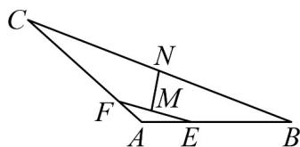

<!-- question-source:start -->
6. 如图，在 $\forall ABC$ 中，已知 $AB = 2\sqrt{2}, AC = 3, \angle A = 135^{\circ}$ ， $AE = xAB, AF = yAC$ ，且 $x + 3y = 1(x > 0, y > 0)$

若线段 $EF, BC$ 的中点分别为 $M, N$ ，则 $\left|\overline{MN}\right|$ 的最小值为

<!-- question-source:end -->

![[高中/课堂同步/题库/人教A版高中数学同步讲义(2026)/02_必修第二册/第六章 平面向量及其应用/第六章 平面向量及其应用（高效培优讲义）/强化训练/questions/answers/Q00078632A1.md]]
