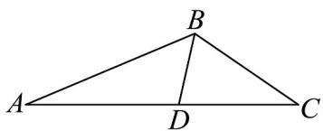

<!-- question-source:start -->
15. 如图，在 $\forall ABC$ 中， $\cos \angle ABC = -\frac{\sqrt{6}}{3}$ ， $BC = 4$ ，点 $D$ 在 $AC$ 上， $\angle ABD = \frac{\pi}{3}$ ， $BD = 2\cdot$

(1)求 $CD^{2}$ ;

(2)求 $AB$ .
<!-- question-source:end -->

![[高中/课堂同步/题库/人教A版高中数学同步讲义(2026)/02_必修第二册/第六章 平面向量及其应用/第六章 平面向量及其应用（高效培优讲义）/强化训练/questions/answers/Q00078640A1.md]]
